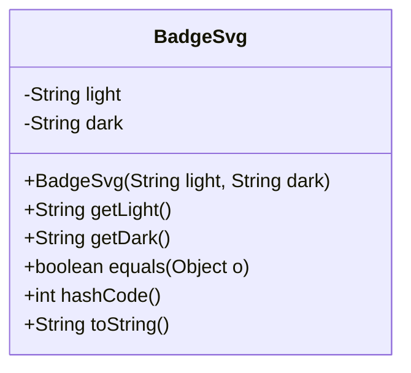
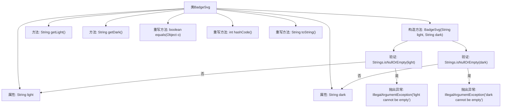

# 基础信息

|      |      |
|------|------|
| 名称 | BadgeSvg |
| 编码语言 | .java |
| 代码路径 | Signal-Server/service/src/main/java/org/whispersystems/textsecuregcm/entities/BadgeSvg.java |
| 包名 | org.whispersystems.textsecuregcm.entities |
| 依赖项 | ['com.fasterxml.jackson.annotation.JsonCreator', 'com.fasterxml.jackson.annotation.JsonProperty', 'com.google.common.base.Strings', 'java.util.Objects', 'jakarta.validation.constraints.NotEmpty'] |
| 概述说明 | BadgeSvg类含light、dark属性，验证非空并实现equals、hashCode、toString方法。 |

# 说明

BadgeSvg类包含两个属性：light和dark，这些属性在类中进行非空验证以确保其有效性。此外，该类实现了equals、hashCode和toString方法，以支持对象比较、哈希计算和字符串表示功能。这些方法的实现确保类实例在集合操作和调试时表现一致且可靠。

# 类列表 Class Summary

| 名称   | 类型  | 说明 |
|-------|------|-------------|
| BadgeSvg | class | BadgeSvg类包含light和dark属性，验证非空并实现equals、hashCode和toString方法。 |

## 类 BadgeSvg

|      |      |
|------|------|
| 访问范围 | public |
| 类型 | class |
| 名称 | BadgeSvg |
| 说明 | BadgeSvg类包含light和dark属性，验证非空并实现equals、hashCode和toString方法。 |

### UML类图

**描述：**  
`BadgeSvg` 类用于表示包含 `light` 和 `dark` 两种模式的徽章SVG图像。类中包含两个私有成员变量 `light` 和 `dark`，分别表示两种模式的SVG内容。构造函数通过 `@JsonCreator` 注解进行反序列化，并对输入参数进行非空校验。类提供了获取 `light` 和 `dark` 内容的方法，并重写了 `equals`、`hashCode` 和 `toString` 方法以实现对象的比较和字符串表示。

### 内部方法调用关系图

这段代码定义了一个名为 `BadgeSvg` 的类，包含两个私有属性 `light` 和 `dark`，并通过构造方法进行初始化。构造方法中会对传入的参数进行非空验证，若为空则抛出异常。类中还提供了获取属性的方法，并重写了 `equals`、`hashCode` 和 `toString` 方法，用于对象的比较、哈希值计算和字符串表示。流程图展示了类的结构、方法调用关系以及异常处理流程。

### 字段列表 Field List

| 名称  | 类型  | 说明 |
|-------|-------|------|
| dark | String | 私有字符串变量dark声明为final。 |
| light | String | 定义了一个私有的不可变字符串变量light。 |

### 方法列表 Method List

| 名称  | 类型  | 说明 |
|-------|-------|------|
| getLight | String | 方法getLight返回light变量的值。 |
| getDark | String | 定义公共方法getDark，返回dark变量值。 |
| equals | boolean | 重写equals方法，比较对象是否相同或属性值相等。 |
| toString | String | 重写toString方法，返回包含light和dark属性的BadgeSvg对象字符串。 |
| hashCode | int | 重写hashCode方法，使用light和dark属性生成哈希值。 |

