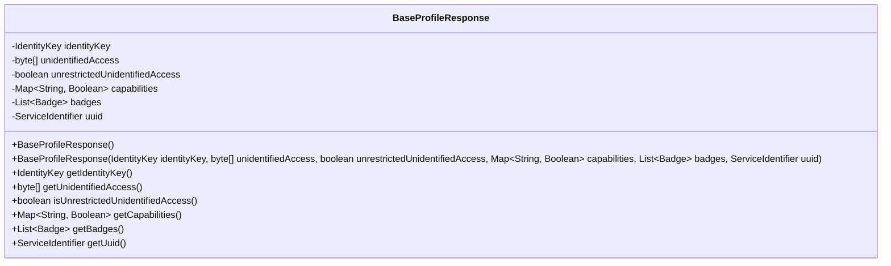

# 基础信息

|      |      |
|------|------|
| 名称 | BaseProfileResponse |
| 编码语言 | .java |
| 代码路径 | Signal-Server/service/src/main/java/org/whispersystems/textsecuregcm/entities/BaseProfileResponse.java |
| 包名 | org.whispersystems.textsecuregcm.entities |
| 依赖项 | ['com.fasterxml.jackson.annotation.JsonProperty', 'com.fasterxml.jackson.databind.annotation.JsonDeserialize', 'com.fasterxml.jackson.databind.annotation.JsonSerialize', 'org.signal.libsignal.protocol.IdentityKey', 'org.whispersystems.textsecuregcm.identity.ServiceIdentifier', 'org.whispersystems.textsecuregcm.util.ByteArrayBase64WithPaddingAdapter', 'org.whispersystems.textsecuregcm.util.ServiceIdentifierAdapter', 'org.whispersystems.textsecuregcm.util.IdentityKeyAdapter', 'java.util.List', 'java.util.Map'] |
| 概述说明 | BaseProfileResponse类包含身份密钥、未识别访问、能力、徽章和UUID等属性。 |

# 说明

BaseProfileResponse类是一个包含多个关键属性的类，主要用于管理用户的基本信息。其属性包括身份密钥，用于标识用户身份；未识别访问，记录未识别的访问行为；能力，描述用户的功能权限；徽章，代表用户的成就或标识；以及UUID，作为用户的唯一标识符。此外，该类还提供了相应的方法，用于操作和管理这些属性，确保用户信息的完整性和安全性。

# 类列表 Class Summary

| 名称   | 类型  | 说明 |
|-------|------|-------------|
| BaseProfileResponse | class | BaseProfileResponse类包含身份密钥、未识别访问、能力、徽章和UUID等属性及其方法。 |

## 类 BaseProfileResponse

|      |      |
|------|------|
| 访问范围 | public |
| 类型 | class |
| 名称 | BaseProfileResponse |
| 说明 | BaseProfileResponse类包含身份密钥、未识别访问、能力、徽章和UUID等属性及其方法。 |

### UML类图

BaseProfileResponse类用于表示一个基本的配置文件响应，包含身份密钥、未识别的访问信息、未限制的未识别访问标志、能力映射、徽章列表和服务标识符。该类提供了构造函数和相应的getter方法，用于访问这些私有属性。类图展示了类的结构及其成员变量和方法，清晰地描述了类的设计意图和功能。

### 内部方法调用关系图

```mermaid
graph TD
    A["类BaseProfileResponse"]
    B["属性: IdentityKey identityKey"]
    C["属性: byte[] unidentifiedAccess"]
    D["属性: boolean unrestrictedUnidentifiedAccess"]
    E["属性: Map<String, Boolean> capabilities"]
    F["属性: List<Badge> badges"]
    G["属性: ServiceIdentifier uuid"]
    H["构造方法: BaseProfileResponse()"]
    I["构造方法: BaseProfileResponse(IdentityKey identityKey, byte[] unidentifiedAccess, boolean unrestrictedUnidentifiedAccess, Map<String, Boolean> capabilities, List<Badge> badges, ServiceIdentifier uuid)"]
    J["方法: IdentityKey getIdentityKey()"]
    K["方法: byte[] getUnidentifiedAccess()"]
    L["方法: boolean isUnrestrictedUnidentifiedAccess()"]
    M["方法: Map<String, Boolean> getCapabilities()"]
    N["方法: List<Badge> getBadges()"]
    O["方法: ServiceIdentifier getUuid()"]

    A --> B
    A --> C
    A --> D
    A --> E
    A --> F
    A --> G
    A --> H
    A --> I
    A --> J
    A --> K
    A --> L
    A --> M
    A --> N
    A --> O
```

这段代码定义了一个名为`BaseProfileResponse`的类，该类包含多个属性，如`identityKey`、`unidentifiedAccess`、`unrestrictedUnidentifiedAccess`、`capabilities`、`badges`和`uuid`。类中有两个构造方法，一个无参构造方法和一个带参构造方法，用于初始化这些属性。此外，类还提供了多个getter方法，用于获取这些属性的值。这些属性和方法共同构成了一个用于处理基础配置文件响应的数据结构。

### 字段列表 Field List

| 名称  | 类型  | 说明 |
|-------|-------|------|
| unrestrictedUnidentifiedAccess | boolean | 属性用于控制未识别访问是否无限制。 |
| identityKey | IdentityKey | 该代码片段使用Jackson注解配置IdentityKey字段的序列化和反序列化。 |
| uuid | ServiceIdentifier | 使用自定义序列化与反序列化处理ServiceIdentifier字段。 |
| badges | List<Badge> | JSON属性badges映射为私有List<Badge>类型。 |
| capabilities | Map<String, Boolean> | 类属性capabilities为Map类型，键为String，值为Boolean。 |
| unidentifiedAccess | byte[] | 使用Base64编码适配器序列化和反序列化未识别的访问字节数组。 |

### 方法列表 Method List

| 名称  | 类型  | 说明 |
|-------|-------|------|
| getIdentityKey | IdentityKey | 获取身份密钥的方法。 |
| getUnidentifiedAccess | byte[] | 该方法返回未识别访问的字节数组。 |
| getBadges | List<Badge> | 获取徽章列表的方法。 |
| getUuid | ServiceIdentifier | 获取服务标识符的UUID值。 |
| isUnrestrictedUnidentifiedAccess | boolean | 该方法返回布尔值，表示是否允许无限制的未识别访问。 |
| getCapabilities | Map<String, Boolean> | 该方法返回包含字符串和布尔值的映射表。 |

