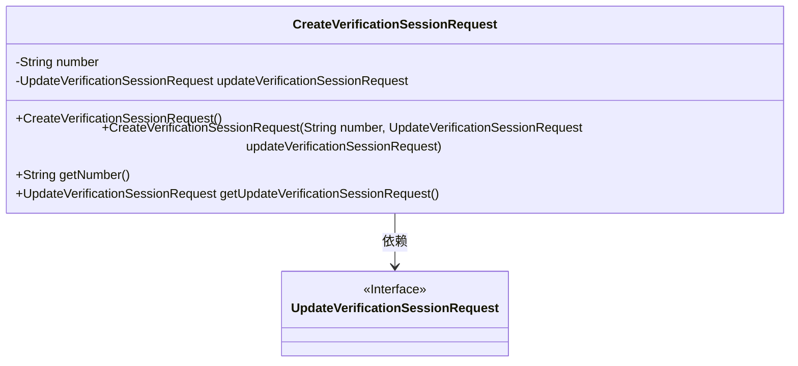
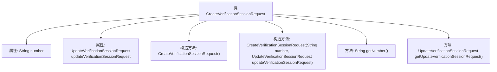

# 基础信息

|      |      |
|------|------|
| 名称 | CreateVerificationSessionRequest |
| 编码语言 | .java |
| 代码路径 | Signal-Server/service/src/main/java/org/whispersystems/textsecuregcm/entities/CreateVerificationSessionRequest.java |
| 包名 | org.whispersystems.textsecuregcm.entities |
| 依赖项 | ['com.fasterxml.jackson.annotation.JsonProperty', 'com.fasterxml.jackson.annotation.JsonUnwrapped', 'com.google.common.annotations.VisibleForTesting', 'io.swagger.v3.oas.annotations.media.Schema', 'jakarta.validation.Valid', 'jakarta.validation.constraints.NotBlank', 'org.whispersystems.textsecuregcm.util.E164'] |
| 概述说明 | 创建验证会话请求类，包含E164格式电话号码和更新验证会话请求。 |

# 说明

创建验证会话请求类主要包含两个关键部分：E164格式的电话号码和更新验证会话请求。E164格式是一种国际标准的电话号码表示方法，确保号码在全球范围内唯一且规范。更新验证会话请求则用于在验证过程中对会话进行修改或重新发起验证。这两个部分共同构成了验证会话请求类的核心内容，确保验证流程的准确性和有效性。

# 类列表 Class Summary

| 名称   | 类型  | 说明 |
|-------|------|-------------|
| CreateVerificationSessionRequest | class | 创建验证会话请求类，包含E164格式电话号码和更新验证会话请求。 |

## 类 CreateVerificationSessionRequest

|      |      |
|------|------|
| 访问范围 | public final |
| 类型 | class |
| 名称 | CreateVerificationSessionRequest |
| 说明 | 创建验证会话请求类，包含E164格式电话号码和更新验证会话请求。 |

### UML类图

**描述：**  
`CreateVerificationSessionRequest` 类用于创建验证会话请求，包含一个必需的 `number` 字段和一个 `updateVerificationSessionRequest` 对象。`updateVerificationSessionRequest` 是一个接口，表示验证会话的更新请求。该类提供了两个构造函数，分别用于默认初始化和测试初始化，并提供了获取字段值的方法。

### 内部方法调用关系图

这段代码定义了一个名为 `CreateVerificationSessionRequest` 的类，该类包含两个主要属性：`number` 和 `updateVerificationSessionRequest`。类提供了两个构造方法，一个默认构造方法和一个用于测试的构造方法，分别用于初始化这两个属性。此外，类还提供了两个getter方法，用于获取这两个属性的值。代码通过注解对属性进行了验证和序列化配置，确保数据的有效性和一致性。

### 字段列表 Field List

| 名称  | 类型  | 说明 |
|-------|-------|------|
| number | String | 必填的E164格式电话号码，用于验证。 |
| updateVerificationSessionRequest | UpdateVerificationSessionRequest | 包含解封装和验证的更新验证会话请求对象。 |

### 方法列表 Method List

| 名称  | 类型  | 说明 |
|-------|-------|------|
| getNumber | String | 该方法返回字符串类型的number变量。 |
| getUpdateVerificationSessionRequest | UpdateVerificationSessionRequest | 获取更新验证会话请求的方法。 |

