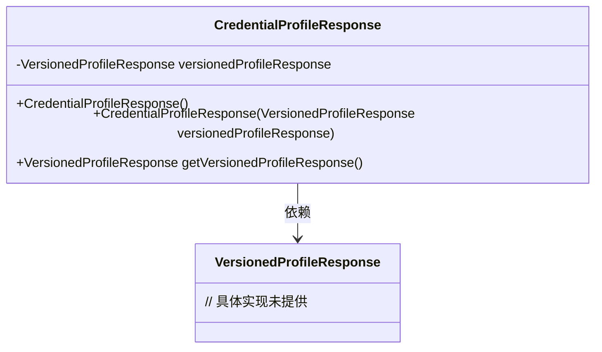
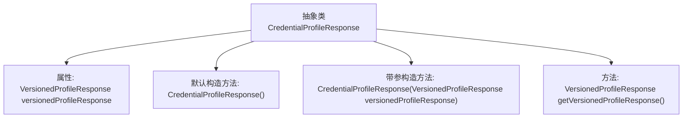

# 基础信息

|      |      |
|------|------|
| 名称 | CredentialProfileResponse |
| 编码语言 | .java |
| 代码路径 | Signal-Server/service/src/main/java/org/whispersystems/textsecuregcm/entities/CredentialProfileResponse.java |
| 包名 | org.whispersystems.textsecuregcm.entities |
| 依赖项 | ['com.fasterxml.jackson.annotation.JsonUnwrapped'] |
| 概述说明 | 抽象类CredentialProfileResponse提供版本化配置文件响应的构造和获取方法。 |

# 说明

抽象类CredentialProfileResponse用于表示版本化的配置文件响应，提供了构造方法和获取方法。该类的主要功能是管理和操作配置文件的版本信息，确保配置文件的一致性和可访问性。通过构造方法，可以初始化或更新配置文件的版本信息；通过获取方法，可以检索当前配置文件的版本数据。该类设计为抽象类，意味着它需要由具体子类实现其方法，以适应不同的应用场景和需求。

# 类列表 Class Summary

| 名称   | 类型  | 说明 |
|-------|------|-------------|
| CredentialProfileResponse | class | 抽象类CredentialProfileResponse包含版本化配置文件响应，提供构造和获取方法。 |

## 类 CredentialProfileResponse

|      |      |
|------|------|
| 访问范围 | public abstract |
| 类型 | class |
| 名称 | CredentialProfileResponse |
| 说明 | 抽象类CredentialProfileResponse包含版本化配置文件响应，提供构造和获取方法。 |

### UML类图

这段代码定义了一个抽象类 `CredentialProfileResponse`，它包含一个私有的 `VersionedProfileResponse` 对象，并通过构造函数和方法进行初始化和访问。`CredentialProfileResponse` 依赖于 `VersionedProfileResponse` 类，用于存储和获取版本化的配置文件响应。由于 `CredentialProfileResponse` 是抽象类，它可能被其他具体类继承并实现更多功能。

### 内部方法调用关系图

这段代码定义了一个抽象类 `CredentialProfileResponse`，其中包含一个属性 `versionedProfileResponse`，并通过 `@JsonUnwrapped` 注解进行解包。类提供了两个构造方法，一个默认构造方法和一个带参构造方法，用于初始化 `versionedProfileResponse`。此外，类还提供了一个 `getVersionedProfileResponse` 方法，用于获取 `versionedProfileResponse` 的值。

### 字段列表 Field List

| 名称  | 类型  | 说明 |
|-------|-------|------|
| versionedProfileResponse | VersionedProfileResponse | 包含版本化配置文件的响应对象。 |

### 方法列表 Method List

| 名称  | 类型  | 说明 |
|-------|-------|------|
| getVersionedProfileResponse | VersionedProfileResponse | 获取版本化配置文件的响应方法。 |

