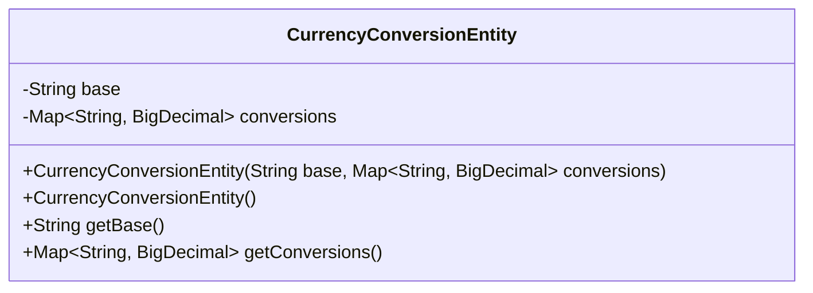
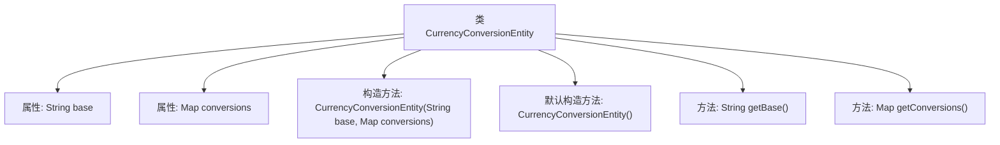

# 基础信息

|      |      |
|------|------|
| 名称 | CurrencyConversionEntity |
| 编码语言 | .java |
| 代码路径 | Signal-Server/service/src/main/java/org/whispersystems/textsecuregcm/entities/CurrencyConversionEntity.java |
| 包名 | org.whispersystems.textsecuregcm.entities |
| 依赖项 | ['com.fasterxml.jackson.annotation.JsonProperty', 'java.math.BigDecimal', 'java.util.Map'] |
| 概述说明 | CurrencyConversionEntity类管理基础货币及汇率转换映射。 |

# 说明

CurrencyConversionEntity类主要用于管理货币转换的相关信息。该类包含两个核心部分：基础货币和汇率转换映射。基础货币表示需要进行转换的原始货币类型，而汇率转换映射则存储了基础货币与其他目标货币之间的汇率关系。通过这两个部分，该类能够有效地支持货币之间的转换操作，确保在需要时能够准确地进行汇率计算和货币转换。

# 类列表 Class Summary

| 名称   | 类型  | 说明 |
|-------|------|-------------|
| CurrencyConversionEntity | class | CurrencyConversionEntity类包含基础货币和汇率转换映射。 |

## 类 CurrencyConversionEntity

|      |      |
|------|------|
| 访问范围 | public |
| 类型 | class |
| 名称 | CurrencyConversionEntity |
| 说明 | CurrencyConversionEntity类包含基础货币和汇率转换映射。 |

### UML类图

这段代码定义了一个名为 `CurrencyConversionEntity` 的类，用于表示货币转换的实体。类中包含两个私有成员变量：`base` 表示基础货币，`conversions` 是一个映射，存储目标货币及其对应的汇率。类提供了两个构造函数，一个用于初始化所有成员变量，另一个是默认构造函数。此外，类还提供了获取 `base` 和 `conversions` 的公有方法。这个类主要用于处理货币转换相关的数据。

### 内部方法调用关系图

该流程图展示了`CurrencyConversionEntity`类的结构及其内部函数调用关系。类包含两个属性`base`和`conversions`，分别表示货币转换的基础货币和转换率映射。类提供了两个构造方法，一个带参数的构造方法用于初始化属性，另一个默认构造方法。此外，类还提供了`getBase`和`getConversions`两个方法，分别用于获取基础货币和转换率映射。

### 字段列表 Field List

| 名称  | 类型  | 说明 |
|-------|-------|------|
| base | String | 使用JsonProperty注解标记私有字符串变量base。 |
| conversions | Map<String, BigDecimal> | 类中定义了一个私有Map类型变量conversions，用于存储字符串与大数的映射。 |

### 方法列表 Method List

| 名称  | 类型  | 说明 |
|-------|-------|------|
| getBase | String | 该方法返回字符串类型的base变量值。 |
| getConversions | Map<String, BigDecimal> | 该方法返回一个包含字符串与大数值映射的Map。 |

