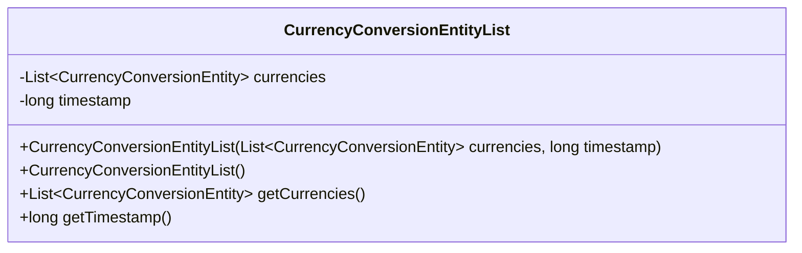
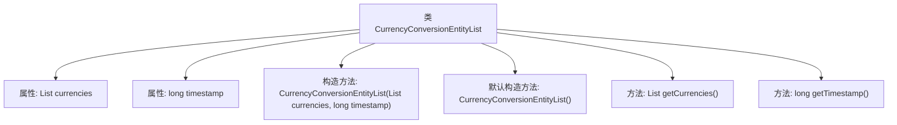

# 基础信息

|      |      |
|------|------|
| 名称 | CurrencyConversionEntityList |
| 编码语言 | .java |
| 代码路径 | Signal-Server/service/src/main/java/org/whispersystems/textsecuregcm/entities/CurrencyConversionEntityList.java |
| 包名 | org.whispersystems.textsecuregcm.entities |
| 依赖项 | ['com.fasterxml.jackson.annotation.JsonProperty', 'java.util.List'] |
| 概述说明 | 类包含货币转换列表和时间戳，提供构造和获取方法。 |

# 说明

该类设计用于管理货币转换实体列表，并包含时间戳信息。它提供了构造函数用于初始化对象，并包含获取方法以便访问货币转换实体列表和时间戳。这种结构便于在需要时获取和更新转换数据，同时确保时间戳的准确性，适用于需要记录和处理货币转换信息的应用场景。

# 类列表 Class Summary

| 名称   | 类型  | 说明 |
|-------|------|-------------|
| CurrencyConversionEntityList | class | 类包含货币转换实体列表和时间戳，提供构造函数和获取方法。 |

## 类 CurrencyConversionEntityList

|      |      |
|------|------|
| 访问范围 | public |
| 类型 | class |
| 名称 | CurrencyConversionEntityList |
| 说明 | 类包含货币转换实体列表和时间戳，提供构造函数和获取方法。 |

### UML类图

**描述：**
`CurrencyConversionEntityList` 类用于存储一组 `CurrencyConversionEntity` 对象及其对应的时间戳。该类包含两个私有属性：`currencies` 是一个 `CurrencyConversionEntity` 类型的列表，`timestamp` 是一个长整型时间戳。类提供了两个构造函数，一个用于初始化所有属性，另一个为默认构造函数。此外，类还提供了获取 `currencies` 和 `timestamp` 的公有方法。

### 内部方法调用关系图

这段代码定义了一个名为 `CurrencyConversionEntityList` 的类，包含两个属性：`currencies` 和 `timestamp`，分别表示货币转换实体列表和时间戳。类提供了两个构造方法，一个用于初始化属性，另一个是默认构造方法。此外，类还提供了两个方法 `getCurrencies` 和 `getTimestamp`，用于获取 `currencies` 和 `timestamp` 的值。

### 字段列表 Field List

| 名称  | 类型  | 说明 |
|-------|-------|------|
| timestamp | long | JSON属性映射为长整型时间戳。 |
| currencies | List<CurrencyConversionEntity> | 该代码定义了一个私有列表变量，用于存储货币转换实体。 |

### 方法列表 Method List

| 名称  | 类型  | 说明 |
|-------|-------|------|
| getTimestamp | long | 获取时间戳的方法。 |
| getCurrencies | List<CurrencyConversionEntity> | 方法返回货币转换实体列表。 |

