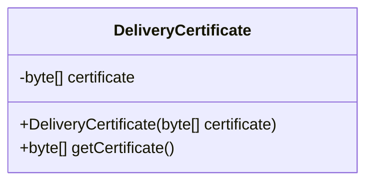
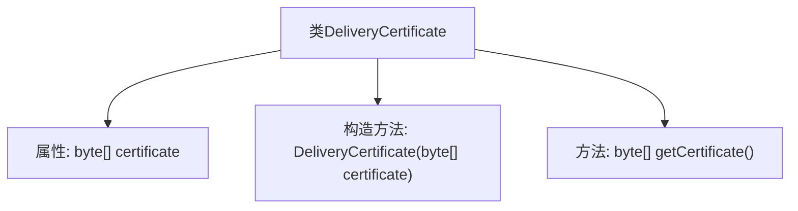

# 基础信息

|      |      |
|------|------|
| 名称 | DeliveryCertificate |
| 编码语言 | .java |
| 代码路径 | Signal-Server/service/src/main/java/org/whispersystems/textsecuregcm/entities/DeliveryCertificate.java |
| 包名 | org.whispersystems.textsecuregcm.entities |
| 依赖项 | ['com.fasterxml.jackson.annotation.JsonCreator', 'com.fasterxml.jackson.annotation.JsonProperty'] |
| 概述说明 | DeliveryCertificate类包含字节数组证书，提供构造和获取方法。 |

# 说明

DeliveryCertificate类设计用于处理字节数组形式的证书数据。该类包含一个构造函数，用于初始化证书对象，并提供一个获取方法，允许外部访问存储的证书字节数组。通过这种方式，DeliveryCertificate类实现了对证书数据的封装和有效管理。

# 类列表 Class Summary

| 名称   | 类型  | 说明 |
|-------|------|-------------|
| DeliveryCertificate | class | DeliveryCertificate类包含字节数组证书，提供构造函数和获取方法。 |

## 类 DeliveryCertificate

|      |      |
|------|------|
| 访问范围 | public |
| 类型 | class |
| 名称 | DeliveryCertificate |
| 说明 | DeliveryCertificate类包含字节数组证书，提供构造函数和获取方法。 |

### UML类图

这段代码定义了一个名为 `DeliveryCertificate` 的类，该类包含一个私有的 `byte[]` 类型的成员变量 `certificate`，并通过构造函数进行初始化。类中还提供了一个公有的 `getCertificate` 方法，用于获取 `certificate` 的值。这个类的主要作用是封装一个交付证书的二进制数据，并提供一个安全的访问方式。

### 内部方法调用关系图

这段代码定义了一个名为 `DeliveryCertificate` 的类，该类包含一个 `byte[]` 类型的私有属性 `certificate`。类中提供了一个带有 `@JsonCreator` 注解的构造方法，用于通过 `@JsonProperty` 注解从 JSON 数据中反序列化生成对象。此外，还提供了一个 `getCertificate` 方法，用于获取 `certificate` 属性的值。流程图清晰地展示了类的结构及其内部方法的关系。

### 字段列表 Field List

| 名称  | 类型  | 说明 |
|-------|-------|------|
| certificate | byte[] | 私有字节数组存储证书数据。 |

### 方法列表 Method List

| 名称  | 类型  | 说明 |
|-------|-------|------|
| getCertificate | byte[] | 该方法返回证书的字节数组。 |

