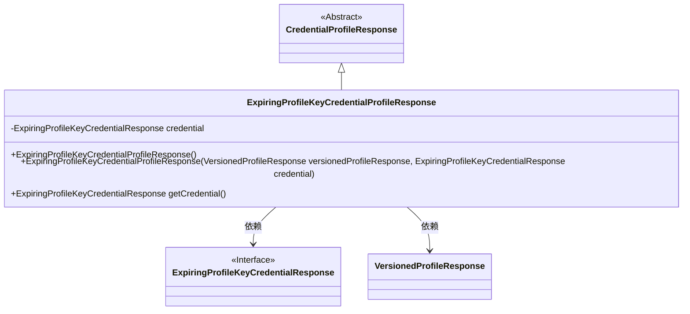
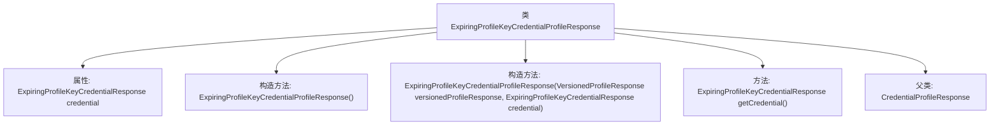

# 基础信息

|      |      |
|------|------|
| 名称 | ExpiringProfileKeyCredentialProfileResponse |
| 编码语言 | .java |
| 代码路径 | Signal-Server/service/src/main/java/org/whispersystems/textsecuregcm/entities/ExpiringProfileKeyCredentialProfileResponse.java |
| 包名 | org.whispersystems.textsecuregcm.entities |
| 依赖项 | ['com.fasterxml.jackson.annotation.JsonProperty', 'com.fasterxml.jackson.databind.annotation.JsonDeserialize', 'com.fasterxml.jackson.databind.annotation.JsonSerialize', 'javax.annotation.Nullable', 'org.signal.libsignal.zkgroup.profiles.ExpiringProfileKeyCredentialResponse'] |
| 概述说明 | ExpiringProfileKeyCredentialProfileResponse继承CredentialProfileResponse，含可空凭证属性。 |

# 说明

ExpiringProfileKeyCredentialProfileResponse类继承自CredentialProfileResponse类，该类的主要特点是包含了一个可空的凭证属性。这个设计允许凭证属性在某些情况下为空，提供了更灵活的凭证管理方式。继承关系表明ExpiringProfileKeyCredentialProfileResponse类具备了CredentialProfileResponse类的所有功能，并在此基础上增加了对可空凭证属性的支持。

# 类列表 Class Summary

| 名称   | 类型  | 说明 |
|-------|------|-------------|
| ExpiringProfileKeyCredentialProfileResponse | class | ExpiringProfileKeyCredentialProfileResponse类继承CredentialProfileResponse，包含可空凭证属性。 |

## 类 ExpiringProfileKeyCredentialProfileResponse

|      |      |
|------|------|
| 访问范围 | public |
| 类型 | class |
| 名称 | ExpiringProfileKeyCredentialProfileResponse |
| 说明 | ExpiringProfileKeyCredentialProfileResponse类继承CredentialProfileResponse，包含可空凭证属性。 |

### UML类图

**描述**：  
`ExpiringProfileKeyCredentialProfileResponse` 类继承自 `CredentialProfileResponse`，并包含一个可空的 `ExpiringProfileKeyCredentialResponse` 类型的成员变量 `credential`。该类提供了两个构造函数，一个默认构造函数和一个带参数的构造函数，后者接受 `VersionedProfileResponse` 和 `ExpiringProfileKeyCredentialResponse` 作为参数。此外，该类还提供了一个获取 `credential` 的方法。`ExpiringProfileKeyCredentialResponse` 是一个接口，`VersionedProfileResponse` 是一个普通类。

### 内部方法调用关系图

这段代码定义了一个名为`ExpiringProfileKeyCredentialProfileResponse`的类，继承自`CredentialProfileResponse`。该类包含一个可空的`ExpiringProfileKeyCredentialResponse`类型的属性`credential`，并提供了两个构造方法：一个无参构造方法和一个接受`VersionedProfileResponse`和`ExpiringProfileKeyCredentialResponse`参数的构造方法。此外，还提供了一个`getCredential`方法用于获取`credential`属性的值。

### 字段列表 Field List

| 名称  | 类型  | 说明 |
|-------|-------|------|
| credential | ExpiringProfileKeyCredentialResponse | 使用注解处理JSON序列化和反序列化的可空凭证响应字段。 |

### 方法列表 Method List

| 名称  | 类型  | 说明 |
|-------|-------|------|
| getCredential | ExpiringProfileKeyCredentialResponse | 该方法返回可空的`ExpiringProfileKeyCredentialResponse`类型凭证。 |

