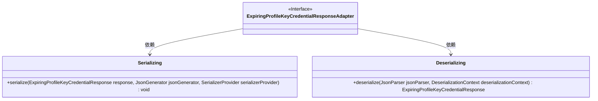
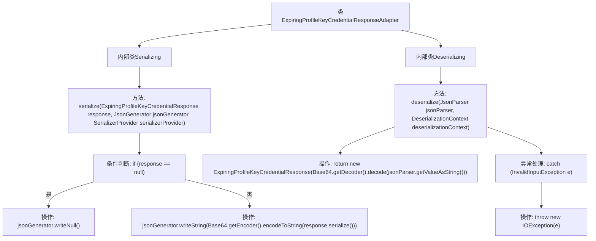

# 基础信息

|      |      |
|------|------|
| 名称 | ExpiringProfileKeyCredentialResponseAdapter |
| 编码语言 | .java |
| 代码路径 | Signal-Server/service/src/main/java/org/whispersystems/textsecuregcm/entities/ExpiringProfileKeyCredentialResponseAdapter.java |
| 包名 | org.whispersystems.textsecuregcm.entities |
| 依赖项 | ['com.fasterxml.jackson.core.JsonGenerator', 'com.fasterxml.jackson.core.JsonParser', 'com.fasterxml.jackson.databind.DeserializationContext', 'com.fasterxml.jackson.databind.JsonDeserializer', 'com.fasterxml.jackson.databind.JsonSerializer', 'com.fasterxml.jackson.databind.SerializerProvider', 'java.io.IOException', 'java.util.Base64', 'org.signal.libsignal.zkgroup.InvalidInputException', 'org.signal.libsignal.zkgroup.profiles.ExpiringProfileKeyCredentialResponse'] |
| 概述说明 | ExpiringProfileKeyCredentialResponse的JSON序列化与反序列化适配器。 |

# 说明

ExpiringProfileKeyCredentialResponse的JSON序列化与反序列化适配器用于处理该数据结构的转换。序列化过程将对象转换为JSON格式，以便存储或传输；反序列化则将JSON数据还原为对象，便于程序处理。适配器确保数据在不同格式间准确转换，保持结构完整性和数据一致性，适用于需要持久化或网络通信的场景。

# 类列表 Class Summary

| 名称   | 类型  | 说明 |
|-------|------|-------------|
| ExpiringProfileKeyCredentialResponseAdapter | class | ExpiringProfileKeyCredentialResponse的JSON序列化与反序列化适配器。 |

## 类 ExpiringProfileKeyCredentialResponseAdapter

|      |      |
|------|------|
| 访问范围 | public |
| 类型 | class |
| 名称 | ExpiringProfileKeyCredentialResponseAdapter |
| 说明 | ExpiringProfileKeyCredentialResponse的JSON序列化与反序列化适配器。 |

### UML类图

这段代码定义了一个`ExpiringProfileKeyCredentialResponseAdapter`类，它包含了两个静态内部类`Serializing`和`Deserializing`，分别用于序列化和反序列化`ExpiringProfileKeyCredentialResponse`对象。`Serializing`类通过`JsonSerializer`接口实现序列化，将对象转换为Base64编码的字符串；`Deserializing`类通过`JsonDeserializer`接口实现反序列化，将Base64编码的字符串解码并转换为`ExpiringProfileKeyCredentialResponse`对象。这两个类都依赖于`ExpiringProfileKeyCredentialResponseAdapter`类。

### 内部方法调用关系图

这段代码定义了一个名为`ExpiringProfileKeyCredentialResponseAdapter`的类，其中包含两个内部类`Serializing`和`Deserializing`，分别用于序列化和反序列化`ExpiringProfileKeyCredentialResponse`对象。`Serializing`类的`serialize`方法将对象序列化为Base64编码的字符串，而`Deserializing`类的`deserialize`方法则将Base64编码的字符串反序列化为对象，并在遇到无效输入时抛出异常。

### 字段列表 Field List

| 名称  | 类型  | 说明 |
|-------|-------|------|

### 方法列表 Method List

| 名称  | 类型  | 说明 |
|-------|-------|------|

