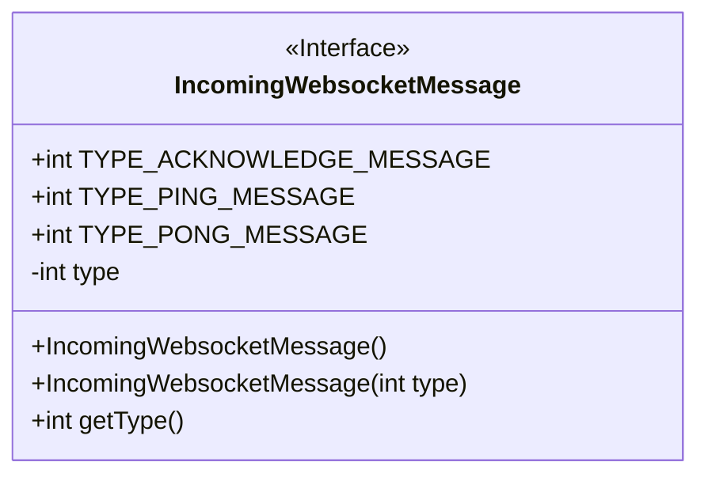
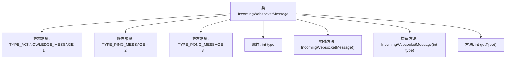

# 基础信息

|      |      |
|------|------|
| 名称 | IncomingWebsocketMessage |
| 编码语言 | .java |
| 代码路径 | Signal-Server/service/src/main/java/org/whispersystems/textsecuregcm/entities/IncomingWebsocketMessage.java |
| 包名 | org.whispersystems.textsecuregcm.entities |
| 依赖项 | ['com.fasterxml.jackson.annotation.JsonIgnoreProperties', 'com.fasterxml.jackson.annotation.JsonProperty'] |
| 概述说明 | WebSocket消息类，包含ACK、PING、PONG类型及获取方法。 |

# 说明

WebSocket消息类是一个用于处理WebSocket通信的核心类，支持多种消息类型，包括ACK、PING和PONG。ACK类型用于确认消息的接收，PING类型用于检测连接的活动性，PONG类型则是对PING的响应。该类提供了获取方法，允许用户根据需求获取特定类型的消息。通过这一设计，开发者可以有效地管理和处理WebSocket通信中的各种消息，确保连接的稳定性和数据的准确传输。

# 类列表 Class Summary

| 名称   | 类型  | 说明 |
|-------|------|-------------|
| IncomingWebsocketMessage | class | WebSocket消息类，包含ACK、PING、PONG类型和获取方法。 |

## 类 IncomingWebsocketMessage

|      |      |
|------|------|
| 访问范围 | @JsonIgnoreProperties(ignoreUnknown = true);public |
| 类型 | class |
| 名称 | IncomingWebsocketMessage |
| 说明 | WebSocket消息类，包含ACK、PING、PONG类型和获取方法。 |

### UML类图

这段代码定义了一个名为 `IncomingWebsocketMessage` 的类，用于处理传入的WebSocket消息。类中包含三个静态常量，分别表示不同类型的消息（ACKNOWLEDGE、PING、PONG）。类中的 `type` 属性用于存储消息类型，并通过构造函数进行初始化。`getType` 方法用于获取消息类型。类通过 `@JsonIgnoreProperties` 注解忽略未知的JSON属性，确保反序列化时不会因未知属性而抛出异常。

### 内部方法调用关系图

这段代码定义了一个名为 `IncomingWebsocketMessage` 的类，用于处理WebSocket消息。类中包含三个静态常量，分别表示不同类型的消息（确认、Ping、Pong）。类中定义了一个受保护的 `type` 属性，用于存储消息类型。类提供了两个构造方法，一个无参构造方法和一个带 `type` 参数的构造方法，以及一个 `getType` 方法用于获取消息类型。通过 `@JsonIgnoreProperties` 和 `@JsonProperty` 注解，类支持JSON序列化和反序列化，并忽略未知属性。

### 字段列表 Field List

| 名称  | 类型  | 说明 |
|-------|-------|------|
| TYPE_ACKNOWLEDGE_MESSAGE = 1 | int | 定义常量TYPE_ACKNOWLEDGE_MESSAGE，值为1。 |
| TYPE_PONG_MESSAGE        = 3 | int | 定义常量TYPE_PONG_MESSAGE，值为3。 |
| type | int | JSON属性映射为整型变量type。 |
| TYPE_PING_MESSAGE        = 2 | int | 常量TYPE_PING_MESSAGE的值为2。 |

### 方法列表 Method List

| 名称  | 类型  | 说明 |
|-------|-------|------|
| getType | int | 该方法返回整数类型的变量`type`的值。 |

