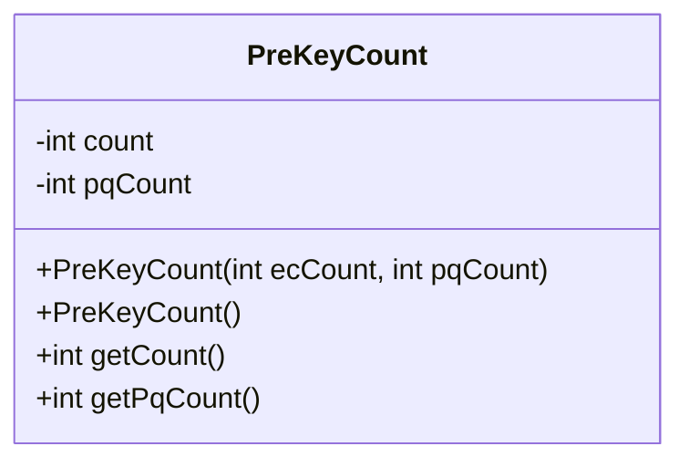
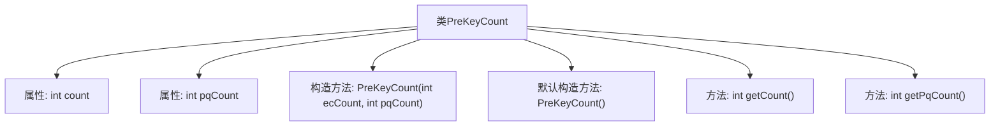

# 基础信息

|      |      |
|------|------|
| 名称 | PreKeyCount |
| 编码语言 | .java |
| 代码路径 | Signal-Server/service/src/main/java/org/whispersystems/textsecuregcm/entities/PreKeyCount.java |
| 包名 | org.whispersystems.textsecuregcm.entities |
| 依赖项 | ['com.fasterxml.jackson.annotation.JsonProperty', 'io.swagger.v3.oas.annotations.media.Schema'] |
| 概述说明 | PreKeyCount类存储椭圆曲线和一次性后量子预密钥数量。 |

# 说明

PreKeyCount类用于存储与设备相关的椭圆曲线和一次性后量子预密钥的数量信息。该类的主要功能是记录和管理这些密钥的数量，确保设备在通信过程中能够使用正确的密钥进行加密和解密操作。通过维护椭圆曲线和一次性后量子预密钥的数量，PreKeyCount类有助于提高设备通信的安全性和可靠性。

# 类列表 Class Summary

| 名称   | 类型  | 说明 |
|-------|------|-------------|
| PreKeyCount | class | PreKeyCount类存储设备椭圆曲线和一次性后量子预密钥数量。 |

## 类 PreKeyCount

|      |      |
|------|------|
| 访问范围 | public |
| 类型 | class |
| 名称 | PreKeyCount |
| 说明 | PreKeyCount类存储设备椭圆曲线和一次性后量子预密钥数量。 |

### UML类图

**描述：**  
`PreKeyCount` 类用于存储设备的预密钥数量，包括椭圆曲线预密钥和一次性后量子预密钥。类中包含两个私有属性 `count` 和 `pqCount`，分别表示椭圆曲线预密钥的数量和后量子预密钥的数量。类提供了两个构造函数，一个用于初始化这两个属性，另一个为默认构造函数。此外，类还提供了两个公有方法 `getCount` 和 `getPqCount`，用于获取这两个属性的值。

### 内部方法调用关系图

这段代码定义了一个名为`PreKeyCount`的类，该类包含两个私有属性`count`和`pqCount`，分别表示存储的未签名椭圆曲线预密钥的数量和一次性后量子预密钥的数量。类提供了两个构造方法，一个带有参数的构造方法用于初始化这两个属性，另一个默认构造方法。此外，类还提供了两个公共方法`getCount`和`getPqCount`，分别用于获取`count`和`pqCount`的值。这段代码主要用于管理设备上的预密钥数量。

### 字段列表 Field List

| 名称  | 类型  | 说明 |
|-------|-------|------|
| count | int | 设备存储的未签名椭圆曲线预密钥数量。 |
| pqCount | int | 设备存储的一次性后量子预密钥数量。 |

### 方法列表 Method List

| 名称  | 类型  | 说明 |
|-------|-------|------|
| getPqCount | int | 获取pqCount值的公共方法。 |
| getCount | int | 该方法返回整数变量`count`的值。 |

