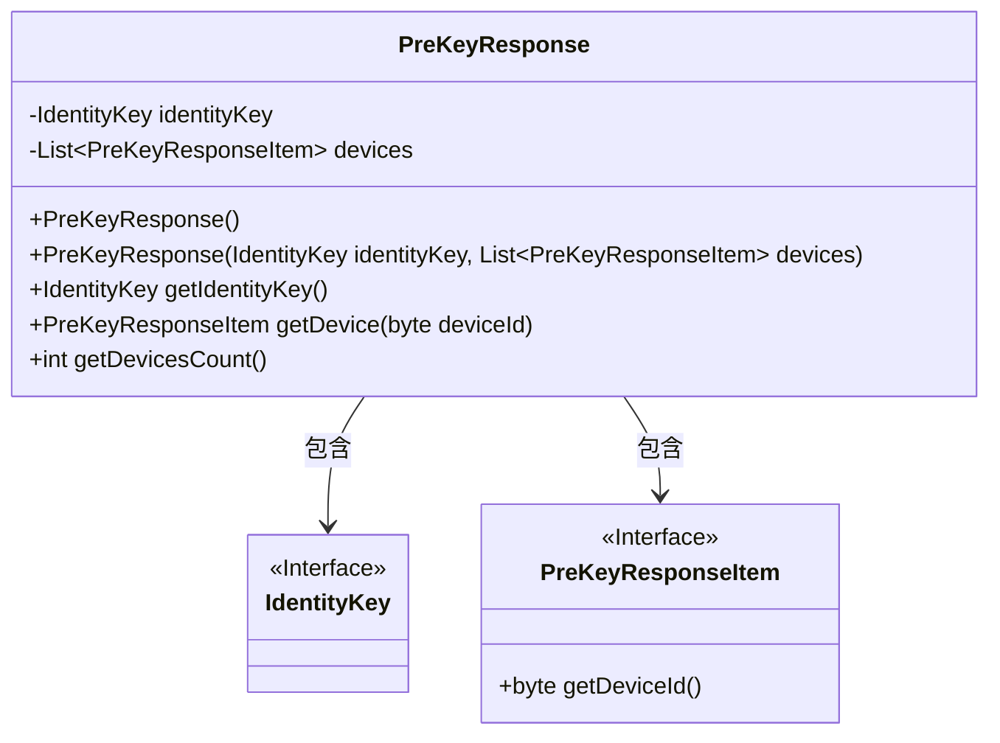
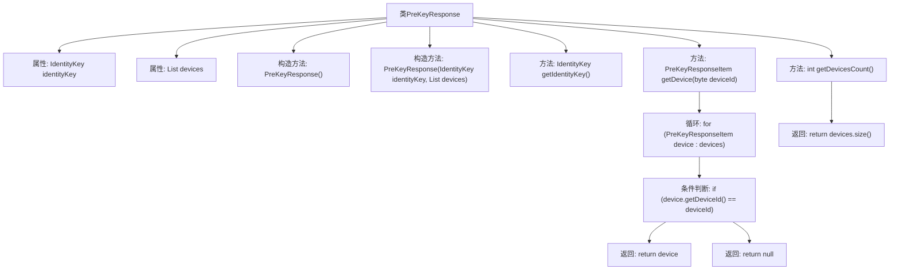

# 基础信息

|      |      |
|------|------|
| 名称 | PreKeyResponse |
| 编码语言 | .java |
| 代码路径 | Signal-Server/service/src/main/java/org/whispersystems/textsecuregcm/entities/PreKeyResponse.java |
| 包名 | org.whispersystems.textsecuregcm.entities |
| 依赖项 | ['com.fasterxml.jackson.annotation.JsonIgnore', 'com.fasterxml.jackson.annotation.JsonProperty', 'com.fasterxml.jackson.databind.annotation.JsonDeserialize', 'com.fasterxml.jackson.databind.annotation.JsonSerialize', 'com.google.common.annotations.VisibleForTesting', 'io.swagger.v3.oas.annotations.media.Schema', 'java.util.List', 'org.signal.libsignal.protocol.IdentityKey', 'org.whispersystems.textsecuregcm.util.IdentityKeyAdapter'] |
| 概述说明 | PreKeyResponse类存储身份密钥和设备信息，支持获取密钥和设备数量。 |

# 说明

PreKeyResponse类是一个用于管理身份密钥和设备信息的类。它提供了获取密钥和设备数量的方法，使用户能够方便地访问和操作这些关键数据。该类的主要功能是存储和检索与身份验证相关的密钥信息，以及管理关联设备的数量。通过此类，用户可以有效地处理与密钥和设备相关的操作，确保系统的安全性和完整性。

# 类列表 Class Summary

| 名称   | 类型  | 说明 |
|-------|------|-------------|
| PreKeyResponse | class | PreKeyResponse类包含身份密钥和设备信息，提供获取密钥和设备数量的方法。 |

## 类 PreKeyResponse

|      |      |
|------|------|
| 访问范围 | public |
| 类型 | class |
| 名称 | PreKeyResponse |
| 说明 | PreKeyResponse类包含身份密钥和设备信息，提供获取密钥和设备数量的方法。 |

### UML类图

**描述：**  
`PreKeyResponse` 类用于封装预密钥响应数据，包含一个 `IdentityKey` 类型的身份密钥和一个 `PreKeyResponseItem` 类型的设备列表。类提供了构造方法、获取身份密钥的方法、根据设备ID获取设备信息的方法以及获取设备数量的方法。`IdentityKey` 和 `PreKeyResponseItem` 是接口，分别表示身份密钥和设备信息的抽象。

### 内部方法调用关系图

这段代码定义了一个名为 `PreKeyResponse` 的类，包含两个主要属性：`identityKey` 和 `devices`。类提供了两个构造方法，一个无参构造方法和一个带参构造方法。此外，类还提供了三个测试可见的方法：`getIdentityKey` 用于获取 `identityKey`，`getDevice` 用于根据 `deviceId` 查找对应的 `PreKeyResponseItem`，`getDevicesCount` 用于获取 `devices` 列表的大小。`getDevice` 方法中使用了循环和条件判断来查找指定 `deviceId` 的设备。

### 字段列表 Field List

| 名称  | 类型  | 说明 |
|-------|-------|------|
| devices | List<PreKeyResponseItem> | 包含设备信息的预密钥响应项列表。 |
| identityKey | IdentityKey | 使用IdentityKeyAdapter序列化和反序列化公钥。 |

### 方法列表 Method List

| 名称  | 类型  | 说明 |
|-------|-------|------|
| getIdentityKey | IdentityKey | 测试可见方法返回身份密钥。 |
| getDevicesCount | int | 公开方法返回设备数量，忽略JSON序列化，仅用于测试。 |
| getDevice | PreKeyResponseItem | 测试可见方法，通过设备ID获取预密钥响应项。 |

