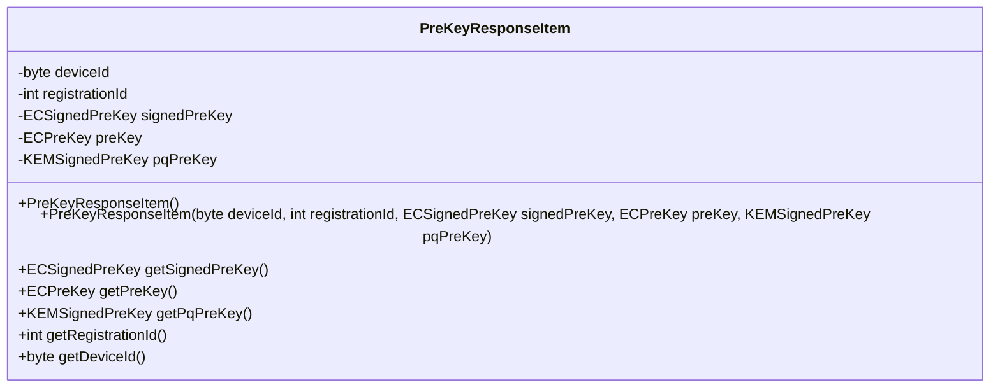
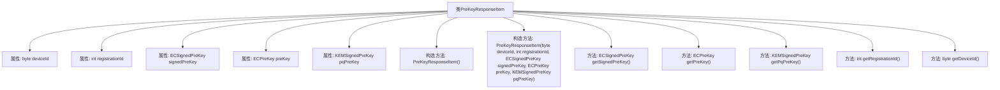

# 基础信息

|      |      |
|------|------|
| 名称 | PreKeyResponseItem |
| 编码语言 | .java |
| 代码路径 | Signal-Server/service/src/main/java/org/whispersystems/textsecuregcm/entities/PreKeyResponseItem.java |
| 包名 | org.whispersystems.textsecuregcm.entities |
| 依赖项 | ['com.fasterxml.jackson.annotation.JsonProperty', 'com.google.common.annotations.VisibleForTesting', 'io.swagger.v3.oas.annotations.media.Schema'] |
| 概述说明 | PreKeyResponseItem类包含设备ID、注册ID、签名预密钥、预密钥和量子预密钥。 |

# 说明

PreKeyResponseItem类是一个包含多个关键字段的数据结构，主要用于存储与设备相关的密钥信息。这些字段包括设备ID，用于唯一标识设备；注册ID，用于标识设备的注册状态；签名预密钥，用于生成签名；预密钥，用于加密通信；以及量子预密钥，用于增强安全性。这些字段共同构成了设备密钥管理的基础，确保通信的安全性和唯一性。

# 类列表 Class Summary

| 名称   | 类型  | 说明 |
|-------|------|-------------|
| PreKeyResponseItem | class | PreKeyResponseItem类包含设备ID、注册ID、签名预密钥、预密钥和量子预密钥等字段。 |

## 类 PreKeyResponseItem

|      |      |
|------|------|
| 访问范围 | public |
| 类型 | class |
| 名称 | PreKeyResponseItem |
| 说明 | PreKeyResponseItem类包含设备ID、注册ID、签名预密钥、预密钥和量子预密钥等字段。 |

### UML类图

**描述：**  
`PreKeyResponseItem` 类用于表示与设备相关的预密钥响应项，包含设备ID、注册ID、签名的椭圆曲线预密钥、未签名的椭圆曲线预密钥以及签名的后量子预密钥。该类提供了构造函数和多个获取私有成员的方法，主要用于测试和访问这些密钥信息。

### 内部方法调用关系图

这段代码定义了一个名为 `PreKeyResponseItem` 的类，用于存储与设备相关的预密钥信息。类中包含多个属性，如 `deviceId`、`registrationId`、`signedPreKey`、`preKey` 和 `pqPreKey`，分别表示设备ID、注册ID、签名的椭圆曲线预密钥、未签名的椭圆曲线预密钥以及签名的后量子预密钥。类提供了两个构造方法，一个无参构造方法和一个带参构造方法，用于初始化这些属性。此外，类还提供了多个 `@VisibleForTesting` 注解的 getter 方法，用于在测试环境中获取这些属性的值。

### 字段列表 Field List

| 名称  | 类型  | 说明 |
|-------|-------|------|
| deviceId | byte | 设备ID，关联特定设备的标识符。 |
| registrationId | int | 设备注册ID，用于唯一标识设备。 |
| preKey | ECPreKey | 设备剩余的未签名椭圆曲线预密钥。 |
| pqPreKey | KEMSignedPreKey | 设备的签后量子预密钥，包含一次性或备用密钥。 |
| signedPreKey | ECSignedPreKey | 设备设置的椭圆曲线签名预密钥。 |

### 方法列表 Method List

| 名称  | 类型  | 说明 |
|-------|-------|------|
| getDeviceId | byte | 公开测试方法获取设备ID。 |
| getSignedPreKey | ECSignedPreKey | 测试可见方法返回签名的预密钥对象。 |
| getRegistrationId | int | 公开测试方法获取注册ID。 |
| getPqPreKey | KEMSignedPreKey | 公开方法`getPqPreKey`返回`pqPreKey`，用于测试。 |
| getPreKey | ECPreKey | 公开方法`getPreKey`返回`preKey`，用于测试。 |

