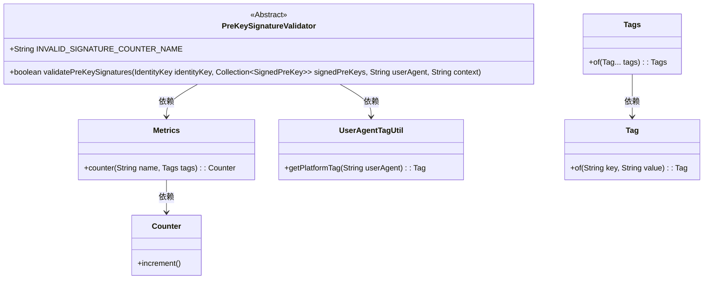
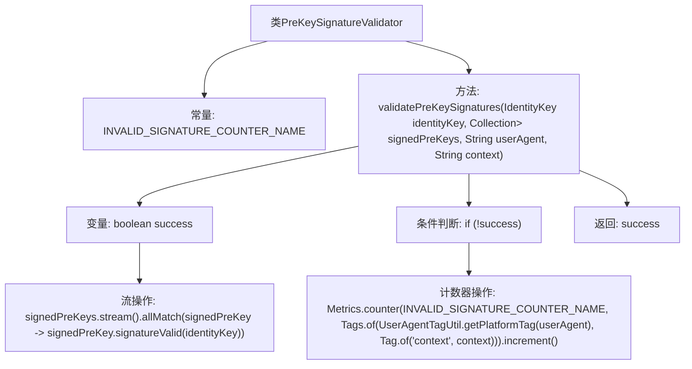

# 基础信息

|      |      |
|------|------|
| 名称 | PreKeySignatureValidator |
| 编码语言 | .java |
| 代码路径 | Signal-Server/service/src/main/java/org/whispersystems/textsecuregcm/entities/PreKeySignatureValidator.java |
| 包名 | org.whispersystems.textsecuregcm.entities |
| 依赖项 | ['io.micrometer.core.instrument.Metrics', 'io.micrometer.core.instrument.Tag', 'io.micrometer.core.instrument.Tags', 'org.signal.libsignal.protocol.IdentityKey', 'org.whispersystems.textsecuregcm.metrics.MetricsUtil', 'org.whispersystems.textsecuregcm.metrics.UserAgentTagUtil', 'javax.annotation.Nullable', 'java.util.Collection'] |
| 概述说明 | 预密钥签名验证类用于验证签名有效性并统计无效签名次数。 |

# 说明

预密钥签名验证类的主要功能是验证签名的有效性，并在发现无效签名时记录其计数。该类通过执行签名验证过程，确保签名的正确性和完整性。如果签名验证失败，系统会自动增加无效签名的计数，以便后续分析和处理。这一机制有助于及时发现和解决签名相关的问题，确保系统的安全性和可靠性。

# 类列表 Class Summary

| 名称   | 类型  | 说明 |
|-------|------|-------------|
| PreKeySignatureValidator | class | 预密钥签名验证类，验证签名有效性并记录无效签名计数。 |

## 类 PreKeySignatureValidator

|      |      |
|------|------|
| 访问范围 | public abstract |
| 类型 | class |
| 名称 | PreKeySignatureValidator |
| 说明 | 预密钥签名验证类，验证签名有效性并记录无效签名计数。 |

### UML类图

这段代码定义了一个抽象类 `PreKeySignatureValidator`，其中包含一个静态方法 `validatePreKeySignatures`，用于验证一组 `SignedPreKey` 对象的签名是否有效。如果签名无效，代码会通过 `Metrics` 类记录无效签名的计数。`Metrics` 类依赖于 `Counter` 和 `Tags` 类来生成和增加计数器，而 `Tags` 类又依赖于 `Tag` 类来创建标签。`UserAgentTagUtil` 类用于生成与用户代理相关的标签。整个流程展示了如何通过多个类的协作来验证签名并记录相关指标。

### 内部方法调用关系图

这段代码定义了一个抽象类 `PreKeySignatureValidator`，其中包含一个静态常量 `INVALID_SIGNATURE_COUNTER_NAME` 和一个静态方法 `validatePreKeySignatures`。该方法用于验证一组 `SignedPreKey` 对象的签名是否有效。如果所有签名都有效，则返回 `true`；否则，增加一个计数器并返回 `false`。流程图展示了方法的主要步骤，包括流操作、条件判断和计数器操作。

### 字段列表 Field List

| 名称  | 类型  | 说明 |
|-------|-------|------|
| INVALID_SIGNATURE_COUNTER_NAME =      MetricsUtil.name(PreKeySignatureValidator.class, "invalidPreKeySignature") | String | PreKeySignatureValidator类中定义无效签名的计数器名称。 |

### 方法列表 Method List

| 名称  | 类型  | 说明 |
|-------|-------|------|
| validatePreKeySignatures | boolean | 验证预密钥签名，检查所有签名有效性，无效时记录指标并返回结果。 |

