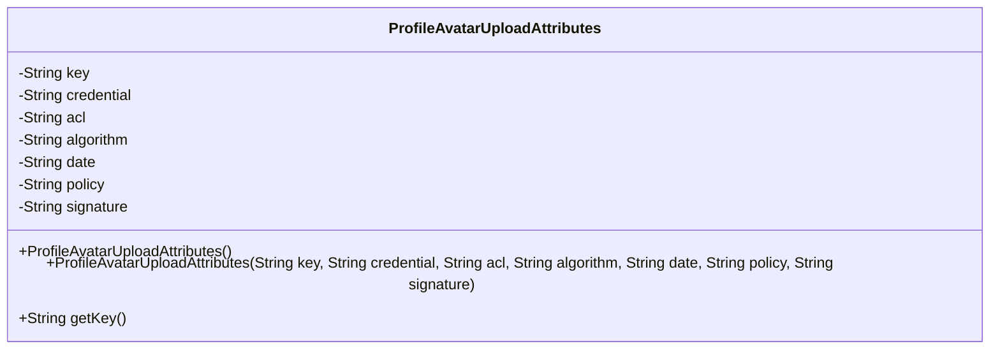
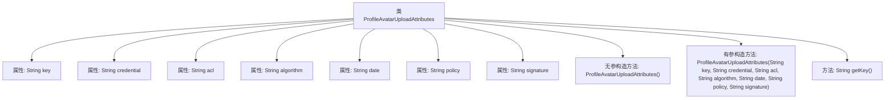

# 基础信息

|      |      |
|------|------|
| 名称 | ProfileAvatarUploadAttributes |
| 编码语言 | .java |
| 代码路径 | Signal-Server/service/src/main/java/org/whispersystems/textsecuregcm/entities/ProfileAvatarUploadAttributes.java |
| 包名 | org.whispersystems.textsecuregcm.entities |
| 依赖项 | ['com.fasterxml.jackson.annotation.JsonProperty'] |
| 概述说明 | ProfileAvatarUploadAttributes类存储上传头像的关键属性。 |

# 说明

ProfileAvatarUploadAttributes类是一个用于处理头像上传功能的类，它包含了上传头像所需的关键属性。这些属性可能涉及文件类型、文件大小限制、上传路径、图像尺寸要求等，确保用户在上传头像时能够满足特定的条件和规范。通过该类，开发者可以方便地管理和控制头像上传过程中的各项参数，从而提升用户体验和系统安全性。

# 类列表 Class Summary

| 名称   | 类型  | 说明 |
|-------|------|-------------|
| ProfileAvatarUploadAttributes | class | ProfileAvatarUploadAttributes类包含上传头像所需的关键属性。 |

## 类 ProfileAvatarUploadAttributes

|      |      |
|------|------|
| 访问范围 | public |
| 类型 | class |
| 名称 | ProfileAvatarUploadAttributes |
| 说明 | ProfileAvatarUploadAttributes类包含上传头像所需的关键属性。 |

### UML类图

**描述：**  
`ProfileAvatarUploadAttributes` 类用于管理用户头像上传的相关属性。它包含多个私有字段，如 `key`、`credential`、`acl` 等，分别表示上传所需的密钥、凭证、访问控制列表等信息。类提供了两个构造函数，一个无参构造函数用于默认初始化，另一个带参构造函数用于初始化所有字段。此外，类还提供了一个公有方法 `getKey()`，用于获取 `key` 字段的值。

### 内部方法调用关系图

这段代码定义了一个名为 `ProfileAvatarUploadAttributes` 的类，用于存储和管理上传头像时所需的属性。类中包含多个私有属性，如 `key`、`credential`、`acl` 等，并通过 `@JsonProperty` 注解进行序列化。类提供了两个构造方法，一个无参构造方法和一个有参构造方法，用于初始化这些属性。此外，类还提供了一个 `getKey` 方法，用于获取 `key` 属性的值。代码结构清晰，属性封装良好，适用于需要上传头像的场景。

### 字段列表 Field List

| 名称  | 类型  | 说明 |
|-------|-------|------|
| credential | String | JSON属性映射为Java类的credential字段。 |
| key | String | 该代码定义了一个私有字符串变量key，并使用JsonProperty注解进行标记。 |
| date | String | JSON属性映射为日期字符串。 |
| signature | String | 使用JsonProperty注解定义私有字符串字段signature。 |
| policy | String | Java代码中定义了一个私有字符串变量policy，并使用JsonProperty注解进行序列化标记。 |
| algorithm | String | 使用JsonProperty注解标记algorithm字段为JSON属性。 |
| acl | String | 代码定义了一个私有字符串变量acl，并使用JsonProperty注解进行序列化。 |

### 方法列表 Method List

| 名称  | 类型  | 说明 |
|-------|-------|------|
| getKey | String | 该方法返回字符串类型的key值。 |

