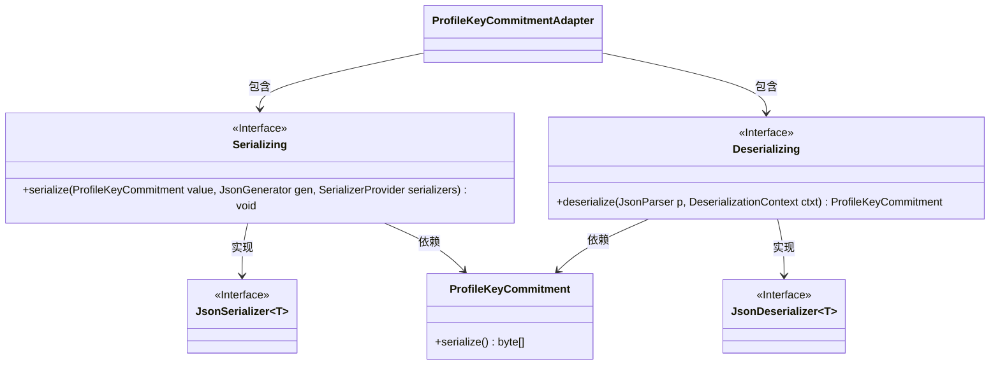
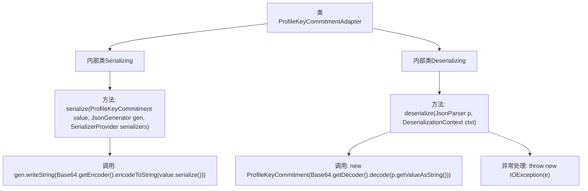

# 基础信息

|      |      |
|------|------|
| 名称 | ProfileKeyCommitmentAdapter |
| 编码语言 | .java |
| 代码路径 | Signal-Server/service/src/main/java/org/whispersystems/textsecuregcm/entities/ProfileKeyCommitmentAdapter.java |
| 包名 | org.whispersystems.textsecuregcm.entities |
| 依赖项 | ['com.fasterxml.jackson.core.JsonGenerator', 'com.fasterxml.jackson.core.JsonParser', 'com.fasterxml.jackson.databind.DeserializationContext', 'com.fasterxml.jackson.databind.JsonDeserializer', 'com.fasterxml.jackson.databind.JsonSerializer', 'com.fasterxml.jackson.databind.SerializerProvider', 'java.io.IOException', 'java.util.Base64', 'org.signal.libsignal.zkgroup.InvalidInputException', 'org.signal.libsignal.zkgroup.profiles.ProfileKeyCommitment'] |
| 概述说明 | ProfileKeyCommitmentAdapter类实现ProfileKeyCommitment对象的Base64编码转换。 |

# 说明

ProfileKeyCommitmentAdapter类提供了序列化和反序列化功能，专门用于处理ProfileKeyCommitment对象的Base64编码转换。该类能够将ProfileKeyCommitment对象转换为Base64编码格式，同时也支持将Base64编码数据还原为ProfileKeyCommitment对象，确保数据的完整性和可操作性。

# 类列表 Class Summary

| 名称   | 类型  | 说明 |
|-------|------|-------------|
| ProfileKeyCommitmentAdapter | class | ProfileKeyCommitmentAdapter类包含序列化和反序列化方法，用于处理ProfileKeyCommitment对象的Base64编码转换。 |

## 类 ProfileKeyCommitmentAdapter

|      |      |
|------|------|
| 访问范围 | public |
| 类型 | class |
| 名称 | ProfileKeyCommitmentAdapter |
| 说明 | ProfileKeyCommitmentAdapter类包含序列化和反序列化方法，用于处理ProfileKeyCommitment对象的Base64编码转换。 |

### UML类图

### 描述
该代码定义了一个`ProfileKeyCommitmentAdapter`类，其中包含两个内部类`Serializing`和`Deserializing`，分别用于序列化和反序列化`ProfileKeyCommitment`对象。`Serializing`类实现了`JsonSerializer`接口，负责将`ProfileKeyCommitment`对象序列化为Base64编码的字符串。`Deserializing`类实现了`JsonDeserializer`接口，负责将Base64编码的字符串反序列化为`ProfileKeyCommitment`对象。这两个类都依赖于`ProfileKeyCommitment`类来完成其功能。

### 内部方法调用关系图

该流程图描述了`ProfileKeyCommitmentAdapter`类及其两个内部类`Serializing`和`Deserializing`的结构和功能。`Serializing`类负责将`ProfileKeyCommitment`对象序列化为Base64编码的字符串，而`Deserializing`类则负责将Base64编码的字符串反序列化为`ProfileKeyCommitment`对象，并在反序列化过程中处理可能的异常。

### 字段列表 Field List

| 名称  | 类型  | 说明 |
|-------|-------|------|

### 方法列表 Method List

| 名称  | 类型  | 说明 |
|-------|-------|------|

