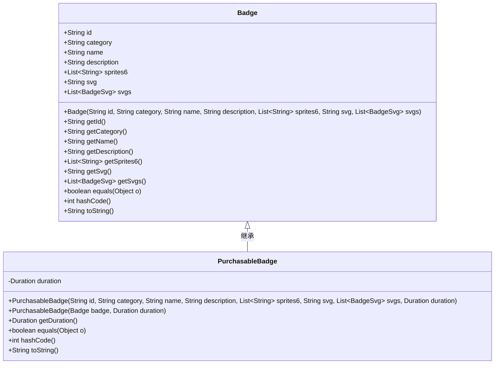
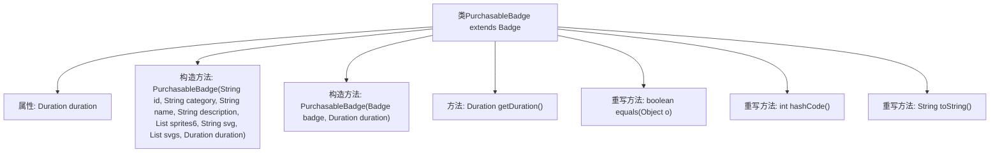

# 基础信息

|      |      |
|------|------|
| 名称 | PurchasableBadge |
| 编码语言 | .java |
| 代码路径 | Signal-Server/service/src/main/java/org/whispersystems/textsecuregcm/entities/PurchasableBadge.java |
| 包名 | org.whispersystems.textsecuregcm.entities |
| 依赖项 | ['com.fasterxml.jackson.annotation.JsonCreator', 'com.fasterxml.jackson.annotation.JsonFormat', 'com.fasterxml.jackson.annotation.JsonFormat.Shape', 'com.fasterxml.jackson.annotation.JsonProperty', 'java.time.Duration', 'java.time.temporal.ChronoUnit', 'java.util.List', 'java.util.Objects'] |
| 概述说明 | PurchasableBadge继承Badge，新增duration，重写构造方法和equals、hashCode、toString。 |

# 说明

PurchasableBadge类继承自Badge类，新增了一个duration属性，用于表示徽章的持续时间。该类提供了构造方法，用于初始化对象。同时，重写了equals、hashCode和toString方法，以确保对象的比较、哈希计算和字符串表示的准确性。这些重写方法增强了类的功能性和实用性，使其在实际应用中更加灵活和可靠。

# 类列表 Class Summary

| 名称   | 类型  | 说明 |
|-------|------|-------------|
| PurchasableBadge | class | PurchasableBadge类继承Badge，新增duration属性，提供构造方法和equals、hashCode、toString重写。 |

## 类 PurchasableBadge

|      |      |
|------|------|
| 访问范围 | public |
| 类型 | class |
| 名称 | PurchasableBadge |
| 说明 | PurchasableBadge类继承Badge，新增duration属性，提供构造方法和equals、hashCode、toString重写。 |

### UML类图

**描述**：`PurchasableBadge`类继承自`Badge`类，表示可购买的徽章。它包含一个`Duration`类型的私有成员`duration`，表示徽章的有效期。类中提供了两个构造函数，一个用于通过多个参数创建对象，另一个通过`Badge`对象和`Duration`创建对象。此外，类还重写了`equals`、`hashCode`和`toString`方法，以确保对象的正确比较和字符串表示。

### 内部方法调用关系图

这段代码定义了一个`PurchasableBadge`类，继承自`Badge`类。它包含一个`Duration`类型的属性`duration`，并提供了两个构造方法，分别用于从多个参数或一个`Badge`对象和`Duration`对象初始化`PurchasableBadge`实例。此外，它还重写了`equals`、`hashCode`和`toString`方法，确保对象的比较、哈希计算和字符串表示的准确性。

### 字段列表 Field List

| 名称  | 类型  | 说明 |
|-------|-------|------|
| duration | Duration | 定义了一个私有的不可变Duration类型变量duration。 |

### 方法列表 Method List

| 名称  | 类型  | 说明 |
|-------|-------|------|
| getDuration | Duration | 该方法返回整型格式的持续时间。 |
| hashCode | int | 重写hashCode方法，使用super.hashCode和duration生成哈希值。 |
| toString | String | 重写toString方法，返回PurchasableBadge对象及其父类信息和duration属性。 |
| equals | boolean | 重写equals方法，比较对象引用、类类型及父类属性，并检查duration是否相等。 |

