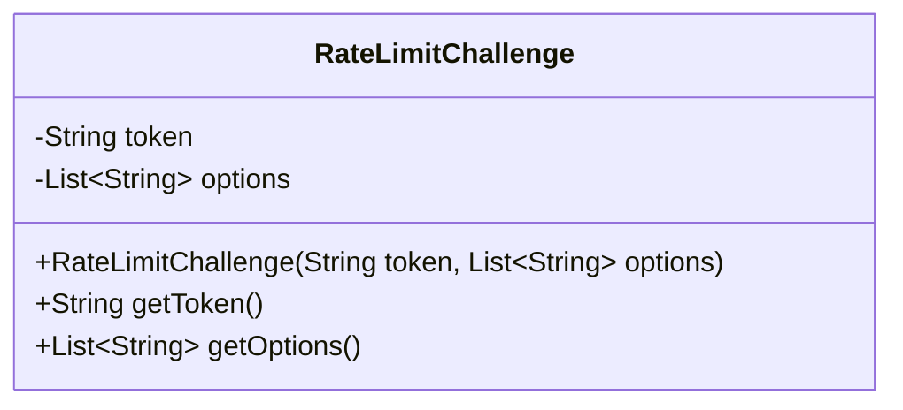
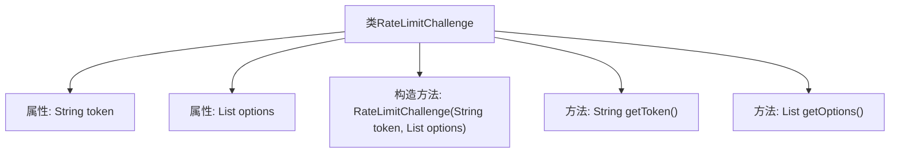

# 基础信息

|      |      |
|------|------|
| 名称 | RateLimitChallenge |
| 编码语言 | .java |
| 代码路径 | Signal-Server/service/src/main/java/org/whispersystems/textsecuregcm/entities/RateLimitChallenge.java |
| 包名 | org.whispersystems.textsecuregcm.entities |
| 依赖项 | ['com.fasterxml.jackson.annotation.JsonCreator', 'com.fasterxml.jackson.annotation.JsonProperty', 'jakarta.validation.constraints.NotNull', 'java.util.List'] |
| 概述说明 | RateLimitChallenge类含token和options属性，提供构造和获取方法。 |

# 说明

RateLimitChallenge类具有两个主要属性：token和options。该类包含一个构造函数，用于初始化这些属性，并提供相应的获取方法，以便访问和检索token和options的值。这个类设计用于处理与速率限制相关的挑战，确保相关数据能够被有效地管理和访问。

# 类列表 Class Summary

| 名称   | 类型  | 说明 |
|-------|------|-------------|
| RateLimitChallenge | class | RateLimitChallenge类包含token和options属性，并提供构造函数和获取方法。 |

## 类 RateLimitChallenge

|      |      |
|------|------|
| 访问范围 | public |
| 类型 | class |
| 名称 | RateLimitChallenge |
| 说明 | RateLimitChallenge类包含token和options属性，并提供构造函数和获取方法。 |

### UML类图

**描述：**  
`RateLimitChallenge` 类用于表示一个速率限制挑战，包含两个私有成员变量：`token` 和 `options`。`token` 是一个字符串，表示挑战的唯一标识符；`options` 是一个字符串列表，表示挑战的可选选项。类提供了一个构造函数用于初始化这两个成员变量，并提供了两个公有方法 `getToken` 和 `getOptions` 用于获取相应的值。该类使用了 `@JsonProperty` 和 `@NotNull` 注解，表明这些字段在序列化和反序列化过程中是必需的。

### 内部方法调用关系图

这段代码定义了一个名为 `RateLimitChallenge` 的类，包含两个不可变的属性 `token` 和 `options`，分别表示令牌和选项列表。类中提供了一个构造方法用于初始化这两个属性，并提供了两个公共方法 `getToken` 和 `getOptions` 来获取它们的值。代码使用了 `@JsonProperty` 和 `@JsonCreator` 注解，表明该类可以与 JSON 数据进行序列化和反序列化操作。

### 字段列表 Field List

| 名称  | 类型  | 说明 |
|-------|-------|------|
| token | String | 定义了一个不可为空且最终类型的字符串变量token。 |
| options | List<String> | 属性options为不可为空且只读的字符串列表。 |

### 方法列表 Method List

| 名称  | 类型  | 说明 |
|-------|-------|------|
| getOptions | List<String> | 获取选项列表的方法。 |
| getToken | String | 获取并返回token字符串。 |

