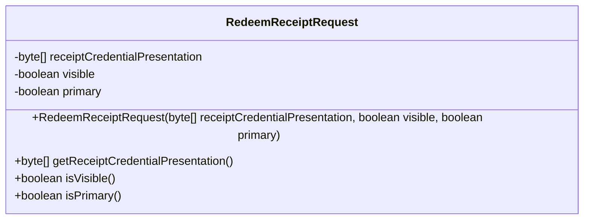
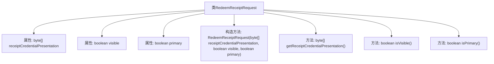

# 基础信息

|      |      |
|------|------|
| 名称 | RedeemReceiptRequest |
| 编码语言 | .java |
| 代码路径 | Signal-Server/service/src/main/java/org/whispersystems/textsecuregcm/entities/RedeemReceiptRequest.java |
| 包名 | org.whispersystems.textsecuregcm.entities |
| 依赖项 | ['com.fasterxml.jackson.annotation.JsonCreator', 'com.fasterxml.jackson.annotation.JsonProperty', 'jakarta.validation.constraints.NotEmpty'] |
| 概述说明 | RedeemReceiptRequest类含凭证展示、可见性及主状态属性。 |

# 说明

RedeemReceiptRequest类是一个用于处理凭证赎回请求的类，它包含三个主要属性。首先，凭证展示属性用于定义凭证在用户界面中的展示方式，确保用户能够清晰看到凭证内容。其次，可见性属性控制凭证的可见范围，决定哪些用户或系统可以访问该凭证。最后，主要状态属性用于跟踪凭证的当前状态，如已使用、未使用或已过期，以便系统能够根据状态进行相应的处理。这些属性共同确保了凭证赎回过程的有效管理和用户体验的优化。

# 类列表 Class Summary

| 名称   | 类型  | 说明 |
|-------|------|-------------|
| RedeemReceiptRequest | class | RedeemReceiptRequest类包含凭证展示、可见性和主要状态属性。 |

## 类 RedeemReceiptRequest

|      |      |
|------|------|
| 访问范围 | public |
| 类型 | class |
| 名称 | RedeemReceiptRequest |
| 说明 | RedeemReceiptRequest类包含凭证展示、可见性和主要状态属性。 |

### UML类图

这段代码定义了一个名为 `RedeemReceiptRequest` 的类，用于表示一个收据兑换请求。该类包含三个私有属性：`receiptCredentialPresentation`（收据凭证表示）、`visible`（是否可见）和 `primary`（是否为主收据）。通过构造函数初始化这些属性，并提供了相应的 getter 方法来获取它们的值。该类使用了 `@JsonCreator` 和 `@JsonProperty` 注解，表明它可以通过 JSON 数据进行反序列化。

### 内部方法调用关系图

这段代码定义了一个名为 `RedeemReceiptRequest` 的类，该类包含三个属性：`receiptCredentialPresentation`、`visible` 和 `primary`。类通过 `@JsonCreator` 注解的构造方法进行初始化，并通过 `@JsonProperty` 注解将 JSON 属性映射到类的属性上。类还提供了三个方法分别用于获取这些属性的值。流程图清晰地展示了类的结构及其内部方法之间的关系。

### 字段列表 Field List

| 名称  | 类型  | 说明 |
|-------|-------|------|
| receiptCredentialPresentation | byte[] | 私有字节数组存储收据凭证展示信息。 |
| visible | boolean | 定义一个私有的不可变的布尔变量visible。 |
| primary | boolean | 私有布尔变量primary，用于标记是否为主。 |

### 方法列表 Method List

| 名称  | 类型  | 说明 |
|-------|-------|------|
| isVisible | boolean | 该方法返回布尔值，表示对象的可见性状态。 |
| isPrimary | boolean | 该方法返回布尔值，表示是否为主要的。 |
| getReceiptCredentialPresentation | byte[] | 获取收据凭证展示的字节数组方法。 |

