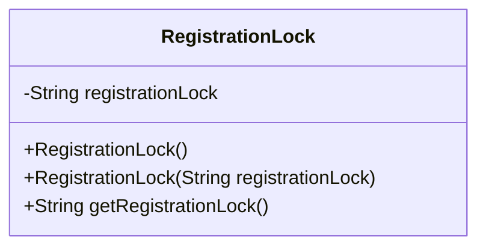
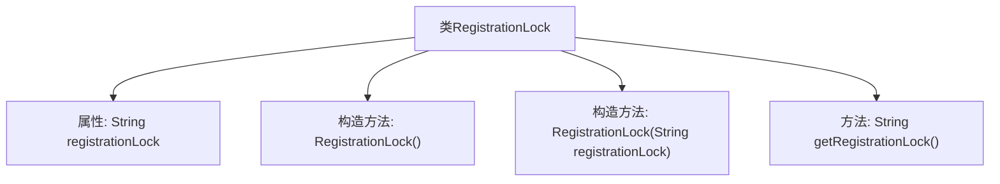

# 基础信息

|      |      |
|------|------|
| 名称 | RegistrationLock |
| 编码语言 | .java |
| 代码路径 | Signal-Server/service/src/main/java/org/whispersystems/textsecuregcm/entities/RegistrationLock.java |
| 包名 | org.whispersystems.textsecuregcm.entities |
| 依赖项 | ['com.fasterxml.jackson.annotation.JsonProperty', 'com.google.common.annotations.VisibleForTesting', 'jakarta.validation.constraints.NotEmpty', 'jakarta.validation.constraints.Size'] |
| 概述说明 | 类RegistrationLock包含64字符注册锁字符串，提供构造和获取方法。 |

# 说明

类RegistrationLock包含一个长度为64字符的注册锁字符串，提供了构造方法和获取方法，用于生成和获取该注册锁字符串。

# 类列表 Class Summary

| 名称   | 类型  | 说明 |
|-------|------|-------------|
| RegistrationLock | class | 类RegistrationLock包含64字符长度的注册锁字符串，提供构造和获取方法。 |

## 类 RegistrationLock

|      |      |
|------|------|
| 访问范围 | public |
| 类型 | class |
| 名称 | RegistrationLock |
| 说明 | 类RegistrationLock包含64字符长度的注册锁字符串，提供构造和获取方法。 |

### UML类图

这段代码定义了一个名为 `RegistrationLock` 的类，用于表示一个注册锁。该类包含一个私有字符串类型的 `registrationLock` 属性，并通过构造函数和 `getRegistrationLock` 方法进行初始化和访问。`registrationLock` 属性通过 `@JsonProperty`、`@Size` 和 `@NotEmpty` 注解进行约束，确保其长度为64且不为空。此外，提供了一个带有 `@VisibleForTesting` 注解的构造函数，便于测试时使用。

### 内部方法调用关系图

这段代码定义了一个名为 `RegistrationLock` 的类，包含一个私有字符串属性 `registrationLock`，该属性通过 `@JsonProperty`、`@Size` 和 `@NotEmpty` 注解进行约束。类提供了两个构造方法，一个无参构造方法和一个用于测试的带参构造方法，以及一个获取 `registrationLock` 值的方法 `getRegistrationLock`。流程图展示了类的结构及其内部方法的调用关系。

### 字段列表 Field List

| 名称  | 类型  | 说明 |
|-------|-------|------|
| registrationLock | String | 注册锁字段需为64字符非空字符串。 |

### 方法列表 Method List

| 名称  | 类型  | 说明 |
|-------|-------|------|
| getRegistrationLock | String | 获取注册锁方法，返回registrationLock变量值。 |

