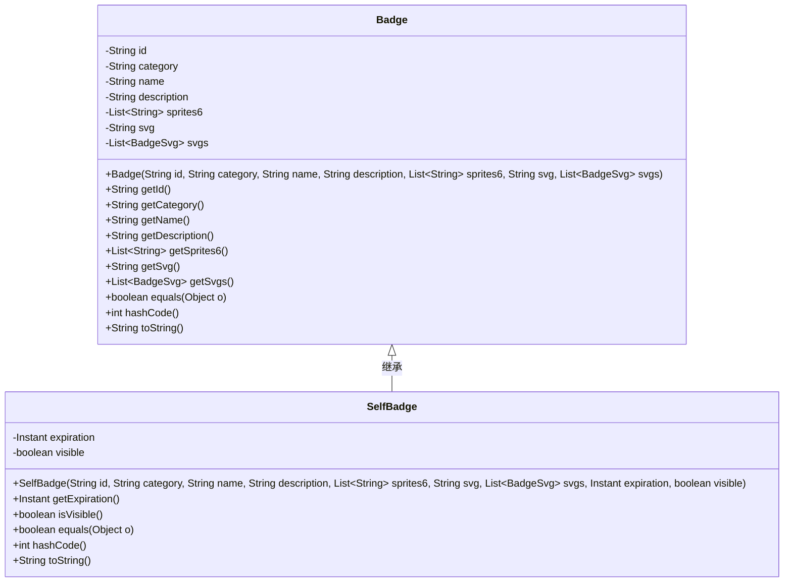
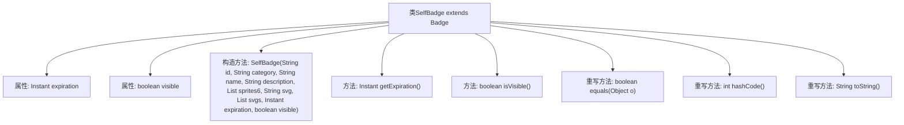

# 基础信息

|      |      |
|------|------|
| 名称 | SelfBadge |
| 编码语言 | .java |
| 代码路径 | Signal-Server/service/src/main/java/org/whispersystems/textsecuregcm/entities/SelfBadge.java |
| 包名 | org.whispersystems.textsecuregcm.entities |
| 依赖项 | ['com.fasterxml.jackson.annotation.JsonProperty', 'java.time.Instant', 'java.util.List', 'java.util.Objects'] |
| 概述说明 | SelfBadge继承Badge，含过期时间和可见性，重写equals、hashCode、toString方法。 |

# 说明

SelfBadge类继承自Badge类，具备过期时间和可见性两个属性。该类重写了equals方法，用于比较两个SelfBadge对象的相等性；重写了hashCode方法，确保对象在哈希表中的一致性；重写了toString方法，提供对象的字符串表示。这些重写方法确保了SelfBadge类在比较、存储和输出时的正确性和一致性。

# 类列表 Class Summary

| 名称   | 类型  | 说明 |
|-------|------|-------------|
| SelfBadge | class | SelfBadge类继承Badge，包含过期时间和可见性属性，并重写equals、hashCode和toString方法。 |

## 类 SelfBadge

|      |      |
|------|------|
| 访问范围 | public |
| 类型 | class |
| 名称 | SelfBadge |
| 说明 | SelfBadge类继承Badge，包含过期时间和可见性属性，并重写equals、hashCode和toString方法。 |

### UML类图

### 描述
`SelfBadge` 类继承自 `Badge` 类，扩展了 `Badge` 的功能，增加了 `expiration` 和 `visible` 两个属性。`SelfBadge` 类通过构造函数初始化这些属性，并提供了相应的 getter 方法。此外，`SelfBadge` 重写了 `equals`、`hashCode` 和 `toString` 方法，以确保对象的比较、哈希计算和字符串表示的正确性。`SelfBadge` 类依赖于 `Badge` 类的属性和方法，继承了 `Badge` 的所有功能，并在此基础上进行了扩展。

### 内部方法调用关系图

这段代码定义了一个名为`SelfBadge`的类，该类继承自`Badge`类。`SelfBadge`类包含两个私有属性：`expiration`和`visible`，分别表示徽章的过期时间和可见性。类中定义了一个构造方法，用于初始化这些属性，并提供了获取这些属性的方法。此外，类还重写了`equals`、`hashCode`和`toString`方法，以确保对象的比较、哈希码生成和字符串表示的准确性。流程图展示了类的结构及其方法之间的关系。

### 字段列表 Field List

| 名称  | 类型  | 说明 |
|-------|-------|------|
| expiration | Instant | 私有不可变的过期时间变量。 |
| visible | boolean | 声明一个私有的不可变的布尔类型变量visible。 |

### 方法列表 Method List

| 名称  | 类型  | 说明 |
|-------|-------|------|
| getExpiration | Instant | 获取过期时间的公共方法。 |
| isVisible | boolean | 方法isVisible返回布尔值visible的状态。 |
| hashCode | int | 重写hashCode方法，返回包含父类、expiration和visible的哈希值。 |
| equals | boolean | 重写equals方法，比较对象引用、类型、父类及属性。 |
| toString | String | 重写toString方法，返回包含父类、过期时间和可见性的字符串。 |

