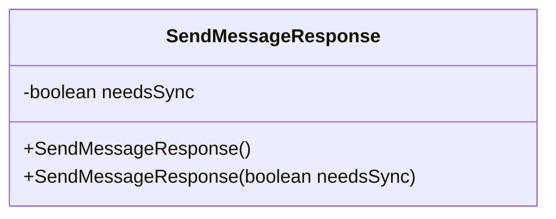
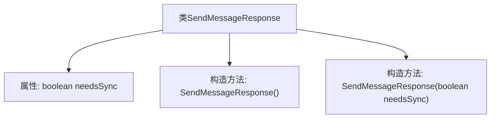

# 基础信息

|      |      |
|------|------|
| 名称 | SendMessageResponse |
| 编码语言 | .java |
| 代码路径 | Signal-Server/service/src/main/java/org/whispersystems/textsecuregcm/entities/SendMessageResponse.java |
| 包名 | org.whispersystems.textsecuregcm.entities |
| 依赖项 | ['com.fasterxml.jackson.annotation.JsonProperty'] |
| 概述说明 | SendMessageResponse类的needsSync属性表示同步需求。 |

# 说明

SendMessageResponse类中包含一个名为needsSync的属性，该属性用于指示当前是否需要执行同步操作。这个属性通常用于判断系统或应用程序的状态，以决定是否需要进行数据或状态的同步，确保信息的一致性和及时更新。通过needsSync属性，开发者可以有效地管理同步流程，避免不必要的资源消耗和数据冲突。

# 类列表 Class Summary

| 名称   | 类型  | 说明 |
|-------|------|-------------|
| SendMessageResponse | class | SendMessageResponse类包含needsSync属性，用于指示是否需要同步。 |

## 类 SendMessageResponse

|      |      |
|------|------|
| 访问范围 | public |
| 类型 | class |
| 名称 | SendMessageResponse |
| 说明 | SendMessageResponse类包含needsSync属性，用于指示是否需要同步。 |

### UML类图

这段代码定义了一个名为 `SendMessageResponse` 的类，该类包含一个私有布尔类型的成员变量 `needsSync`，以及两个构造函数：一个无参构造函数和一个带布尔参数的构造函数。`needsSync` 用于表示是否需要同步操作。类图展示了类的结构，包括成员变量和构造函数的访问权限和类型。

### 内部方法调用关系图

这段代码定义了一个名为 `SendMessageResponse` 的类，包含一个布尔类型的属性 `needsSync` 和两个构造方法。第一个构造方法是无参构造方法，第二个构造方法接受一个布尔参数并初始化 `needsSync` 属性。该类主要用于表示发送消息后的响应状态，`needsSync` 属性用于指示是否需要同步操作。

### 字段列表 Field List

| 名称  | 类型  | 说明 |
|-------|-------|------|
| needsSync | boolean | 属性needsSync用于标识是否需要同步。 |

### 方法列表 Method List

| 名称  | 类型  | 说明 |
|-------|-------|------|

