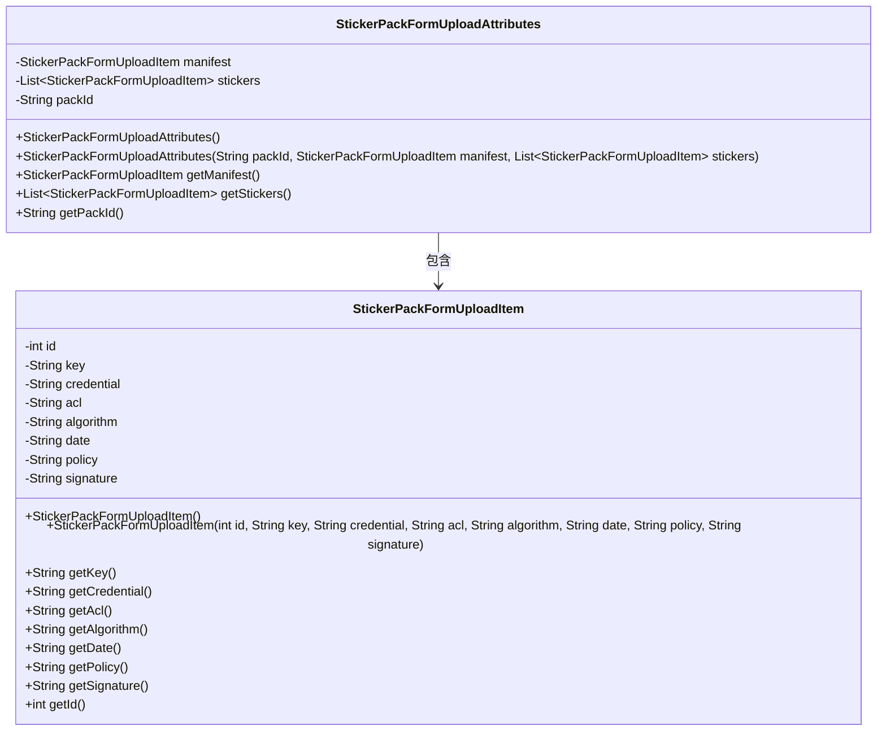

# 基础信息

|      |      |
|------|------|
| 名称 | StickerPackFormUploadAttributes |
| 编码语言 | .java |
| 代码路径 | Signal-Server/service/src/main/java/org/whispersystems/textsecuregcm/entities/StickerPackFormUploadAttributes.java |
| 包名 | org.whispersystems.textsecuregcm.entities |
| 依赖项 | ['com.fasterxml.jackson.annotation.JsonProperty', 'java.util.List'] |
| 概述说明 | StickerPackFormUploadAttributes类管理贴纸包上传信息，包含packId、manifest和stickers属性。 |

# 说明

StickerPackFormUploadAttributes类包含三个关键属性：packId、manifest和stickers。该类主要用于管理贴纸包的上传信息，其中packId用于标识贴纸包的唯一ID，manifest存储贴纸包的元数据或配置信息，stickers则包含贴纸包中的具体贴纸内容。通过这三个属性，该类能够有效地组织和处理贴纸包的上传和存储过程。

# 类列表 Class Summary

| 名称   | 类型  | 说明 |
|-------|------|-------------|
| StickerPackFormUploadAttributes | class | StickerPackFormUploadAttributes类包含packId、manifest和stickers属性，用于管理贴纸包上传信息。 |

## 类 StickerPackFormUploadAttributes

|      |      |
|------|------|
| 访问范围 | public |
| 类型 | class |
| 名称 | StickerPackFormUploadAttributes |
| 说明 | StickerPackFormUploadAttributes类包含packId、manifest和stickers属性，用于管理贴纸包上传信息。 |

### UML类图

**描述：**  
`StickerPackFormUploadAttributes` 类用于管理贴纸包的上传属性，包含一个 `StickerPackFormUploadItem` 类型的 `manifest` 和一个 `StickerPackFormUploadItem` 类型的列表 `stickers`，以及一个 `packId`。`StickerPackFormUploadItem` 类则定义了每个上传项的详细属性，如 `id`、`key`、`credential` 等。这两个类共同协作，用于处理和存储贴纸包上传时的相关数据。

### 内部方法调用关系图

```mermaid
graph TD
    A["类StickerPackFormUploadAttributes"]
    B["属性: StickerPackFormUploadItem manifest"]
    C["属性: List<StickerPackFormUploadItem> stickers"]
    D["属性: String packId"]
    E["构造方法: StickerPackFormUploadAttributes()"]
    F["构造方法: StickerPackFormUploadAttributes(String packId, StickerPackFormUploadItem manifest, List<StickerPackFormUploadItem> stickers)"]
    G["方法: StickerPackFormUploadItem getManifest()"]
    H["方法: List<StickerPackFormUploadItem> getStickers()"]
    I["方法: String getPackId()"]
    J["内部类StickerPackFormUploadItem"]
    K["属性: int id"]
    L["属性: String key"]
    M["属性: String credential"]
    N["属性: String acl"]
    O["属性: String algorithm"]
    P["属性: String date"]
    Q["属性: String policy"]
    R["属性: String signature"]
    S["构造方法: StickerPackFormUploadItem()"]
    T["构造方法: StickerPackFormUploadItem(int id, String key, String credential, String acl, String algorithm, String date, String policy, String signature)"]
    U["方法: String getKey()"]
    V["方法: String getCredential()"]
    W["方法: String getAcl()"]
    X["方法: String getAlgorithm()"]
    Y["方法: String getDate()"]
    Z["方法: String getPolicy()"]
    AA["方法: String getSignature()"]
    AB["方法: int getId()"]

    A --> B
    A --> C
    A --> D
    A --> E
    A --> F
    A --> G
    A --> H
    A --> I
    A --> J
    J --> K
    J --> L
    J --> M
    J --> N
    J --> O
    J --> P
    J --> Q
    J --> R
    J --> S
    J --> T
    J --> U
    J --> V
    J --> W
    J --> X
    J --> Y
    J --> Z
    J --> AA
    J --> AB
```

这段代码定义了一个名为 `StickerPackFormUploadAttributes` 的类，该类包含三个属性：`manifest`、`stickers` 和 `packId`，并提供了相应的构造方法和getter方法。此外，该类还包含一个内部类 `StickerPackFormUploadItem`，该类定义了多个属性和方法，用于管理贴纸包的上传项信息。流程图展示了类与内部类之间的关系以及各个方法的调用顺序。

### 字段列表 Field List

| 名称  | 类型  | 说明 |
|-------|-------|------|
| packId | String | 属性packId使用JsonProperty注解进行序列化。 |
| stickers | List<StickerPackFormUploadItem> | 包含StickerPackFormUploadItem类型的私有贴纸列表。 |
| manifest | StickerPackFormUploadItem | JSON属性绑定为StickerPackFormUploadItem类型的manifest字段。 |

### 方法列表 Method List

| 名称  | 类型  | 说明 |
|-------|-------|------|
| getStickers | List<StickerPackFormUploadItem> | 获取贴纸包上传项列表的方法。 |
| getPackId | String | 该方法返回 packId 字符串。 |
| getManifest | StickerPackFormUploadItem | 获取StickerPackFormUploadItem的manifest方法。 |

