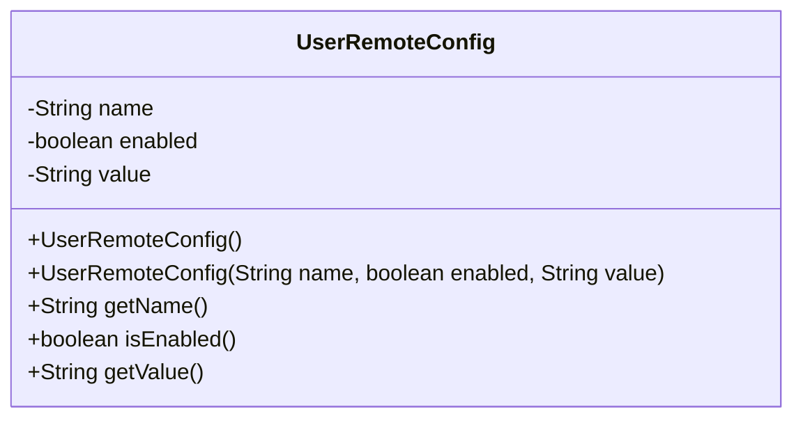
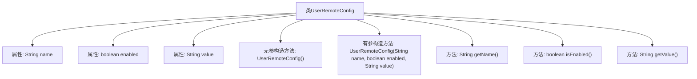

# 基础信息

|      |      |
|------|------|
| 名称 | UserRemoteConfig |
| 编码语言 | .java |
| 代码路径 | Signal-Server/service/src/main/java/org/whispersystems/textsecuregcm/entities/UserRemoteConfig.java |
| 包名 | org.whispersystems.textsecuregcm.entities |
| 依赖项 | ['com.fasterxml.jackson.annotation.JsonProperty', 'io.swagger.v3.oas.annotations.media.Schema'] |
| 概述说明 | 用户远程配置类：名称、启用状态、配置值。 |

# 说明

用户远程配置类是一个用于管理远程配置的结构体，主要包含三个关键属性：名称、启用状态和配置值。名称用于标识具体的配置项，启用状态用于控制配置项是否生效，配置值则存储具体的配置数据。该类设计简洁，便于在远程配置管理系统中进行配置项的增删改查操作，确保配置的灵活性和可维护性。

# 类列表 Class Summary

| 名称   | 类型  | 说明 |
|-------|------|-------------|
| UserRemoteConfig | class | 用户远程配置类，包含名称、启用状态和配置值。 |

## 类 UserRemoteConfig

|      |      |
|------|------|
| 访问范围 | public |
| 类型 | class |
| 名称 | UserRemoteConfig |
| 说明 | 用户远程配置类，包含名称、启用状态和配置值。 |

### UML类图

这段代码定义了一个名为 `UserRemoteConfig` 的类，用于表示用户的远程配置信息。该类包含三个私有属性：`name`（配置名称）、`enabled`（配置是否启用）和 `value`（配置的值）。类中提供了两个构造函数，一个无参构造函数和一个带参构造函数，以及三个公有方法用于获取这些属性的值。这个类主要用于存储和获取用户的远程配置信息。

### 内部方法调用关系图

这段代码定义了一个名为`UserRemoteConfig`的类，用于表示用户的远程配置信息。类中包含三个属性：`name`表示配置名称，`enabled`表示配置是否启用，`value`表示配置的值。类提供了两个构造方法，一个无参构造方法和一个有参构造方法，用于初始化对象。此外，类还提供了三个getter方法，分别用于获取`name`、`enabled`和`value`的值。这段代码主要用于管理和访问用户的远程配置信息。

### 字段列表 Field List

| 名称  | 类型  | 说明 |
|-------|-------|------|
| enabled | boolean | 用户配置启用状态。 |
| value | String | 配置值，用于非布尔类型。 |
| name | String | 配置名称字段，示例为“android.exampleFeature”。 |

### 方法列表 Method List

| 名称  | 类型  | 说明 |
|-------|-------|------|
| isEnabled | boolean | 方法isEnabled返回布尔值enabled的状态。 |
| getValue | String | 方法getValue返回变量value的值。 |
| getName | String | 该方法返回对象的名称属性。 |

