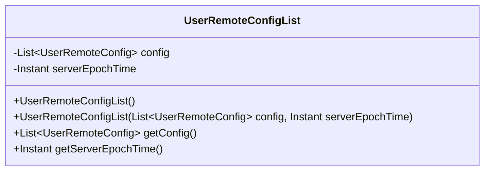
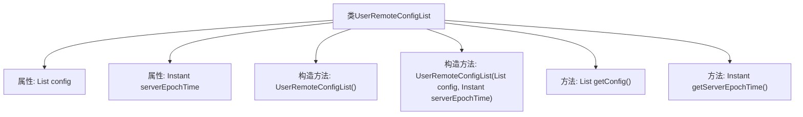

# 基础信息

|      |      |
|------|------|
| 名称 | UserRemoteConfigList |
| 编码语言 | .java |
| 代码路径 | Signal-Server/service/src/main/java/org/whispersystems/textsecuregcm/entities/UserRemoteConfigList.java |
| 包名 | org.whispersystems.textsecuregcm.entities |
| 依赖项 | ['com.fasterxml.jackson.annotation.JsonFormat', 'com.fasterxml.jackson.annotation.JsonProperty', 'com.fasterxml.jackson.databind.annotation.JsonSerialize', 'java.time.Instant', 'java.util.List', 'io.swagger.v3.oas.annotations.media.Schema', 'org.whispersystems.textsecuregcm.util.InstantAdapter'] |
| 概述说明 | 用户远程配置类，含配置列表及生成时间戳。 |

# 说明

用户远程配置列表类是一个用于管理远程配置的数据结构，主要包含两个核心部分：配置列表和生成时间戳。配置列表用于存储用户自定义的远程配置项，支持动态更新和查询。生成时间戳记录了配置列表的最后更新时间，确保用户能够获取最新的配置信息。该类的设计旨在提供高效、可靠的远程配置管理，适用于需要频繁更新和同步配置的场景。

# 类列表 Class Summary

| 名称   | 类型  | 说明 |
|-------|------|-------------|
| UserRemoteConfigList | class | 用户远程配置列表类，包含配置列表和生成时间戳。 |

## 类 UserRemoteConfigList

|      |      |
|------|------|
| 访问范围 | public |
| 类型 | class |
| 名称 | UserRemoteConfigList |
| 说明 | 用户远程配置列表类，包含配置列表和生成时间戳。 |

### UML类图

类图描述：
`UserRemoteConfigList` 类用于存储用户的远程配置列表及其生成时间。该类包含两个私有成员：`config` 是一个 `UserRemoteConfig` 类型的列表，用于存储配置信息；`serverEpochTime` 是一个 `Instant` 类型的时间戳，表示配置生成的时间，但已被弃用。类提供了两个构造函数和一个默认构造函数，以及获取配置列表和时间戳的公有方法。

### 内部方法调用关系图

这段代码定义了一个名为`UserRemoteConfigList`的类，该类包含两个属性：`config`和`serverEpochTime`。`config`是一个`UserRemoteConfig`对象的列表，`serverEpochTime`是一个`Instant`类型的时间戳。类中有两个构造方法，一个无参构造方法和一个带参构造方法，用于初始化这两个属性。此外，类中还提供了两个getter方法，分别用于获取`config`和`serverEpochTime`的值。

### 字段列表 Field List

| 名称  | 类型  | 说明 |
|-------|-------|------|
| config | List<UserRemoteConfig> | 用户远程配置列表。 |
| serverEpochTime | Instant | 配置生成时间戳，已弃用，建议使用`X-Signal-Timestamp`响应头。 |

### 方法列表 Method List

| 名称  | 类型  | 说明 |
|-------|-------|------|
| getConfig | List<UserRemoteConfig> | 该方法返回用户远程配置列表。 |
| getServerEpochTime | Instant | 获取服务器时间戳的方法。 |

