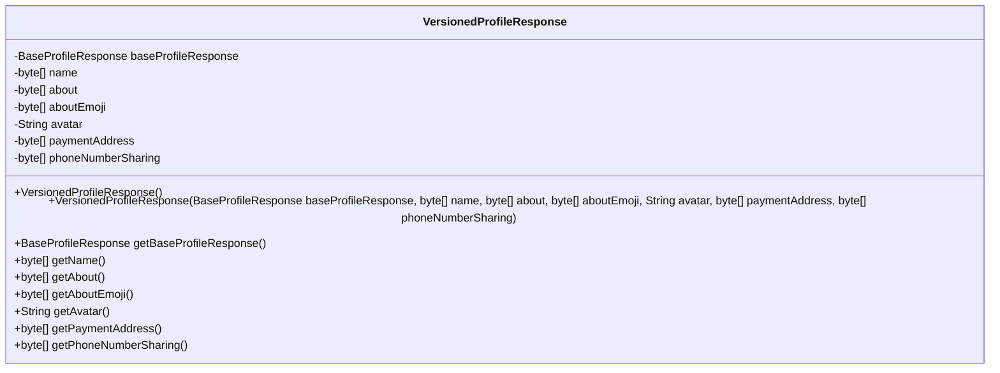

# 基础信息

|      |      |
|------|------|
| 名称 | VersionedProfileResponse |
| 编码语言 | .java |
| 代码路径 | Signal-Server/service/src/main/java/org/whispersystems/textsecuregcm/entities/VersionedProfileResponse.java |
| 包名 | org.whispersystems.textsecuregcm.entities |
| 依赖项 | ['com.fasterxml.jackson.annotation.JsonProperty', 'com.fasterxml.jackson.annotation.JsonUnwrapped', 'com.fasterxml.jackson.databind.annotation.JsonDeserialize', 'com.fasterxml.jackson.databind.annotation.JsonSerialize', 'org.whispersystems.textsecuregcm.util.ByteArrayBase64WithPaddingAdapter'] |
| 概述说明 | VersionedProfileResponse类包含基本信息、名称、简介、表情、头像、支付地址和电话号码共享。 |

# 说明

VersionedProfileResponse类是一个包含多个关键属性的数据结构，用于存储和管理用户的基础信息。这些属性包括用户的名称、简介、表情、头像、支付地址以及电话号码共享状态。该类的设计旨在提供一个全面的用户信息视图，方便系统在不同版本中管理和更新用户资料。通过整合这些属性，VersionedProfileResponse类能够有效地支持用户信息的版本控制和共享功能，确保数据的一致性和可访问性。

# 类列表 Class Summary

| 名称   | 类型  | 说明 |
|-------|------|-------------|
| VersionedProfileResponse | class | VersionedProfileResponse类包含基础信息、名称、简介、表情、头像、支付地址和电话号码共享。 |

## 类 VersionedProfileResponse

|      |      |
|------|------|
| 访问范围 | public |
| 类型 | class |
| 名称 | VersionedProfileResponse |
| 说明 | VersionedProfileResponse类包含基础信息、名称、简介、表情、头像、支付地址和电话号码共享。 |

### UML类图

这段代码定义了一个名为 `VersionedProfileResponse` 的类，用于表示版本化的用户档案响应。该类包含多个私有字段，如 `baseProfileResponse`、`name`、`about`、`aboutEmoji`、`avatar`、`paymentAddress` 和 `phoneNumberSharing`，分别用于存储用户的基本档案信息、姓名、简介、表情符号、头像、支付地址和电话号码共享信息。类提供了两个构造函数，一个无参构造函数和一个全参构造函数，以及多个 getter 方法用于获取这些字段的值。该类主要用于处理与用户档案相关的数据，并通过 `@JsonProperty` 和 `@JsonSerialize`、`@JsonDeserialize` 注解实现 JSON 序列化和反序列化。

### 内部方法调用关系图

```mermaid
graph TD
    A["类VersionedProfileResponse"]
    B["属性: BaseProfileResponse baseProfileResponse"]
    C["属性: byte[] name"]
    D["属性: byte[] about"]
    E["属性: byte[] aboutEmoji"]
    F["属性: String avatar"]
    G["属性: byte[] paymentAddress"]
    H["属性: byte[] phoneNumberSharing"]
    I["构造方法: VersionedProfileResponse()"]
    J["构造方法: VersionedProfileResponse(BaseProfileResponse baseProfileResponse, byte[] name, byte[] about, byte[] aboutEmoji, String avatar, byte[] paymentAddress, byte[] phoneNumberSharing)"]
    K["方法: BaseProfileResponse getBaseProfileResponse()"]
    L["方法: byte[] getName()"]
    M["方法: byte[] getAbout()"]
    N["方法: byte[] getAboutEmoji()"]
    O["方法: String getAvatar()"]
    P["方法: byte[] getPaymentAddress()"]
    Q["方法: byte[] getPhoneNumberSharing()"]

    A --> B
    A --> C
    A --> D
    A --> E
    A --> F
    A --> G
    A --> H
    A --> I
    A --> J
    A --> K
    A --> L
    A --> M
    A --> N
    A --> O
    A --> P
    A --> Q
```

这段代码定义了一个名为 `VersionedProfileResponse` 的类，该类包含多个属性，分别用于存储不同类型的用户资料信息。类中有两个构造方法，一个无参构造方法和一个带参构造方法，用于初始化这些属性。此外，类还提供了多个 getter 方法，用于获取各个属性的值。这些属性和方法共同构成了一个完整的用户资料响应对象，用于在系统中处理和传递用户资料信息。

### 字段列表 Field List

| 名称  | 类型  | 说明 |
|-------|-------|------|
| avatar | String | 属性avatar用于存储用户头像信息。 |
| phoneNumberSharing | byte[] | 使用注解处理字节数组的JSON序列化与反序列化。 |
| baseProfileResponse | BaseProfileResponse | 该代码片段使用@JsonUnwrapped注解将BaseProfileResponse对象解包到父类中。 |
| paymentAddress | byte[] | 使用Base64编码序列化和反序列化支付地址字节数组。 |
| name | byte[] | 使用注解序列化与反序列化字节数组为Base64格式。 |
| aboutEmoji | byte[] | 属性aboutEmoji使用Base64编码进行序列化和反序列化。 |
| about | byte[] | 使用注解处理字节数组的Base64编码与反序列化。 |

### 方法列表 Method List

| 名称  | 类型  | 说明 |
|-------|-------|------|
| getBaseProfileResponse | BaseProfileResponse | 方法返回基础配置文件响应对象。 |
| getAbout | byte[] | 该方法返回字节数组类型的about变量。 |
| getName | byte[] | 返回字节数组类型的name属性。 |
| getPaymentAddress | byte[] | 获取支付地址的字节数组方法。 |
| getPhoneNumberSharing | byte[] | 返回电话号码共享的字节数组。 |
| getAboutEmoji | byte[] | 该方法返回一个字节数组类型的aboutEmoji。 |
| getAvatar | String | 获取头像路径的Java方法。 |

