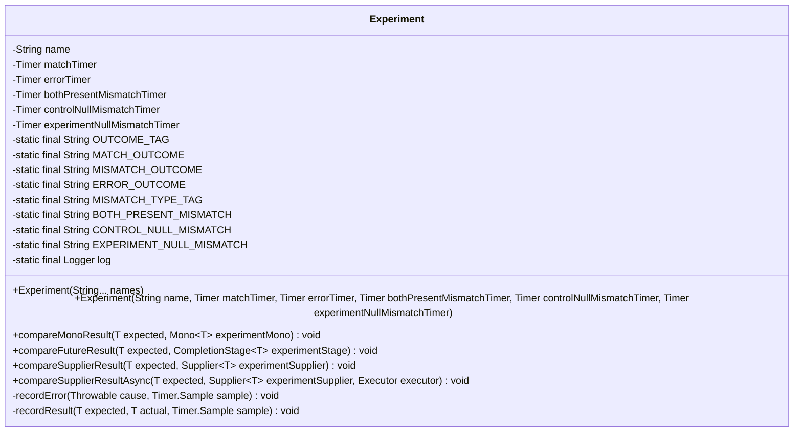
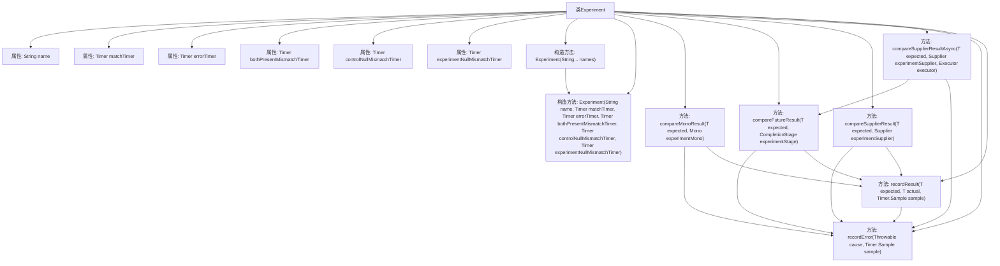

# 基础信息

|      |      |
|------|------|
| 名称 | Experiment |
| 编码语言 | .java |
| 代码路径 | Signal-Server/service/src/main/java/org/whispersystems/textsecuregcm/experiment/Experiment.java |
| 包名 | org.whispersystems.textsecuregcm.experiment |
| 依赖项 | ['org.whispersystems.textsecuregcm.metrics.MetricsUtil.name', 'com.google.common.annotations.VisibleForTesting', 'io.micrometer.core.instrument.Metrics', 'io.micrometer.core.instrument.Timer', 'java.util.Objects', 'java.util.Optional', 'java.util.concurrent.CompletableFuture', 'java.util.concurrent.CompletionStage', 'java.util.concurrent.Executor', 'java.util.function.Supplier', 'org.slf4j.Logger', 'org.slf4j.LoggerFactory', 'reactor.core.publisher.Mono'] |
| 概述说明 | 实验类用于记录匹配、错误及三种不匹配情况的计时器。 |

# 说明

该实验类主要用于记录匹配、错误以及三种不匹配情况的计时器。其功能涵盖了多种场景下的时间记录，确保能够精确捕捉匹配成功、错误发生以及三种不同不匹配情况的时间点。通过这种方式，实验类能够全面监控和分析实验过程中的各类事件，为后续的数据分析和优化提供准确的时间依据。

# 类列表 Class Summary

| 名称   | 类型  | 说明 |
|-------|------|-------------|
| Experiment | class | 实验类，记录匹配、错误及三种不匹配情况的计时器。 |

## 类 Experiment

|      |      |
|------|------|
| 访问范围 | public |
| 类型 | class |
| 名称 | Experiment |
| 说明 | 实验类，记录匹配、错误及三种不匹配情况的计时器。 |

### UML类图

这段代码定义了一个名为 `Experiment` 的类，用于比较实验性结果与预期结果。类中包含多个 `Timer` 实例，用于记录不同情况下的时间消耗，如匹配、错误和不同类型的失配。类提供了多种方法来比较不同来源的结果（如 `Mono`、`CompletionStage` 和 `Supplier`），并根据比较结果选择适当的计时器进行记录。此外，类还提供了记录错误和结果的私有方法，确保在不同情况下能够正确记录时间消耗。

### 内部方法调用关系图

这段代码定义了一个名为`Experiment`的类，用于比较实验结果。类中包含多个计时器属性，用于记录匹配、错误和不同类型的失配情况。构造方法用于初始化这些计时器，而多个比较方法（如`compareMonoResult`、`compareFutureResult`等）则用于处理不同类型的实验结果，并根据结果调用`recordError`或`recordResult`方法来记录结果或错误。`recordResult`方法会根据预期值和实际值的匹配情况选择适当的计时器进行记录。

### 字段列表 Field List

| 名称  | 类型  | 说明 |
|-------|-------|------|
| name | String | 定义了一个私有的最终字符串变量name。 |
| controlNullMismatchTimer | Timer | 私有定时器用于控制空值不匹配。 |
| OUTCOME_TAG = "outcome" | String | 定义静态常量OUTCOME_TAG，值为"outcome"。 |
| experimentNullMismatchTimer | Timer | 私有计时器用于实验空值不匹配检测。 |
| bothPresentMismatchTimer | Timer | 私有计时器用于处理同时存在的不匹配情况。 |
| errorTimer | Timer | 定义了一个私有且不可变的计时器变量errorTimer。 |
| MATCH_OUTCOME = "match" | String | 定义常量MATCH_OUTCOME，值为"match"。 |
| log = LoggerFactory.getLogger(Experiment.class) | Logger | 定义私有静态日志对象，用于记录Experiment类的日志信息。 |
| matchTimer | Timer | 定义了一个私有且不可变的计时器变量matchTimer。 |
| EXPERIMENT_NULL_MISMATCH = "experimentResultNull" | String | 定义常量表示实验结果为空不匹配。 |
| MISMATCH_TYPE_TAG = "mismatchType" | String | 定义私有静态常量字符串MISMATCH_TYPE_TAG，值为"mismatchType"。 |
| ERROR_OUTCOME = "error" | String | 定义常量ERROR_OUTCOME，值为"error"。 |
| BOTH_PRESENT_MISMATCH = "bothPresent" | String | 定义常量BOTH_PRESENT_MISMATCH，值为"bothPresent"。 |
| MISMATCH_OUTCOME = "mismatch" | String | 定义常量字符串MISMATCH_OUTCOME，值为"mismatch"。 |
| CONTROL_NULL_MISMATCH = "controlResultNull" | String | 定义常量CONTROL_NULL_MISMATCH，值为"controlResultNull"。 |

### 方法列表 Method List

| 名称  | 类型  | 说明 |
|-------|-------|------|
| recordError | void | 记录错误并停止计时器，记录异常信息。 |
| compareSupplierResult | void | 方法比较预期值与供应商结果，记录结果或错误。 |
| compareSupplierResultAsync | void | 异步比较供应商结果，记录错误和时间。 |
| compareMonoResult | void | 比较Mono结果，记录成功或错误，并计时。 |
| recordResult | void | 测试方法记录结果，处理Optional类型，根据预期和实际值选择计时器并停止计时。 |
| compareFutureResult | void | 方法比较预期结果与异步计算结果，记录错误或结果。 |

