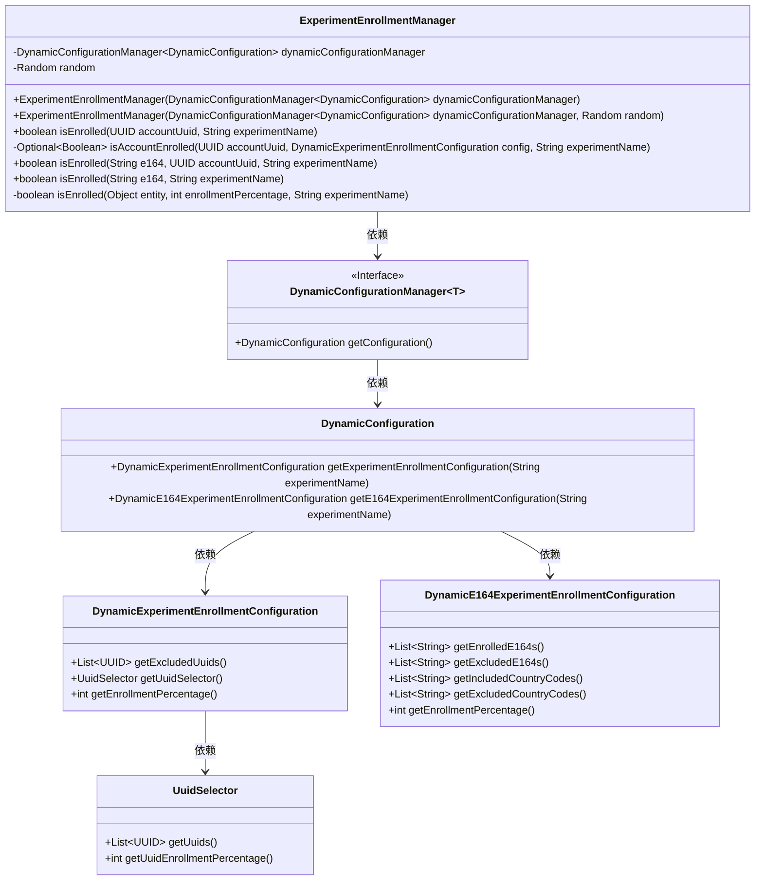
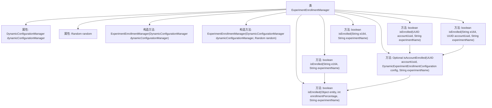

# 基础信息

|      |      |
|------|------|
| 名称 | ExperimentEnrollmentManager |
| 编码语言 | .java |
| 代码路径 | Signal-Server/service/src/main/java/org/whispersystems/textsecuregcm/experiment/ExperimentEnrollmentManager.java |
| 包名 | org.whispersystems.textsecuregcm.experiment |
| 依赖项 | ['com.google.common.annotations.VisibleForTesting', 'java.util.Optional', 'java.util.Random', 'java.util.UUID', 'java.util.concurrent.ThreadLocalRandom', 'org.whispersystems.textsecuregcm.configuration.dynamic.DynamicConfiguration', 'org.whispersystems.textsecuregcm.configuration.dynamic.DynamicExperimentEnrollmentConfiguration', 'org.whispersystems.textsecuregcm.configuration.dynamic.DynamicE164ExperimentEnrollmentConfiguration', 'org.whispersystems.textsecuregcm.storage.DynamicConfigurationManager', 'org.whispersystems.textsecuregcm.util.Util'] |
| 概述说明 | 实验管理类负责用户实验配置与随机分配。 |

# 说明

实验管理类主要负责处理用户参与实验的配置和随机分配。它确保用户能够被合理地分配到不同的实验组中，以便进行有效的实验对比和分析。该类还负责管理实验的配置信息，包括实验参数、条件和规则，以确保实验的顺利进行和数据的准确性。通过这种方式，实验管理类为实验的执行提供了可靠的基础支持。

# 类列表 Class Summary

| 名称   | 类型  | 说明 |
|-------|------|-------------|
| ExperimentEnrollmentManager | class | 实验管理类，处理用户参与实验的配置和随机分配。 |

## 类 ExperimentEnrollmentManager

|      |      |
|------|------|
| 访问范围 | public |
| 类型 | class |
| 名称 | ExperimentEnrollmentManager |
| 说明 | 实验管理类，处理用户参与实验的配置和随机分配。 |

### UML类图

**描述：**  
`ExperimentEnrollmentManager` 类负责管理实验的注册逻辑，依赖于 `DynamicConfigurationManager` 来获取动态配置。它通过 `DynamicConfiguration` 获取实验的具体配置，并根据不同的条件（如UUID、E164号码等）判断用户是否被注册到某个实验中。类中包含多个 `isEnrolled` 方法，用于处理不同类型的实体注册逻辑，确保实验注册的灵活性和准确性。

### 内部方法调用关系图

这段代码描述了一个实验注册管理器类 `ExperimentEnrollmentManager`，用于管理用户是否被注册到某个实验中。该类通过 `DynamicConfigurationManager` 获取实验配置，并根据用户 UUID 或电话号码 (`e164`) 来判断用户是否被注册。代码中包含了多个重载的 `isEnrolled` 方法，分别处理不同的输入参数，并调用内部方法 `isAccountEnrolled` 和 `isEnrolled` 来进行具体的注册判断。流程图展示了类的属性和方法之间的调用关系，清晰地反映了代码的逻辑结构。

### 字段列表 Field List

| 名称  | 类型  | 说明 |
|-------|-------|------|
| dynamicConfigurationManager | DynamicConfigurationManager<DynamicConfiguration> | 动态配置管理器实例化，管理动态配置。 |
| random | Random | 声明一个私有的不可变随机数生成器实例。 |

### 方法列表 Method List

| 名称  | 类型  | 说明 |
|-------|-------|------|
| isEnrolled | boolean | 检查账户是否参与指定实验，返回布尔值。 |
| isEnrolled | boolean | 判断实体是否参与实验，基于哈希值和参与百分比。 |
| isEnrolled | boolean | 方法检查用户是否参与实验，先获取配置，再验证账户或号码是否参与。 |
| isAccountEnrolled | Optional<Boolean> | 该方法检查账户是否参与实验，根据排除列表、选择器和随机百分比决定。 |
| isEnrolled | boolean | 检查号码是否加入实验，根据配置判断包含、排除、国家代码和百分比。 |

