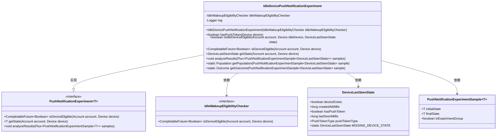

# 基础信息

|      |      |
|------|------|
| 名称 | IdleDevicePushNotificationExperiment |
| 编码语言 | .java |
| 代码路径 | Signal-Server/service/src/main/java/org/whispersystems/textsecuregcm/experiment/IdleDevicePushNotificationExperiment.java |
| 包名 | org.whispersystems.textsecuregcm.experiment |
| 依赖项 | ['com.google.common.annotations.VisibleForTesting', 'org.apache.commons.lang3.StringUtils', 'org.slf4j.Logger', 'org.slf4j.LoggerFactory', 'org.whispersystems.textsecuregcm.storage.Account', 'org.whispersystems.textsecuregcm.storage.Device', 'org.whispersystems.textsecuregcm.workers.IdleWakeupEligibilityChecker', 'reactor.core.publisher.Flux', 'javax.annotation.Nullable', 'java.util.Collections', 'java.util.EnumMap', 'java.util.Map', 'java.util.concurrent.CompletableFuture'] |
| 概述说明 | 空闲设备推送通知实验：检查设备状态并分析结果。 |

# 说明

空闲设备推送通知实验旨在通过检查设备状态并分析结果来优化推送通知的发送策略。实验首先对设备的空闲状态进行监测，确保在设备空闲时发送通知，以提高用户接收率和体验。随后，通过对发送结果的分析，评估通知的有效性和用户响应情况，从而进一步优化推送时机和内容。该实验的目标是提升推送通知的精准度和用户满意度。

# 类列表 Class Summary

| 名称   | 类型  | 说明 |
|-------|------|-------------|
| IdleDevicePushNotificationExperiment | class | 空闲设备推送通知实验，包含设备状态检查和结果分析。 |

## 类 IdleDevicePushNotificationExperiment

|      |      |
|------|------|
| 访问范围 | abstract |
| 类型 | class |
| 名称 | IdleDevicePushNotificationExperiment |
| 说明 | 空闲设备推送通知实验，包含设备状态检查和结果分析。 |

### UML类图

这段代码定义了一个抽象类 `IdleDevicePushNotificationExperiment`，它实现了 `PushNotificationExperiment` 接口。该类主要用于处理设备推送通知实验的逻辑，包括设备是否具备推送令牌、设备是否处于空闲状态、设备状态的分析等。`IdleWakeupEligibilityChecker` 是一个接口，用于检查设备是否具备唤醒资格。`DeviceLastSeenState` 类用于存储设备的最后状态信息，而 `PushNotificationExperimentSample` 类则用于存储实验样本的初始和最终状态。

### 内部方法调用关系图

```mermaid
graph TD
    A["抽象类IdleDevicePushNotificationExperiment"]
    B["属性: IdleWakeupEligibilityChecker idleWakeupEligibilityChecker"]
    C["属性: Logger log"]
    D["枚举: Population"]
    E["枚举: Outcome"]
    F["构造方法: IdleDevicePushNotificationExperiment(IdleWakeupEligibilityChecker idleWakeupEligibilityChecker)"]
    G["方法: boolean hasPushToken(Device device)"]
    H["抽象方法: boolean isIdleDeviceEligible(Account account, Device idleDevice, DeviceLastSeenState state)"]
    I["方法: CompletableFuture<Boolean> isDeviceEligible(Account account, Device device)"]
    J["方法: DeviceLastSeenState getState(Account account, Device device)"]
    K["方法: void analyzeResults(Flux<PushNotificationExperimentSample<DeviceLastSeenState>> samples)"]
    L["方法: static Population getPopulation(PushNotificationExperimentSample<DeviceLastSeenState> sample)"]
    M["方法: static Outcome getOutcome(PushNotificationExperimentSample<DeviceLastSeenState> sample)"]

    A --> B
    A --> C
    A --> D
    A --> E
    A --> F
    A --> G
    A --> H
    A --> I
    A --> J
    A --> K
    A --> L
    A --> M
```

这段代码定义了一个抽象类 `IdleDevicePushNotificationExperiment`，用于处理设备推送通知的实验。该类包含多个方法和枚举，用于检查设备是否处于空闲状态、获取设备状态、分析实验结果等。代码通过 `IdleWakeupEligibilityChecker` 来检查设备是否满足唤醒条件，并通过 `analyzeResults` 方法生成实验结果报告。类中的枚举 `Population` 和 `Outcome` 用于分类实验样本和结果。整体流程涉及设备状态的获取、实验样本的分析以及结果的报告生成。

### 字段列表 Field List

| 名称  | 类型  | 说明 |
|-------|-------|------|
| log = LoggerFactory.getLogger(getClass()) | Logger | 私有日志记录器，用于获取当前类的日志实例。 |
| idleWakeupEligibilityChecker | IdleWakeupEligibilityChecker | 私有且不可变的空闲唤醒资格检查器实例。 |

### 方法列表 Method List

| 名称  | 类型  | 说明 |
|-------|-------|------|
| getPopulation | Population | 根据推送通知样本的设备状态返回实验组或对照组。 |
| isIdleDeviceEligible | boolean | 检查空闲设备是否符合账户和最后状态条件。 |
| isDeviceEligible | CompletableFuture<Boolean> | 方法检查设备是否符合条件，结合空闲和设备状态判断。 |
| hasPushToken | boolean | 测试方法检查设备是否有推送令牌。 |
| getOutcome | Outcome | 根据设备状态判断推送通知实验结果，返回删除、卸载、重新激活或未更改四种结果。 |
| getState | DeviceLastSeenState | 根据账户和设备信息返回设备最后在线状态，包含推送令牌类型。 |
| analyzeResults | void | 分析推送通知实验结果，生成统计报告并记录日志。 |

