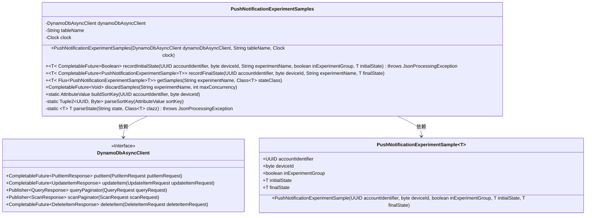

# 基础信息

|      |      |
|------|------|
| 名称 | PushNotificationExperimentSamples |
| 编码语言 | .java |
| 代码路径 | Signal-Server/service/src/main/java/org/whispersystems/textsecuregcm/experiment/PushNotificationExperimentSamples.java |
| 包名 | org.whispersystems.textsecuregcm.experiment |
| 依赖项 | ['com.fasterxml.jackson.core.JsonProcessingException', 'java.nio.ByteBuffer', 'java.time.Clock', 'java.time.Duration', 'java.util.Map', 'java.util.UUID', 'java.util.concurrent.CompletableFuture', 'com.google.common.annotations.VisibleForTesting', 'org.slf4j.Logger', 'org.slf4j.LoggerFactory', 'org.whispersystems.textsecuregcm.util.ExceptionUtils', 'org.whispersystems.textsecuregcm.util.SystemMapper', 'reactor.core.publisher.Flux', 'reactor.core.publisher.Mono', 'reactor.util.function.Tuple2', 'reactor.util.function.Tuples', 'reactor.util.retry.Retry', 'software.amazon.awssdk.core.SdkBytes', 'software.amazon.awssdk.services.dynamodb.DynamoDbAsyncClient', 'software.amazon.awssdk.services.dynamodb.model.AttributeValue', 'software.amazon.awssdk.services.dynamodb.model.ConditionalCheckFailedException', 'software.amazon.awssdk.services.dynamodb.model.DeleteItemRequest', 'software.amazon.awssdk.services.dynamodb.model.PutItemRequest', 'software.amazon.awssdk.services.dynamodb.model.QueryRequest', 'software.amazon.awssdk.services.dynamodb.model.ReturnValue', 'software.amazon.awssdk.services.dynamodb.model.ScanRequest', 'software.amazon.awssdk.services.dynamodb.model.UpdateItemRequest'] |
| 概述说明 | PushNotificationExperimentSamples类管理推送实验设备状态，支持DynamoDB和JSON操作。 |

# 说明

PushNotificationExperimentSamples类负责管理推送通知实验中的设备状态，包括记录设备的初始状态和最终状态。该类支持与DynamoDB数据库的交互操作，能够进行数据的存储和检索。此外，该类还具备JSON序列化功能，能够将设备状态数据转换为JSON格式，便于数据的传输和存储。通过该类的功能，可以有效地管理和跟踪推送通知实验中的设备状态变化。

# 类列表 Class Summary

| 名称   | 类型  | 说明 |
|-------|------|-------------|
| PushNotificationExperimentSamples | class | PushNotificationExperimentSamples类管理推送通知实验设备状态，记录初始和最终状态，支持DynamoDB操作和JSON序列化。 |

## 类 PushNotificationExperimentSamples

|      |      |
|------|------|
| 访问范围 | public |
| 类型 | class |
| 名称 | PushNotificationExperimentSamples |
| 说明 | PushNotificationExperimentSamples类管理推送通知实验设备状态，记录初始和最终状态，支持DynamoDB操作和JSON序列化。 |

### UML类图

这段代码定义了一个`PushNotificationExperimentSamples`类，用于管理与推送通知实验相关的设备状态数据。该类通过`DynamoDbAsyncClient`与DynamoDB进行异步交互，支持记录初始状态、最终状态、获取样本以及删除样本等操作。代码中使用了泛型`T`来表示状态对象的类型，并通过`CompletableFuture`和`Flux`来处理异步操作和流式数据。`PushNotificationExperimentSample`类用于封装实验样本的数据。整体设计旨在高效、可靠地管理实验数据，并确保数据的完整性和一致性。

### 内部方法调用关系图

```mermaid
graph TD
    A["类PushNotificationExperimentSamples"]
    B["属性: DynamoDbAsyncClient dynamoDbAsyncClient"]
    C["属性: String tableName"]
    D["属性: Clock clock"]
    E["构造方法: PushNotificationExperimentSamples(DynamoDbAsyncClient dynamoDbAsyncClient, String tableName, Clock clock)"]
    F["方法: CompletableFuture<Boolean> recordInitialState(UUID accountIdentifier, byte deviceId, String experimentName, boolean inExperimentGroup, T initialState)"]
    G["方法: CompletableFuture<PushNotificationExperimentSample<T>> recordFinalState(UUID accountIdentifier, byte deviceId, String experimentName, T finalState)"]
    H["方法: Flux<PushNotificationExperimentSample<T>> getSamples(String experimentName, Class<T> stateClass)"]
    I["方法: CompletableFuture<Void> discardSamples(String experimentName, int maxConcurrency)"]
    J["方法: static AttributeValue buildSortKey(UUID accountIdentifier, byte deviceId)"]
    K["方法: static Tuple2<UUID, Byte> parseSortKey(AttributeValue sortKey)"]
    L["方法: static <T> T parseState(String state, Class<T> clazz)"]

    A --> B
    A --> C
    A --> D
    A --> E
    A --> F
    A --> G
    A --> H
    A --> I
    A --> J
    A --> K
    A --> L
```

这段代码定义了一个名为 `PushNotificationExperimentSamples` 的类，用于管理与推送通知实验相关的样本数据。类中包含多个方法，用于记录实验的初始状态、最终状态、获取样本数据以及删除样本数据。代码通过 `DynamoDbAsyncClient` 与 DynamoDB 数据库进行异步交互，处理实验数据的状态记录和查询。流程图展示了类的结构及其方法之间的调用关系，帮助理解代码的组织和功能。

### 字段列表 Field List

| 名称  | 类型  | 说明 |
|-------|-------|------|
| ATTR_TTL = "E" | String | 定义静态常量ATTR_TTL，值为"E"。 |
| dynamoDbAsyncClient | DynamoDbAsyncClient | 私有异步DynamoDB客户端实例。 |
| clock | Clock | 私有常量时钟对象。 |
| tableName | String | 私有字符串变量tableName声明为final。 |
| FINAL_SAMPLE_TTL = Duration.ofDays(7) | Duration | 定义了一个7天有效期的私有静态常量。 |
| ATTR_IN_EXPERIMENT_GROUP = "X" | String | 静态常量ATTR_IN_EXPERIMENT_GROUP赋值为"X"。 |
| KEY_EXPERIMENT_NAME = "N" | String | 定义常量KEY_EXPERIMENT_NAME，值为"N"。 |
| ATTR_FINAL_STATE = "F" | String | 定义常量字符串ATTR_FINAL_STATE，值为"F"。 |
| ATTR_ACI_AND_DEVICE_ID = "AD" | String | 定义常量字符串ATTR_ACI_AND_DEVICE_ID，值为"AD"。 |
| ATTR_INITIAL_STATE = "I" | String | 定义静态常量ATTR_INITIAL_STATE，值为"I"。 |
| log = LoggerFactory.getLogger(PushNotificationExperimentSamples.class) | Logger | PushNotificationExperimentSamples类中定义了一个私有静态日志记录器。 |

### 方法列表 Method List

| 名称  | 类型  | 说明 |
|-------|-------|------|
| discardSamples | CompletableFuture<Void> | 异步删除指定实验样本，支持最大并发控制。 |
| parseState | T | 解析字符串为指定类实例的静态方法。 |
| recordInitialState | CompletableFuture<Boolean> | 记录实验初始状态，条件检查失败返回false。 |
| recordFinalState | CompletableFuture<PushNotificationExperimentSample<T>> | 记录实验最终状态并更新DynamoDB表，返回处理结果。 |
| getSamples | Flux<PushNotificationExperimentSample<T>> | 该方法通过DynamoDB查询实验样本，解析并返回包含设备ID、实验组状态及初始和最终状态的Flux流。 |
| parseSortKey | Tuple2<UUID, Byte> | 解析排序键，返回UUID和字节元组。 |
| buildSortKey | AttributeValue | 构建排序键方法，使用UUID和设备ID生成AttributeValue。 |

