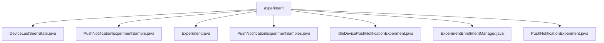

# 基础信息

|      |      |
|------|------|
| 名称 | experiment |
| 编码语言 | .java |
| 代码路径 | Signal-Server/service/src/main/java/org/whispersystems/textsecuregcm/experiment |
| 包名 | Signal-Server.service.src.main.java.org.whispersystems.textsecuregcm.experiment |
| 概述说明 | 推送通知实验类管理设备状态，记录时间，优化发送策略，提升用户满意度。 |

# 说明

## 概述
该代码模块主要围绕推送通知实验的设计、执行和管理展开。模块中的各个类分别负责设备状态的记录、实验样本的管理、用户实验分配、以及实验结果的分析等功能。通过这些类的协同工作，模块能够有效地监控和优化推送通知的发送策略，提升用户接收率和体验。

## 主要业务场景
1. **设备状态监测与记录**：`PushNotificationExperimentSamples`类负责记录设备的初始状态和最终状态，并通过与DynamoDB数据库的交互进行数据的存储和检索。同时，`DeviceLastSeenState`类（未提供具体内容）可能涉及设备最后活跃状态的记录。
  
2. **实验样本管理**：`PushNotificationExperimentSample`类用于记录匹配、错误以及三种不匹配情况的计时器，确保能够精确捕捉实验过程中的各类事件，为后续的数据分析提供准确的时间依据。

3. **用户实验分配**：`ExperimentEnrollmentManager`类负责处理用户参与实验的配置和随机分配，确保用户能够被合理地分配到不同的实验组中，以便进行有效的实验对比和分析。

4. **空闲设备推送通知实验**：`IdleDevicePushNotificationExperiment`类通过检查设备状态并分析结果来优化推送通知的发送策略，确保在设备空闲时发送通知，以提高用户接收率和体验。

5. **实验管理与执行**：`Experiment`类和`PushNotificationExperiment`类（未提供具体内容）可能涉及实验的整体管理和执行，包括实验参数、条件和规则的配置，以确保实验的顺利进行和数据的准确性。

通过这些业务场景，该模块能够全面支持推送通知实验的设计、执行和优化，最终提升推送通知的精准度和用户满意度。

### 包内部结构视图

该流程图展示了`experiment`文件夹下的所有文件及其层级关系。`experiment`作为根节点，包含了多个与实验相关的Java文件，如`DeviceLastSeenState.java`、`PushNotificationExperiment.java`等。这些文件直接隶属于`experiment`文件夹，没有进一步的子文件夹层级。

# 文件列表 File List

| 名称   | 类型  | 说明 |
|-------|------|-------------|
| [PushNotificationExperimentSample.java](PushNotificationExperimentSample.md) | file | 信息为空，无法生成概要描述。 |
| [DeviceLastSeenState.java](DeviceLastSeenState.md) | file | 无内容可总结。 |
| [PushNotificationExperiment.java](PushNotificationExperiment.md) | file | 信息为空，无法生成概要描述。 |
| [ExperimentEnrollmentManager.java](ExperimentEnrollmentManager.md) | file | 实验管理类负责用户实验配置与随机分配。 |
| [IdleDevicePushNotificationExperiment.java](IdleDevicePushNotificationExperiment.md) | file | 空闲设备推送通知实验：检查设备状态并分析结果。 |
| [PushNotificationExperimentSamples.java](PushNotificationExperimentSamples.md) | file | PushNotificationExperimentSamples类管理推送实验设备状态，支持DynamoDB和JSON操作。 |
| [Experiment.java](Experiment.md) | file | 实验类用于记录匹配、错误及三种不匹配情况的计时器。 |

