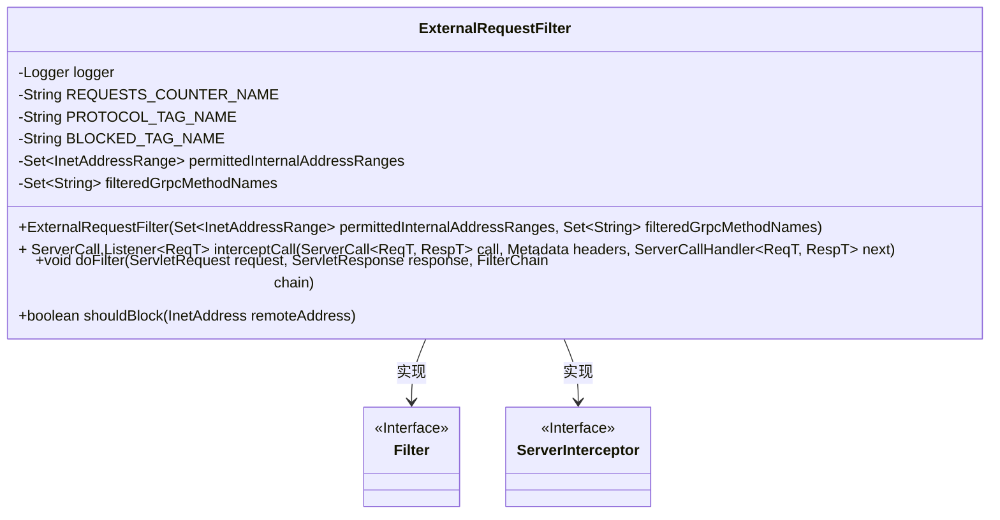
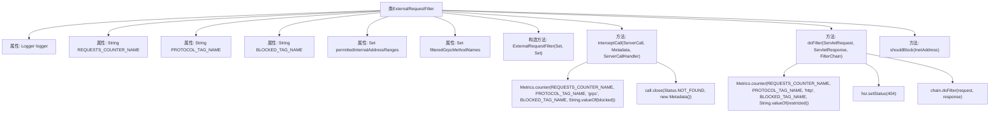

# 基础信息

|      |      |
|------|------|
| 名称 | ExternalRequestFilter |
| 编码语言 | .java |
| 代码路径 | Signal-Server/service/src/main/java/org/whispersystems/textsecuregcm/filters/ExternalRequestFilter.java |
| 包名 | org.whispersystems.textsecuregcm.filters |
| 依赖项 | ['org.whispersystems.textsecuregcm.metrics.MetricsUtil.name', 'io.grpc.Metadata', 'io.grpc.MethodDescriptor', 'io.grpc.ServerCall', 'io.grpc.ServerCallHandler', 'io.grpc.ServerInterceptor', 'io.grpc.Status', 'io.micrometer.core.instrument.Metrics', 'jakarta.servlet.Filter', 'jakarta.servlet.FilterChain', 'jakarta.servlet.ServletException', 'jakarta.servlet.ServletRequest', 'jakarta.servlet.ServletResponse', 'jakarta.servlet.http.HttpServletResponse', 'java.io.IOException', 'java.net.InetAddress', 'java.util.Set', 'org.slf4j.Logger', 'org.slf4j.LoggerFactory', 'org.whispersystems.textsecuregcm.grpc.RequestAttributesUtil', 'org.whispersystems.textsecuregcm.util.InetAddressRange'] |
| 概述说明 | 外部请求过滤器拦截并检查gRPC和HTTP请求，根据地址和方法决定是否阻止，记录请求计数。 |

# 说明

外部请求过滤器用于拦截并检查gRPC和HTTP请求，根据请求的目标地址和方法进行判断，决定是否阻止该请求。同时，该过滤器会记录每个请求的计数，以便进行统计和分析。这一功能有助于实现对请求的精细控制，确保系统安全性和稳定性。

# 类列表 Class Summary

| 名称   | 类型  | 说明 |
|-------|------|-------------|
| ExternalRequestFilter | class | 外部请求过滤器，拦截并检查gRPC和HTTP请求，根据地址和方法决定是否阻止，记录请求计数。 |

## 类 ExternalRequestFilter

|      |      |
|------|------|
| 访问范围 | public |
| 类型 | class |
| 名称 | ExternalRequestFilter |
| 说明 | 外部请求过滤器，拦截并检查gRPC和HTTP请求，根据地址和方法决定是否阻止，记录请求计数。 |

### UML类图

**描述**：`ExternalRequestFilter` 类实现了 `Filter` 和 `ServerInterceptor` 接口，用于过滤外部请求。它通过检查请求的远程地址和gRPC方法名来决定是否阻止请求。类中包含了对请求的拦截和过滤逻辑，并且使用`Metrics`类来记录请求的统计信息。`shouldBlock`方法用于判断请求是否应该被阻止。

### 内部方法调用关系图

这段代码定义了一个名为 `ExternalRequestFilter` 的类，该类实现了 `Filter` 和 `ServerInterceptor` 接口。它的主要功能是过滤外部请求，根据请求的协议（gRPC 或 HTTP）和远程地址来决定是否允许请求通过。代码中包含了构造方法、拦截器方法 `interceptCall`、过滤器方法 `doFilter` 以及一个辅助方法 `shouldBlock`。`interceptCall` 方法用于处理 gRPC 请求，`doFilter` 方法用于处理 HTTP 请求，两者都会根据远程地址和配置的地址范围来决定是否阻止请求，并通过 `Metrics.counter` 记录请求的统计信息。

### 字段列表 Field List

| 名称  | 类型  | 说明 |
|-------|-------|------|
| REQUESTS_COUNTER_NAME = name(ExternalRequestFilter.class, "requests") | String | 定义请求计数器常量，用于统计外部请求数量。 |
| permittedInternalAddressRanges | Set<InetAddressRange> | 私有最终集合存储允许的内部地址范围。 |
| logger = LoggerFactory.getLogger(ExternalRequestFilter.class) | Logger | 定义日志记录器，用于ExternalRequestFilter类。 |
| filteredGrpcMethodNames | Set<String> | 私有集合存储过滤后的gRPC方法名。 |
| BLOCKED_TAG_NAME = "blocked" | String | 定义常量BLOCKED_TAG_NAME，值为"blocked"。 |
| PROTOCOL_TAG_NAME = "protocol" | String | 定义常量PROTOCOL_TAG_NAME，值为"protocol"。 |

### 方法列表 Method List

| 名称  | 类型  | 说明 |
|-------|-------|------|
| shouldBlock | boolean | 该方法检查远程地址是否不在允许的内部地址范围内。 |
| interceptCall | ServerCall.Listener<ReqT> | 拦截gRPC调用，根据方法名和IP地址决定是否阻止请求，并记录请求计数器。 |
| doFilter | void | 过滤器中检查远程地址，若受限则返回404，否则继续处理请求。 |

