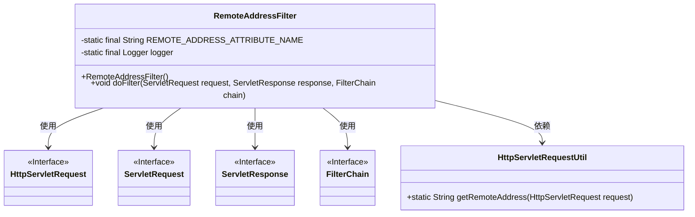
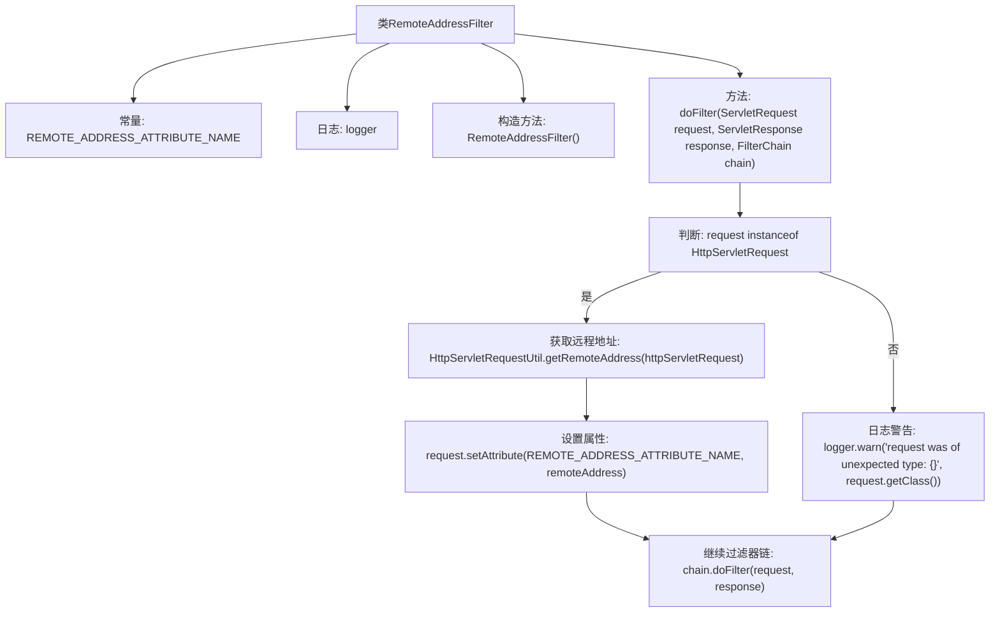

# 基础信息

|      |      |
|------|------|
| 名称 | RemoteAddressFilter |
| 编码语言 | .java |
| 代码路径 | Signal-Server/service/src/main/java/org/whispersystems/textsecuregcm/filters/RemoteAddressFilter.java |
| 包名 | org.whispersystems.textsecuregcm.filters |
| 依赖项 | ['jakarta.servlet.Filter', 'jakarta.servlet.FilterChain', 'jakarta.servlet.ServletException', 'jakarta.servlet.ServletRequest', 'jakarta.servlet.ServletResponse', 'jakarta.servlet.http.HttpServletRequest', 'java.io.IOException', 'org.slf4j.Logger', 'org.slf4j.LoggerFactory', 'org.whispersystems.textsecuregcm.util.HttpServletRequestUtil'] |
| 概述说明 | RemoteAddressFilter类实现Filter接口，管理远程地址属性。 |

# 说明

RemoteAddressFilter类实现了Filter接口，主要用于获取和设置远程地址属性。该类通过实现Filter接口，能够处理与远程地址相关的操作，确保在需要时能够准确地获取或更新远程地址信息。这一功能在网络通信或远程服务调用中尤为重要，有助于管理和维护远程连接的地址数据。

# 类列表 Class Summary

| 名称   | 类型  | 说明 |
|-------|------|-------------|
| RemoteAddressFilter | class | RemoteAddressFilter类实现Filter接口，获取并设置远程地址属性。 |

## 类 RemoteAddressFilter

|      |      |
|------|------|
| 访问范围 | public |
| 类型 | class |
| 名称 | RemoteAddressFilter |
| 说明 | RemoteAddressFilter类实现Filter接口，获取并设置远程地址属性。 |

### UML类图

这段代码定义了一个 `RemoteAddressFilter` 类，该类实现了 `Filter` 接口，用于在过滤器中获取并设置 HTTP 请求的远程地址。`RemoteAddressFilter` 通过 `HttpServletRequestUtil` 工具类获取远程地址，并将其存储在请求属性中。如果请求类型不是 `HttpServletRequest`，则会记录警告日志。类图展示了 `RemoteAddressFilter` 与其他相关接口和工具类之间的依赖关系。

### 内部方法调用关系图

该流程图描述了`RemoteAddressFilter`类的结构和`doFilter`方法的执行流程。首先，类中包含一个常量和一个日志对象，并有一个默认的构造方法。`doFilter`方法首先检查请求是否为`HttpServletRequest`类型，如果是，则获取远程地址并设置请求属性；如果不是，则记录警告日志。无论请求类型如何，最终都会继续执行过滤器链。

### 字段列表 Field List

| 名称  | 类型  | 说明 |
|-------|-------|------|
| REMOTE_ADDRESS_ATTRIBUTE_NAME = RemoteAddressFilter.class.getName() + ".remoteAddress" | String | REMOTE_ADDRESS_ATTRIBUTE_NAME 是 RemoteAddressFilter 类的远程地址属性名。 |
| logger = LoggerFactory.getLogger(RemoteAddressFilter.class) | Logger | 定义静态日志记录器实例，用于RemoteAddressFilter类。 |

### 方法列表 Method List

| 名称  | 类型  | 说明 |
|-------|-------|------|
| doFilter | void | 过滤器中获取请求远程地址并设置属性，继续执行过滤器链。 |

