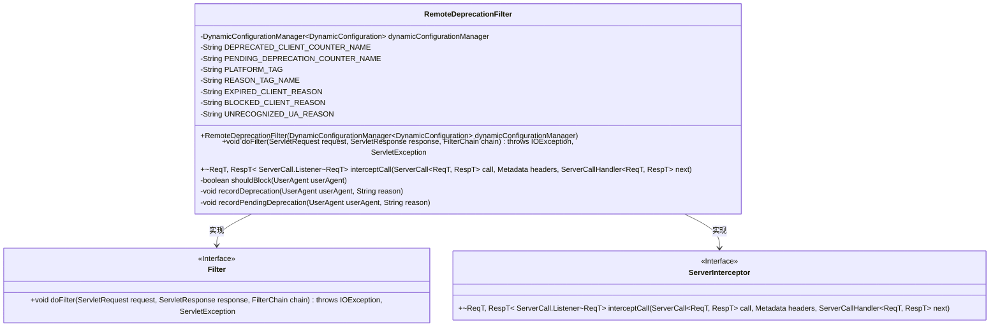
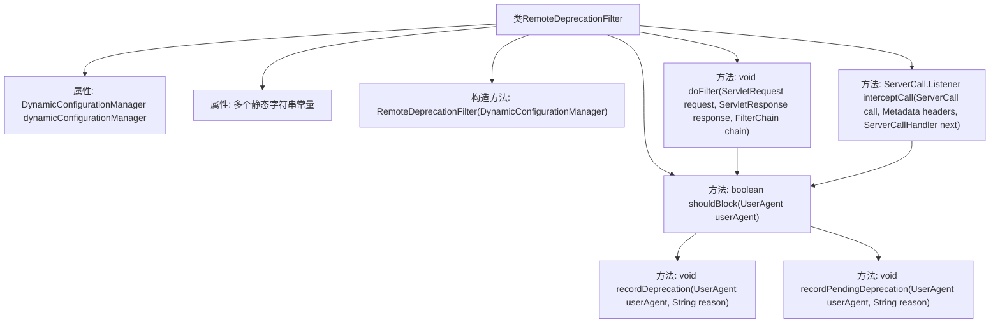
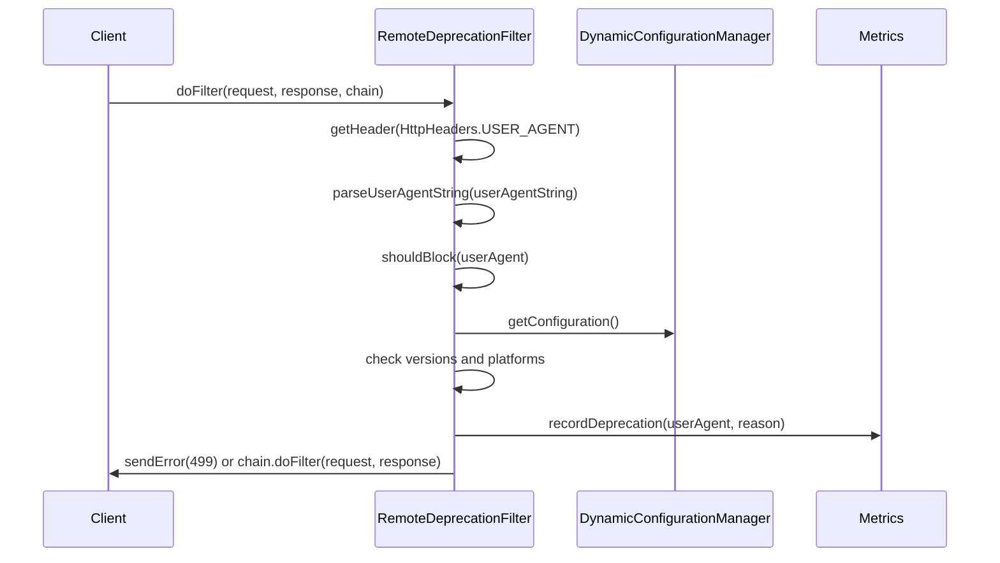

# 基础信息

|      |      |
|------|------|
| 名称 | RemoteDeprecationFilter |
| 编码语言 | .java |
| 代码路径 | Signal-Server/service/src/main/java/org/whispersystems/textsecuregcm/filters/RemoteDeprecationFilter.java |
| 包名 | org.whispersystems.textsecuregcm.filters |
| 依赖项 | ['com.codahale.metrics.MetricRegistry.name', 'com.google.common.net.HttpHeaders', 'com.vdurmont.semver4j.Semver', 'io.grpc.Metadata', 'io.grpc.ServerCall', 'io.grpc.ServerCallHandler', 'io.grpc.ServerInterceptor', 'io.micrometer.core.instrument.Metrics', 'jakarta.servlet.Filter', 'jakarta.servlet.FilterChain', 'jakarta.servlet.ServletException', 'jakarta.servlet.ServletRequest', 'jakarta.servlet.ServletResponse', 'jakarta.servlet.http.HttpServletRequest', 'jakarta.servlet.http.HttpServletResponse', 'java.io.IOException', 'java.util.Map', 'java.util.Set', 'javax.annotation.Nullable', 'org.whispersystems.textsecuregcm.configuration.dynamic.DynamicConfiguration', 'org.whispersystems.textsecuregcm.configuration.dynamic.DynamicRemoteDeprecationConfiguration', 'org.whispersystems.textsecuregcm.grpc.RequestAttributesUtil', 'org.whispersystems.textsecuregcm.grpc.StatusConstants', 'org.whispersystems.textsecuregcm.storage.DynamicConfigurationManager', 'org.whispersystems.textsecuregcm.util.ua.ClientPlatform', 'org.whispersystems.textsecuregcm.util.ua.UnrecognizedUserAgentException', 'org.whispersystems.textsecuregcm.util.ua.UserAgent', 'org.whispersystems.textsecuregcm.util.ua.UserAgentUtil'] |
| 概述说明 | RemoteDeprecationFilter拦截检查客户端版本，决定阻止或记录过时请求。 |

# 说明

RemoteDeprecationFilter是一个用于拦截和检查客户端版本的工具，它根据预设的配置来决定是否阻止或记录来自过时客户端的请求。该过滤器的主要功能是确保客户端版本符合要求，从而维护系统的兼容性和安全性。通过这种方式，可以有效管理客户端请求，避免因版本过时而引发的问题。

# 类列表 Class Summary

| 名称   | 类型  | 说明 |
|-------|------|-------------|
| RemoteDeprecationFilter | class | RemoteDeprecationFilter用于拦截并检查客户端版本，根据配置决定是否阻止或记录过时客户端请求。 |

## 类 RemoteDeprecationFilter

|      |      |
|------|------|
| 访问范围 | public |
| 类型 | class |
| 名称 | RemoteDeprecationFilter |
| 说明 | RemoteDeprecationFilter用于拦截并检查客户端版本，根据配置决定是否阻止或记录过时客户端请求。 |

### UML类图

**描述**：`RemoteDeprecationFilter`类实现了`Filter`和`ServerInterceptor`接口，用于处理客户端请求的过滤和拦截。它通过`DynamicConfigurationManager`获取动态配置，并根据客户端用户代理（UserAgent）的版本信息决定是否阻止请求。类中包含了多个私有方法用于记录客户端版本过时或即将过时的情况，并通过计数器进行统计。

### 内部方法调用关系图

这段代码定义了一个名为 `RemoteDeprecationFilter` 的类，它实现了 `Filter` 和 `ServerInterceptor` 接口。该类主要用于过滤和拦截请求，检查用户代理（User-Agent）是否被阻止或即将被弃用。`doFilter` 方法处理HTTP请求，`interceptCall` 方法处理gRPC调用，`shouldBlock` 方法根据配置决定是否阻止请求，`recordDeprecation` 和 `recordPendingDeprecation` 方法记录相关指标。流程图展示了类的结构和方法的调用关系，时序图展示了请求处理的过程。

### 字段列表 Field List

| 名称  | 类型  | 说明 |
|-------|-------|------|
| dynamicConfigurationManager | DynamicConfigurationManager<DynamicConfiguration> | 动态配置管理器用于管理动态配置实例。 |
| DEPRECATED_CLIENT_COUNTER_NAME = name(RemoteDeprecationFilter.class, "deprecated") | String | 定义废弃客户端计数器名称常量。 |
| PENDING_DEPRECATION_COUNTER_NAME = name(RemoteDeprecationFilter.class, "pendingDeprecation") | String | 定义静态常量记录待弃用计数器名称。 |
| EXPIRED_CLIENT_REASON = "expired" | String | 定义常量表示客户端过期原因。 |
| PLATFORM_TAG = "platform" | String | 定义私有静态常量PLATFORM_TAG，值为"platform"。 |
| REASON_TAG_NAME = "reason" | String | 定义私有静态常量REASON_TAG_NAME，值为"reason"。 |
| BLOCKED_CLIENT_REASON = "blocked" | String | 定义常量字符串BLOCKED_CLIENT_REASON，值为"blocked"。 |
| UNRECOGNIZED_UA_REASON = "unrecognized_user_agent" | String | 定义常量UNRECOGNIZED_UA_REASON表示未识别的用户代理。 |

### 方法列表 Method List

| 名称  | 类型  | 说明 |
|-------|-------|------|
| recordDeprecation | void | 记录客户端弃用信息，更新计数器。 |
| recordPendingDeprecation | void | 记录待弃用用户代理及原因，更新计数器。 |
| shouldBlock | boolean | 根据用户代理版本检查是否应阻止访问，涉及最低版本、待阻止版本等配置。 |
| doFilter | void | 过滤器中解析用户代理，若需拦截则返回错误，否则继续处理请求。 |
| interceptCall | ServerCall.Listener<ReqT> | 拦截服务器调用，根据用户代理决定是否阻止或继续处理请求。 |

