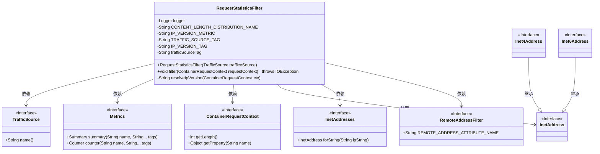
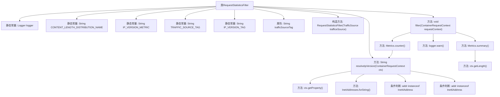

# 基础信息

|      |      |
|------|------|
| 名称 | RequestStatisticsFilter |
| 编码语言 | .java |
| 代码路径 | Signal-Server/service/src/main/java/org/whispersystems/textsecuregcm/filters/RequestStatisticsFilter.java |
| 包名 | org.whispersystems.textsecuregcm.filters |
| 依赖项 | ['com.codahale.metrics.MetricRegistry.name', 'java.util.Objects.requireNonNull', 'com.google.common.net.InetAddresses', 'io.micrometer.core.instrument.Metrics', 'jakarta.ws.rs.container.ContainerRequestContext', 'jakarta.ws.rs.container.ContainerRequestFilter', 'java.io.IOException', 'java.net.Inet4Address', 'java.net.Inet6Address', 'java.net.InetAddress', 'javax.annotation.Nonnull', 'org.slf4j.Logger', 'org.slf4j.LoggerFactory', 'org.whispersystems.textsecuregcm.metrics.MetricsUtil', 'org.whispersystems.textsecuregcm.metrics.TrafficSource'] |
| 概述说明 | 实现请求统计过滤器，记录内容长度和IP版本，处理异常并记录日志。 |

# 说明

实现了一个请求统计过滤器，该过滤器能够记录请求内容的长度以及使用的IP版本。在处理请求过程中，系统会检测并处理可能出现的异常情况，并将相关信息记录到日志中，以便后续分析和排查问题。该功能有助于监控请求的详细情况，提升系统的稳定性和可维护性。

# 类列表 Class Summary

| 名称   | 类型  | 说明 |
|-------|------|-------------|
| RequestStatisticsFilter | class | 实现请求统计过滤器，记录内容长度和IP版本，处理异常并记录日志。 |

## 类 RequestStatisticsFilter

|      |      |
|------|------|
| 访问范围 | public |
| 类型 | class |
| 名称 | RequestStatisticsFilter |
| 说明 | 实现请求统计过滤器，记录内容长度和IP版本，处理异常并记录日志。 |

### UML类图

**描述：**  
`RequestStatisticsFilter` 类实现了 `ContainerRequestFilter` 接口，用于过滤和处理请求的统计信息。它依赖于 `TrafficSource`、`Metrics`、`ContainerRequestContext`、`InetAddress`、`InetAddresses` 和 `RemoteAddressFilter` 等接口或类来获取和处理请求的流量来源、内容长度、IP 版本等信息。`resolveIpVersion` 方法用于解析请求的 IP 版本，并返回 "IPv4"、"IPv6" 或 "unresolved"。`filter` 方法记录请求的内容长度和 IP 版本，并在发生异常时记录警告日志。

### 内部方法调用关系图

这段代码的流程图描述了`RequestStatisticsFilter`类的结构和主要方法调用关系。类中包含多个静态常量和属性，构造方法初始化`trafficSourceTag`属性。`filter`方法负责记录请求的统计信息，包括内容长度和IP版本，并处理可能的异常。`resolveIpVersion`方法根据请求的IP地址解析IP版本，返回IPv4、IPv6或未解析的结果。整个流程展示了类中方法的调用顺序和条件判断。

### 字段列表 Field List

| 名称  | 类型  | 说明 |
|-------|-------|------|
| trafficSourceTag | String | 非空私有最终字符串变量trafficSourceTag。 |
| IP_VERSION_TAG = "ipVersion" | String | 定义静态常量IP_VERSION_TAG，值为"ipVersion"。 |
| logger = LoggerFactory.getLogger(RequestStatisticsFilter.class) | Logger | 定义静态日志记录器，用于RequestStatisticsFilter类的日志输出。 |
| IP_VERSION_METRIC = MetricsUtil.name(RequestStatisticsFilter.class, "ipVersion") | String | 定义静态常量IP_VERSION_METRIC，用于记录IP版本指标。 |
| TRAFFIC_SOURCE_TAG = "trafficSource" | String | 定义静态常量TRAFFIC_SOURCE_TAG，值为"trafficSource"。 |
| CONTENT_LENGTH_DISTRIBUTION_NAME = name(RequestStatisticsFilter.class, "contentLength") | String | 定义了一个静态常量，用于存储内容长度分布的名称。 |

### 方法列表 Method List

| 名称  | 类型  | 说明 |
|-------|-------|------|
| filter | void | 过滤器中记录请求长度和IP版本，异常时记录警告日志。 |
| resolveIpVersion | String | 解析IP版本，返回IPv4、IPv6或未解析。 |

