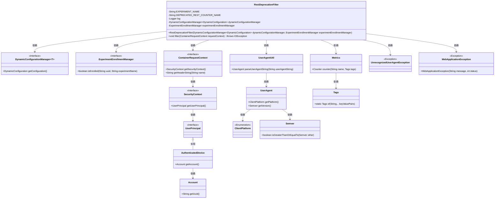
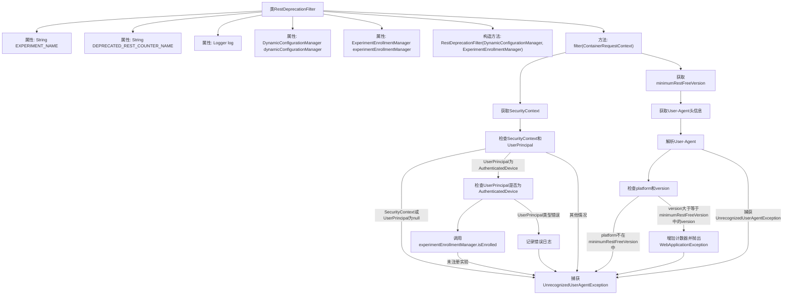

# 基础信息

|      |      |
|------|------|
| 名称 | RestDeprecationFilter |
| 编码语言 | .java |
| 代码路径 | Signal-Server/service/src/main/java/org/whispersystems/textsecuregcm/filters/RestDeprecationFilter.java |
| 包名 | org.whispersystems.textsecuregcm.filters |
| 依赖项 | ['com.google.common.net.HttpHeaders', 'com.vdurmont.semver4j.Semver', 'io.micrometer.core.instrument.Metrics', 'io.micrometer.core.instrument.Tags', 'jakarta.ws.rs.WebApplicationException', 'jakarta.ws.rs.container.ContainerRequestContext', 'jakarta.ws.rs.container.ContainerRequestFilter', 'jakarta.ws.rs.core.SecurityContext', 'java.io.IOException', 'java.util.Map', 'java.util.Optional', 'java.util.Set', 'org.slf4j.Logger', 'org.slf4j.LoggerFactory', 'org.whispersystems.textsecuregcm.auth.AuthenticatedDevice', 'org.whispersystems.textsecuregcm.configuration.dynamic.DynamicConfiguration', 'org.whispersystems.textsecuregcm.experiment.ExperimentEnrollmentManager', 'org.whispersystems.textsecuregcm.metrics.MetricsUtil', 'org.whispersystems.textsecuregcm.storage.DynamicConfigurationManager', 'org.whispersystems.textsecuregcm.util.ua.ClientPlatform', 'org.whispersystems.textsecuregcm.util.ua.UnrecognizedUserAgentException', 'org.whispersystems.textsecuregcm.util.ua.UserAgent', 'org.whispersystems.textsecuregcm.util.ua.UserAgentUtil'] |
| 概述说明 | RestDeprecationFilter类过滤REST请求，检查用户实验并阻止特定版本。 |

# 说明

RestDeprecationFilter类的主要功能是过滤REST请求，通过检查用户是否参与特定实验，并阻止来自特定版本的请求。该类用于确保只有符合条件的请求能够通过，从而实现对REST请求的精确控制和管理。

# 类列表 Class Summary

| 名称   | 类型  | 说明 |
|-------|------|-------------|
| RestDeprecationFilter | class | RestDeprecationFilter类用于过滤REST请求，检查用户是否参与实验并阻止特定版本请求。 |

## 类 RestDeprecationFilter

|      |      |
|------|------|
| 访问范围 | public |
| 类型 | class |
| 名称 | RestDeprecationFilter |
| 说明 | RestDeprecationFilter类用于过滤REST请求，检查用户是否参与实验并阻止特定版本请求。 |

### UML类图

### 描述
`RestDeprecationFilter` 类是一个实现 `ContainerRequestFilter` 的过滤器，用于拦截和处理 REST 请求。它依赖于 `DynamicConfigurationManager` 和 `ExperimentEnrollmentManager` 来获取配置和实验信息。在 `filter` 方法中，它首先检查请求的安全上下文和用户主体，然后根据用户代理信息判断是否在实验中，并根据配置的版本号决定是否阻止请求。如果请求被阻止，它会记录指标并抛出 `WebApplicationException` 异常。整个流程涉及多个类和接口的协作，确保请求的合法性和实验的执行。

### 内部方法调用关系图

这段代码定义了一个名为 `RestDeprecationFilter` 的类，它实现了 `ContainerRequestFilter` 接口。该类的 `filter` 方法用于处理HTTP请求，根据请求的安全上下文、用户代理信息以及动态配置来决定是否阻止请求。如果请求的用户代理信息符合特定条件，则会增加计数器并抛出 `WebApplicationException` 异常，提示使用WebSocket。代码中还包含了对未识别用户代理的处理逻辑。

### 字段列表 Field List

| 名称  | 类型  | 说明 |
|-------|-------|------|
| log = LoggerFactory.getLogger(RestDeprecationFilter.class) | Logger | 定义私有静态日志记录器实例。 |
| experimentEnrollmentManager | ExperimentEnrollmentManager | 实验注册管理器实例化。 |
| EXPERIMENT_NAME = "restDeprecation" | String | 私有静态常量EXPERIMENT_NAME值为"restDeprecation"。 |
| dynamicConfigurationManager | DynamicConfigurationManager<DynamicConfiguration> | 动态配置管理器实例化，类型为动态配置。 |
| DEPRECATED_REST_COUNTER_NAME = MetricsUtil.name(RestDeprecationFilter.class, "blockedRestRequest") | String | 废弃的REST计数器名称定义为RestDeprecationFilter类的blockedRestRequest。 |

### 方法列表 Method List

| 名称  | 类型  | 说明 |
|-------|-------|------|
| filter | void | 过滤器检查用户认证和设备版本，符合条件则抛出异常。 |

