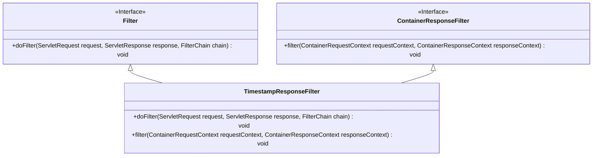
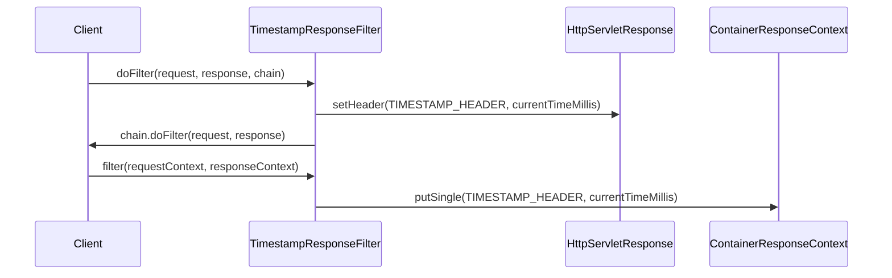
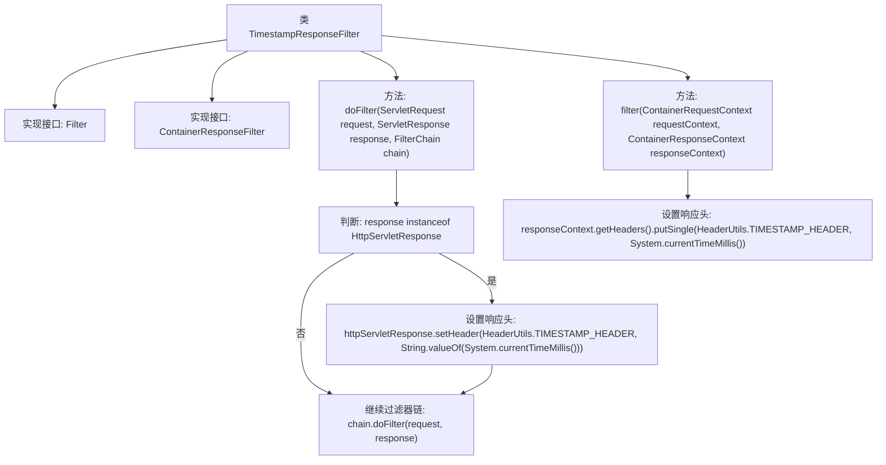

# 基础信息

|      |      |
|------|------|
| 名称 | TimestampResponseFilter |
| 编码语言 | .java |
| 代码路径 | Signal-Server/service/src/main/java/org/whispersystems/textsecuregcm/filters/TimestampResponseFilter.java |
| 包名 | org.whispersystems.textsecuregcm.filters |
| 依赖项 | ['jakarta.servlet.Filter', 'jakarta.servlet.FilterChain', 'jakarta.servlet.ServletException', 'jakarta.servlet.ServletRequest', 'jakarta.servlet.ServletResponse', 'jakarta.servlet.http.HttpServletResponse', 'jakarta.ws.rs.container.ContainerRequestContext', 'jakarta.ws.rs.container.ContainerResponseContext', 'jakarta.ws.rs.container.ContainerResponseFilter', 'java.io.IOException', 'org.whispersystems.textsecuregcm.util.HeaderUtils'] |
| 概述说明 | TimestampResponseFilter类实现Filter和ContainerResponseFilter接口，设置响应头为当前时间戳。 |

# 说明

TimestampResponseFilter类实现了Filter和ContainerResponseFilter接口，主要用于在响应中设置当前时间戳作为响应头。通过实现这两个接口，该类能够拦截和处理HTTP请求与响应，确保每次响应都包含一个表示当前时间的时间戳头信息。这种设计常用于日志记录、调试或时间相关的业务逻辑处理，确保系统能够准确记录或处理时间敏感的操作。

# 类列表 Class Summary

| 名称   | 类型  | 说明 |
|-------|------|-------------|
| TimestampResponseFilter | class | TimestampResponseFilter类实现Filter和ContainerResponseFilter接口，设置响应头为当前时间戳。 |

## 类 TimestampResponseFilter

|      |      |
|------|------|
| 访问范围 | public |
| 类型 | class |
| 名称 | TimestampResponseFilter |
| 说明 | TimestampResponseFilter类实现Filter和ContainerResponseFilter接口，设置响应头为当前时间戳。 |

### UML类图

### 描述
`TimestampResponseFilter` 类实现了 `Filter` 和 `ContainerResponseFilter` 接口，用于在 HTTP 响应中添加时间戳头信息。`doFilter` 方法在处理请求时，如果响应是 `HttpServletResponse` 类型，则设置时间戳头；`filter` 方法在处理容器响应时，直接向响应头中添加时间戳。该类通过两个接口实现了对请求和响应的过滤处理。

### 内部方法调用关系图

这段代码定义了一个名为 `TimestampResponseFilter` 的类，该类实现了 `Filter` 和 `ContainerResponseFilter` 接口。`doFilter` 方法用于处理 HTTP 请求，并在响应头中添加当前时间戳。如果响应是 `HttpServletResponse` 类型，则直接设置响应头；否则，继续执行过滤器链。`filter` 方法则用于在容器响应上下文中设置相同的时间戳响应头。该代码主要用于在 HTTP 响应中添加时间戳信息，以便于跟踪请求处理的时间。

### 字段列表 Field List

| 名称  | 类型  | 说明 |
|-------|-------|------|

### 方法列表 Method List

| 名称  | 类型  | 说明 |
|-------|-------|------|
| doFilter | void | 过滤器中为HTTP响应添加时间戳头信息。 |
| filter | void | 重写过滤器方法，添加单值时间戳头信息。 |

