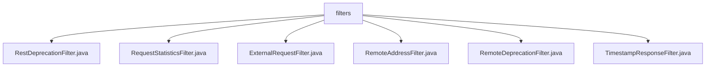

# 基础信息

|      |      |
|------|------|
| 名称 | filters |
| 编码语言 | .java |
| 代码路径 | Signal-Server/service/src/main/java/org/whispersystems/textsecuregcm/filters |
| 包名 | Signal-Server.service.src.main.java.org.whispersystems.textsecuregcm.filters |
| 概述说明 | RestDeprecationFilter过滤REST请求，RequestStatisticsFilter记录请求统计，ExternalRequestFilter拦截gRPC和HTTP请求，RemoteAddressFilter处理远程地址，RemoteDeprecationFilter检查客户端版本，TimestampResponseFilter设置响应时间戳。 |

# 说明

## 概述
该代码模块主要包含一系列用于处理和管理HTTP请求与响应的过滤器类。这些过滤器类分别负责不同的功能，包括请求版本控制、请求统计、远程地址管理、时间戳设置等。通过这些过滤器的协同工作，模块能够实现对请求的精细控制、安全性和稳定性的提升，以及对系统日志和调试的支持。

## 主要业务场景
1. **请求版本控制**：
   - `RestDeprecationFilter`：过滤REST请求，检查用户是否参与特定实验，并阻止来自特定版本的请求，确保只有符合条件的请求能够通过。
   - `RemoteDeprecationFilter`：拦截和检查客户端版本，根据配置决定是否阻止或记录来自过时客户端的请求，确保客户端版本符合要求。

2. **请求统计与监控**：
   - `RequestStatisticsFilter`：记录请求内容的长度和使用的IP版本，处理异常情况并将相关信息记录到日志中，用于监控请求的详细情况，提升系统的稳定性和可维护性。
   - `ExternalRequestFilter`：拦截并检查gRPC和HTTP请求，根据目标地址和方法进行判断，记录每个请求的计数，用于统计和分析请求。

3. **远程地址管理**：
   - `RemoteAddressFilter`：获取和设置远程地址属性，处理与远程地址相关的操作，确保在需要时能够准确地获取或更新远程地址信息。

4. **时间戳设置**：
   - `TimestampResponseFilter`：在响应中设置当前时间戳作为响应头，用于日志记录、调试或时间相关的业务逻辑处理，确保系统能够准确记录或处理时间敏感的操作。

通过这些过滤器，模块能够实现对请求的全方位管理，确保系统的安全性、稳定性和可维护性。

### 包内部结构视图

该流程图展示了`filters`文件夹与其内部文件的层级关系。`filters`作为根节点，包含了六个不同的过滤器文件，分别是`RestDeprecationFilter.java`、`RequestStatisticsFilter.java`、`ExternalRequestFilter.java`、`RemoteAddressFilter.java`、`RemoteDeprecationFilter.java`和`TimestampResponseFilter.java`。每个文件都直接隶属于`filters`文件夹，清晰地展示了文件与文件夹之间的从属关系。

# 文件列表 File List

| 名称   | 类型  | 说明 |
|-------|------|-------------|
| [TimestampResponseFilter.java](TimestampResponseFilter.md) | file | TimestampResponseFilter类实现Filter和ContainerResponseFilter接口，设置响应头为当前时间戳。 |
| [RemoteAddressFilter.java](RemoteAddressFilter.md) | file | RemoteAddressFilter类实现Filter接口，管理远程地址属性。 |
| [RestDeprecationFilter.java](RestDeprecationFilter.md) | file | RestDeprecationFilter类过滤REST请求，检查用户实验并阻止特定版本。 |
| [RemoteDeprecationFilter.java](RemoteDeprecationFilter.md) | file | RemoteDeprecationFilter拦截检查客户端版本，决定阻止或记录过时请求。 |
| [ExternalRequestFilter.java](ExternalRequestFilter.md) | file | 外部请求过滤器拦截并检查gRPC和HTTP请求，根据地址和方法决定是否阻止，记录请求计数。 |
| [RequestStatisticsFilter.java](RequestStatisticsFilter.md) | file | 实现请求统计过滤器，记录内容长度和IP版本，处理异常并记录日志。 |

