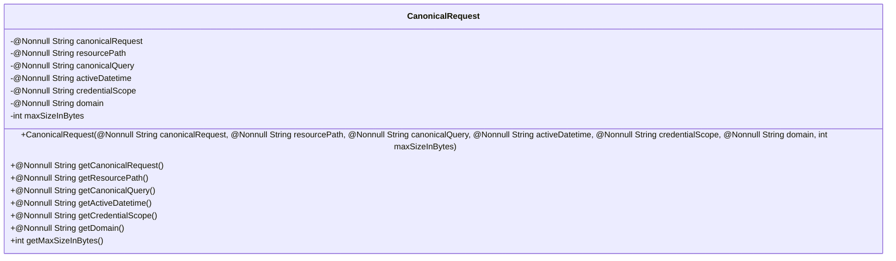

# 基础信息

|      |      |
|------|------|
| 名称 | CanonicalRequest |
| 编码语言 | .java |
| 代码路径 | Signal-Server/service/src/main/java/org/whispersystems/textsecuregcm/gcp/CanonicalRequest.java |
| 包名 | org.whispersystems.textsecuregcm.gcp |
| 依赖项 | ['javax.annotation.Nonnull'] |
| 概述说明 | CanonicalRequest类包含请求路径、查询、时间、范围、域名和最大字节数。 |

# 说明

CanonicalRequest类是一个用于封装请求相关关键信息的类，包含请求路径、查询参数、时间戳、请求范围、域名以及最大字节数等要素。这些信息共同构成了请求的核心内容，确保请求的完整性和准确性。通过此类，可以有效地管理和处理请求数据，便于后续的操作和分析。

# 类列表 Class Summary

| 名称   | 类型  | 说明 |
|-------|------|-------------|
| CanonicalRequest | class | CanonicalRequest类包含请求路径、查询、时间、范围、域名和最大字节数等关键信息。 |

## 类 CanonicalRequest

|      |      |
|------|------|
| 访问范围 | public |
| 类型 | class |
| 名称 | CanonicalRequest |
| 说明 | CanonicalRequest类包含请求路径、查询、时间、范围、域名和最大字节数等关键信息。 |

### UML类图

**描述：**  
`CanonicalRequest` 类用于封装一个规范的请求信息，包含七个私有成员变量：`canonicalRequest`、`resourcePath`、`canonicalQuery`、`activeDatetime`、`credentialScope`、`domain` 和 `maxSizeInBytes`。这些变量通过构造函数进行初始化，并通过对应的 `getter` 方法提供访问。所有成员变量都标记为 `@Nonnull`，表示它们不能为 `null`，确保数据的完整性和一致性。此类适用于需要处理规范请求的场景，如 API 请求的验证和处理。

### 内部方法调用关系图

```mermaid
graph TD
    A["类CanonicalRequest"]
    B["属性: String canonicalRequest"]
    C["属性: String resourcePath"]
    D["属性: String canonicalQuery"]
    E["属性: String activeDatetime"]
    F["属性: String credentialScope"]
    G["属性: String domain"]
    H["属性: int maxSizeInBytes"]
    I["构造方法: CanonicalRequest(String canonicalRequest, String resourcePath, String canonicalQuery, String activeDatetime, String credentialScope, String domain, int maxSizeInBytes)"]
    J["方法: String getCanonicalRequest()"]
    K["方法: String getResourcePath()"]
    L["方法: String getCanonicalQuery()"]
    M["方法: String getActiveDatetime()"]
    N["方法: String getCredentialScope()"]
    O["方法: String getDomain()"]
    P["方法: int getMaxSizeInBytes()"]

    A --> B
    A --> C
    A --> D
    A --> E
    A --> F
    A --> G
    A --> H
    A --> I
    A --> J
    A --> K
    A --> L
    A --> M
    A --> N
    A --> O
    A --> P
```

该流程图描述了`CanonicalRequest`类的结构和内部方法调用关系。`CanonicalRequest`类包含多个非空字符串属性和一个整型属性，并通过构造方法进行初始化。类中提供了多个getter方法用于获取这些属性的值。每个属性与方法之间的关系通过箭头清晰地表示出来，展示了类的完整结构和功能。

### 字段列表 Field List

| 名称  | 类型  | 说明 |
|-------|-------|------|
| canonicalRequest | String | 非空私有常量字符串存储规范请求。 |
| resourcePath | String | 不可为空字符串资源路径。 |
| domain | String | 非空私有字符串域变量。 |
| activeDatetime | String | 非空私有常量字符串类型变量activeDatetime。 |
| canonicalQuery | String | 不可为空且不可变的字符串类型变量canonicalQuery。 |
| maxSizeInBytes | int | 私有整型变量maxSizeInBytes表示最大字节大小。 |
| credentialScope | String | 不可为空且为最终字符串类型的凭证范围。 |

### 方法列表 Method List

| 名称  | 类型  | 说明 |
|-------|-------|------|
| getCanonicalQuery | String | 非空方法返回规范查询字符串。 |
| getCanonicalRequest | String | 返回非空的规范请求字符串。 |
| getDomain | String | 非空方法返回域名字符串。 |
| getCredentialScope | String | 非空方法返回凭证范围。 |
| getResourcePath | String | 方法返回非空资源路径字符串。 |
| getActiveDatetime | String | 获取非空活动日期时间字符串。 |
| getMaxSizeInBytes | int | 方法getMaxSizeInBytes返回maxSizeInBytes的值。 |

