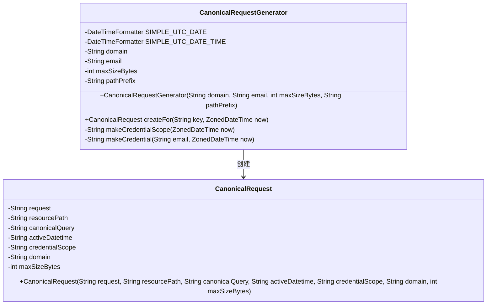
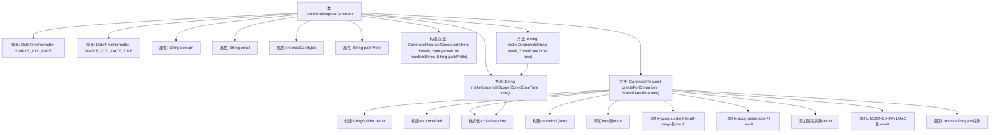

# 基础信息

|      |      |
|------|------|
| 名称 | CanonicalRequestGenerator |
| 编码语言 | .java |
| 代码路径 | Signal-Server/service/src/main/java/org/whispersystems/textsecuregcm/gcp/CanonicalRequestGenerator.java |
| 包名 | org.whispersystems.textsecuregcm.gcp |
| 依赖项 | ['java.net.URLEncoder', 'java.nio.charset.StandardCharsets', 'java.time.Duration', 'java.time.ZoneOffset', 'java.time.ZonedDateTime', 'java.time.format.DateTimeFormatter', 'java.time.temporal.ChronoUnit', 'java.util.Locale', 'javax.annotation.Nonnull', 'org.apache.commons.lang3.StringUtils'] |
| 概述说明 | 生成POST请求的类，包含域名、邮箱、最大字节数和路径前缀。 |

# 说明

生成规范请求的类用于创建POST请求，包含四个关键属性：域名、邮箱、最大字节数和路径前缀。域名指定请求的目标服务器地址，邮箱用于标识请求者或相关用户，最大字节数限制请求数据的最大大小，路径前缀则定义请求URL的基础路径。通过这些属性，可以确保POST请求的规范性和完整性，便于系统处理和验证。

# 类列表 Class Summary

| 名称   | 类型  | 说明 |
|-------|------|-------------|
| CanonicalRequestGenerator | class | 生成规范请求的类，包含域名、邮箱、最大字节数和路径前缀，用于创建POST请求。 |

## 类 CanonicalRequestGenerator

|      |      |
|------|------|
| 访问范围 | public |
| 类型 | class |
| 名称 | CanonicalRequestGenerator |
| 说明 | 生成规范请求的类，包含域名、邮箱、最大字节数和路径前缀，用于创建POST请求。 |

### UML类图

**描述**：`CanonicalRequestGenerator`类用于生成规范请求，包含处理日期格式、构建请求路径和查询参数等逻辑。它通过`createFor`方法生成`CanonicalRequest`对象，该对象封装了请求的详细信息，如资源路径、查询参数和凭证范围等。`CanonicalRequest`类则用于存储和表示这些生成的请求数据。

### 内部方法调用关系图

这段代码定义了一个`CanonicalRequestGenerator`类，用于生成规范的请求。类中包含两个常量`SIMPLE_UTC_DATE`和`SIMPLE_UTC_DATE_TIME`用于日期格式化，以及多个属性和方法。`createFor`方法是核心，它通过构建`StringBuilder`对象`result`来逐步生成请求内容，包括`resourcePath`、`activeDatetime`、`canonicalQuery`等，并最终返回一个`CanonicalRequest`对象。`makeCredentialScope`和`makeCredential`方法用于生成凭证范围和凭证。

### 字段列表 Field List

| 名称  | 类型  | 说明 |
|-------|-------|------|
| pathPrefix | String | 非空私有最终字符串路径前缀。 |
| email | String | 非空私有最终字符串类型变量email。 |
| maxSizeBytes | int | 私有整型变量maxSizeBytes用于存储最大字节数。 |
| domain | String | 声明一个不可为空的最终字符串域变量。 |
| SIMPLE_UTC_DATE_TIME = DateTimeFormatter.ofPattern("yyyyMMdd'T'HHmmss'Z'", Locale.US).withZone(ZoneOffset.UTC) | DateTimeFormatter | 定义了一个静态UTC日期时间格式化器，使用"yyyyMMdd'T'HHmmss'Z'"格式。 |
| SIMPLE_UTC_DATE = DateTimeFormatter.ofPattern("yyyyMMdd", Locale.US).withZone(ZoneOffset.UTC) | DateTimeFormatter | 定义私有静态日期格式化器，格式为"yyyyMMdd"，使用UTC时区。 |

### 方法列表 Method List

| 名称  | 类型  | 说明 |
|-------|-------|------|
| makeCredentialScope | String | 生成当前日期与固定路径组合的凭证范围字符串。 |
| makeCredential | String | 生成凭据：将邮箱与当前时间组合。 |
| createFor | CanonicalRequest | 创建CanonicalRequest方法，生成POST请求，包含路径、查询参数、头部信息及未签名负载。 |

