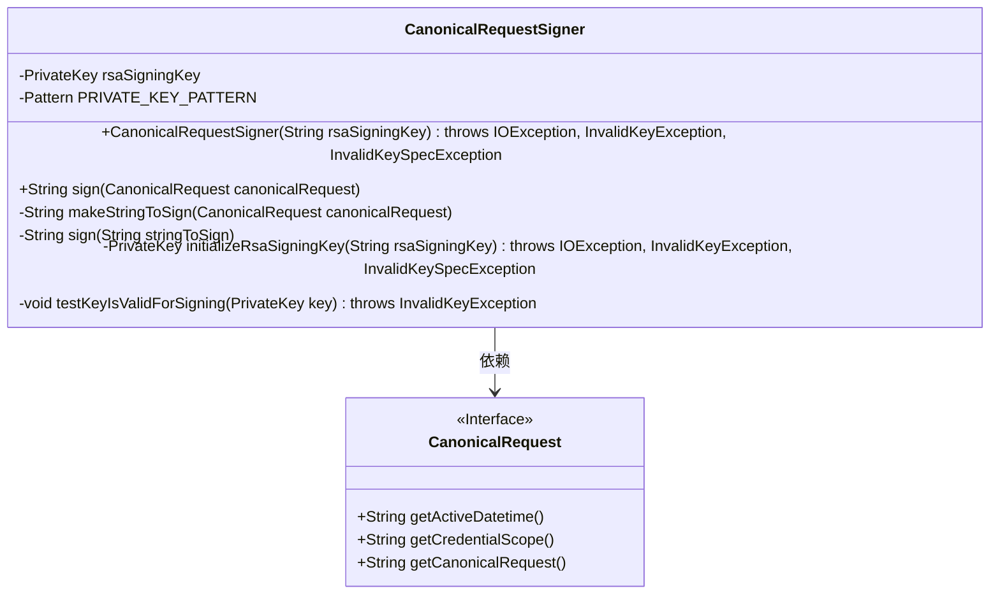
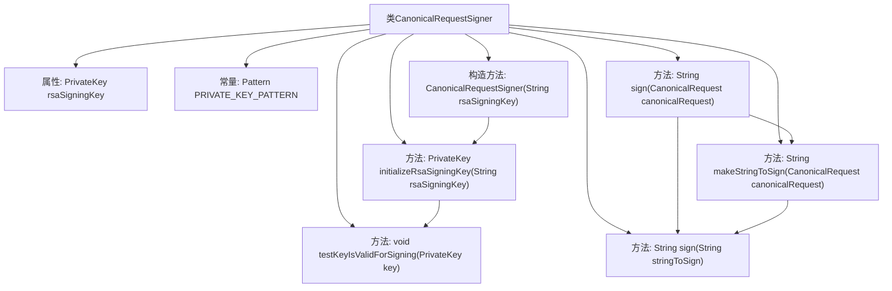

# 基础信息

|      |      |
|------|------|
| 名称 | CanonicalRequestSigner |
| 编码语言 | .java |
| 代码路径 | Signal-Server/service/src/main/java/org/whispersystems/textsecuregcm/gcp/CanonicalRequestSigner.java |
| 包名 | org.whispersystems.textsecuregcm.gcp |
| 依赖项 | ['java.io.IOException', 'java.nio.charset.StandardCharsets', 'java.security.InvalidKeyException', 'java.security.KeyFactory', 'java.security.MessageDigest', 'java.security.NoSuchAlgorithmException', 'java.security.PrivateKey', 'java.security.Signature', 'java.security.SignatureException', 'java.security.spec.InvalidKeySpecException', 'java.security.spec.PKCS8EncodedKeySpec', 'java.util.Base64', 'java.util.HexFormat', 'java.util.regex.Matcher', 'java.util.regex.Pattern', 'javax.annotation.Nonnull'] |
| 概述说明 | 类CanonicalRequestSigner用RSA私钥签请求，支持SHA256WITHRSA。 |

# 说明

类CanonicalRequestSigner是一个用于对规范请求进行签名的工具，它使用RSA私钥来实现签名功能。该类支持SHA256WITHRSA算法，确保签名的安全性和完整性。通过这种方式，可以有效地验证请求的合法性和来源，防止数据被篡改或伪造。

# 类列表 Class Summary

| 名称   | 类型  | 说明 |
|-------|------|-------------|
| CanonicalRequestSigner | class | 类CanonicalRequestSigner用于使用RSA私钥对规范请求进行签名，支持SHA256WITHRSA算法。 |

## 类 CanonicalRequestSigner

|      |      |
|------|------|
| 访问范围 | public |
| 类型 | class |
| 名称 | CanonicalRequestSigner |
| 说明 | 类CanonicalRequestSigner用于使用RSA私钥对规范请求进行签名，支持SHA256WITHRSA算法。 |

### UML类图

这段代码定义了一个`CanonicalRequestSigner`类，用于对`CanonicalRequest`对象进行签名。该类包含一个私有的`PrivateKey`对象和一个用于匹配私钥的正则表达式。构造函数接收一个字符串形式的RSA私钥，并将其初始化为`PrivateKey`对象。`sign`方法用于对`CanonicalRequest`对象进行签名，内部调用了`makeStringToSign`方法生成待签名字符串，并调用另一个`sign`方法进行签名。`initializeRsaSigningKey`方法用于从字符串中提取并初始化RSA私钥，`testKeyIsValidForSigning`方法用于验证私钥是否可用于签名。`CanonicalRequest`接口定义了获取日期时间、凭证范围和规范化请求的方法。

### 内部方法调用关系图

这段代码定义了一个`CanonicalRequestSigner`类，用于对规范请求进行签名。类中包含一个私有的`PrivateKey`对象和一个用于匹配私钥的正则表达式。构造方法`CanonicalRequestSigner`通过调用`initializeRsaSigningKey`方法初始化私钥。`sign`方法用于对请求进行签名，它依赖于`makeStringToSign`方法生成待签名字符串，并调用另一个`sign`方法进行实际签名操作。`initializeRsaSigningKey`方法负责解析和验证私钥，而`testKeyIsValidForSigning`方法则用于测试私钥是否可用于签名。整个流程确保了请求的安全性和完整性。

### 字段列表 Field List

| 名称  | 类型  | 说明 |
|-------|-------|------|
| PRIVATE_KEY_PATTERN =      Pattern.compile("^-+BEGIN PRIVATE KEY-+\\s*(.+)\\n-+END PRIVATE KEY-+\\s*$", Pattern.DOTALL) | Pattern | 定义私有静态常量正则表达式，用于匹配私钥格式。 |
| rsaSigningKey | PrivateKey | 非空私有终态RSA签名密钥变量。 |

### 方法列表 Method List

| 名称  | 类型  | 说明 |
|-------|-------|------|
| initializeRsaSigningKey | PrivateKey | 初始化RSA签名密钥，验证有效性后返回私钥。 |
| sign | String | 使用SHA256WITHRSA算法对字符串进行签名并返回十六进制结果。 |
| testKeyIsValidForSigning | void | 验证私钥是否可用于SHA256WITHRSA签名。 |
| makeStringToSign | String | 生成Google签名字符串，包含算法、时间、凭证范围和SHA-256哈希值。 |
| sign | String | 对CanonicalRequest签名并返回结果。 |

