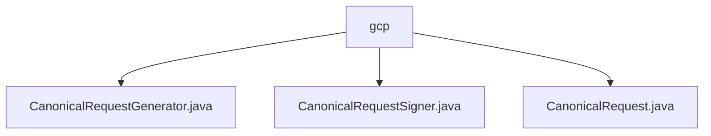

# 基础信息

|      |      |
|------|------|
| 名称 | gcp |
| 编码语言 | .java |
| 代码路径 | Signal-Server/service/src/main/java/org/whispersystems/textsecuregcm/gcp |
| 包名 | Signal-Server.service.src.main.java.org.whispersystems.textsecuregcm.gcp |
| 概述说明 | 生成POST请求类含域名、邮箱、最大字节数和路径前缀，确保请求规范完整。签名工具使用RSA私钥，支持SHA256WITHRSA算法，验证请求合法性。封装类包含路径、查询参数等关键信息，确保请求准确。 |

# 说明

## 概述
该代码模块主要用于生成、签名和处理规范化的POST请求。它包含三个核心类：`CanonicalRequestGenerator`、`CanonicalRequestSigner`和`CanonicalRequest`。这些类共同协作，确保请求的规范性、完整性和安全性。`CanonicalRequestGenerator`负责生成包含关键属性的POST请求，`CanonicalRequestSigner`用于对请求进行签名，而`CanonicalRequest`则封装了请求的核心信息，便于后续处理和分析。

## 主要业务场景
1. **生成规范请求**：`CanonicalRequestGenerator`类用于创建规范化的POST请求，包含域名、邮箱、最大字节数和路径前缀等关键属性。这些属性确保了请求的规范性和完整性，便于系统处理和验证。
2. **请求签名**：`CanonicalRequestSigner`类使用RSA私钥对规范请求进行签名，支持SHA256WITHRSA算法。通过这种方式，可以有效地验证请求的合法性和来源，防止数据被篡改或伪造。
3. **请求信息封装**：`CanonicalRequest`类封装了请求路径、查询参数、时间戳、请求范围、域名以及最大字节数等关键信息。这些信息共同构成了请求的核心内容，确保请求的完整性和准确性，便于后续的操作和分析。

### 包内部结构视图

该流程图展示了 `gcp` 目录下的三个文件 `CanonicalRequestGenerator.java`、`CanonicalRequestSigner.java` 和 `CanonicalRequest.java` 的层级关系。所有文件都直接位于 `gcp` 目录下，没有进一步的子目录结构。

# 文件列表 File List

| 名称   | 类型  | 说明 |
|-------|------|-------------|
| [CanonicalRequestSigner.java](CanonicalRequestSigner.md) | file | 类CanonicalRequestSigner用RSA私钥签请求，支持SHA256WITHRSA。 |
| [CanonicalRequest.java](CanonicalRequest.md) | file | CanonicalRequest类包含请求路径、查询、时间、范围、域名和最大字节数。 |
| [CanonicalRequestGenerator.java](CanonicalRequestGenerator.md) | file | 生成POST请求的类，包含域名、邮箱、最大字节数和路径前缀。 |

