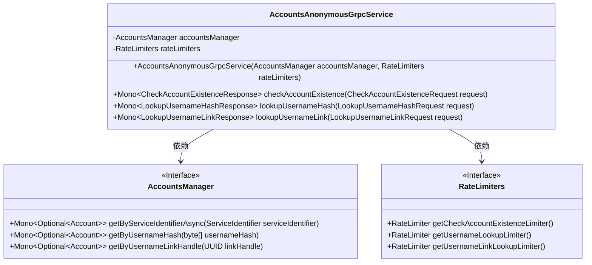

# 基础信息

|      |      |
|------|------|
| 名称 | AccountsAnonymousGrpcService |
| 编码语言 | .java |
| 代码路径 | Signal-Server/service/src/main/java/org/whispersystems/textsecuregcm/grpc/AccountsAnonymousGrpcService.java |
| 包名 | org.whispersystems.textsecuregcm.grpc |
| 依赖项 | ['com.google.protobuf.ByteString', 'io.grpc.Status', 'org.signal.chat.account.CheckAccountExistenceRequest', 'org.signal.chat.account.CheckAccountExistenceResponse', 'org.signal.chat.account.LookupUsernameHashRequest', 'org.signal.chat.account.LookupUsernameHashResponse', 'org.signal.chat.account.LookupUsernameLinkRequest', 'org.signal.chat.account.LookupUsernameLinkResponse', 'org.signal.chat.account.ReactorAccountsAnonymousGrpc', 'org.whispersystems.textsecuregcm.controllers.AccountController', 'org.whispersystems.textsecuregcm.identity.AciServiceIdentifier', 'org.whispersystems.textsecuregcm.identity.ServiceIdentifier', 'org.whispersystems.textsecuregcm.limits.RateLimiters', 'org.whispersystems.textsecuregcm.storage.Account', 'org.whispersystems.textsecuregcm.storage.AccountsManager', 'org.whispersystems.textsecuregcm.util.UUIDUtil', 'reactor.core.publisher.Mono', 'java.util.Optional', 'java.util.UUID'] |
| 概述说明 | AccountsAnonymousGrpcService提供账户检查、哈希查找和链接查找功能。 |

# 说明

AccountsAnonymousGrpcService是一个服务，主要提供三项核心功能：账户检查、用户名哈希查找和用户名链接查找。账户检查功能用于验证账户的存在性和状态；用户名哈希查找通过哈希值快速定位特定用户名；用户名链接查找则用于根据用户名查找相关链接信息。该服务通过Grpc协议实现，确保高效、可靠的通信和数据传输。

# 类列表 Class Summary

| 名称   | 类型  | 说明 |
|-------|------|-------------|
| AccountsAnonymousGrpcService | class | AccountsAnonymousGrpcService实现账户检查、用户名哈希查找和用户名链接查找功能。 |

## 类 AccountsAnonymousGrpcService

|      |      |
|------|------|
| 访问范围 | public |
| 类型 | class |
| 名称 | AccountsAnonymousGrpcService |
| 说明 | AccountsAnonymousGrpcService实现账户检查、用户名哈希查找和用户名链接查找功能。 |

### UML类图

**描述：**  
`AccountsAnonymousGrpcService` 类是一个 gRPC 服务实现类，依赖于 `AccountsManager` 和 `RateLimiters` 接口。它提供了三个方法：`checkAccountExistence`、`lookupUsernameHash` 和 `lookupUsernameLink`，分别用于检查账户是否存在、根据用户名哈希查找账户信息以及根据用户名链接查找账户信息。每个方法都包含速率限制和异步处理逻辑，确保在高并发场景下的稳定性和安全性。

### 内部方法调用关系图

```mermaid
graph TD
    A["类AccountsAnonymousGrpcService"]
    B["属性: AccountsManager accountsManager"]
    C["属性: RateLimiters rateLimiters"]
    D["构造方法: AccountsAnonymousGrpcService(AccountsManager accountsManager, RateLimiters rateLimiters)"]
    E["方法: Mono<CheckAccountExistenceResponse> checkAccountExistence(CheckAccountExistenceRequest request)"]
    F["方法: Mono<LookupUsernameHashResponse> lookupUsernameHash(LookupUsernameHashRequest request)"]
    G["方法: Mono<LookupUsernameLinkResponse> lookupUsernameLink(LookupUsernameLinkRequest request)"]
    H["步骤: 从request中获取ServiceIdentifier"]
    I["步骤: 调用rateLimitByRemoteAddress进行限流"]
    J["步骤: 调用accountsManager.getByServiceIdentifierAsync获取账户信息"]
    K["步骤: 检查账户是否存在并构建响应"]
    L["步骤: 检查usernameHash长度是否合法"]
    M["步骤: 调用accountsManager.getByUsernameHash获取账户信息"]
    N["步骤: 构建LookupUsernameHashResponse响应"]
    O["步骤: 从request中解析UUID linkHandle"]
    P["步骤: 调用accountsManager.getByUsernameLinkHandle获取账户信息"]
    Q["步骤: 构建LookupUsernameLinkResponse响应"]

    A --> B
    A --> C
    A --> D
    A --> E
    A --> F
    A --> G
    E --> H
    E --> I
    E --> J
    E --> K
    F --> L
    F --> I
    F --> M
    F --> N
    G --> O
    G --> I
    G --> P
    G --> Q
```

这段代码定义了一个名为 `AccountsAnonymousGrpcService` 的类，该类继承自 `ReactorAccountsAnonymousGrpc.AccountsAnonymousImplBase`。类中包含三个主要方法：`checkAccountExistence`、`lookupUsernameHash` 和 `lookupUsernameLink`。每个方法都涉及从请求中提取信息、调用限流器进行限流、通过 `accountsManager` 获取账户信息，并最终构建响应对象。代码中处理了多种边缘情况，如 `usernameHash` 长度不合法、`linkHandle` 解析失败等，并抛出了相应的异常。

### 字段列表 Field List

| 名称  | 类型  | 说明 |
|-------|-------|------|
| rateLimiters | RateLimiters | 私有常量rateLimiters用于限流控制。 |
| accountsManager | AccountsManager | 私有不可变的账户管理器实例。 |

### 方法列表 Method List

| 名称  | 类型  | 说明 |
|-------|-------|------|
| checkAccountExistence | Mono<CheckAccountExistenceResponse> | 重写方法检查账户存在性，限流后异步查询并返回结果。 |
| lookupUsernameHash | Mono<LookupUsernameHashResponse> | 方法校验用户名哈希长度，限速后查询账户信息并返回结果。 |
| lookupUsernameLink | Mono<LookupUsernameLinkResponse> | 通过UUID查找用户名链接，处理异常并返回加密用户名。 |

