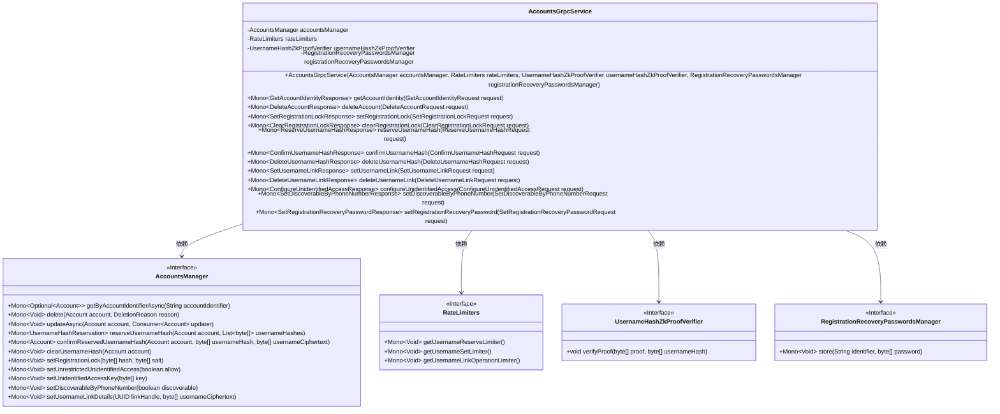

# 基础信息

|      |      |
|------|------|
| 名称 | AccountsGrpcService |
| 编码语言 | .java |
| 代码路径 | Signal-Server/service/src/main/java/org/whispersystems/textsecuregcm/grpc/AccountsGrpcService.java |
| 包名 | org.whispersystems.textsecuregcm.grpc |
| 依赖项 | ['com.google.protobuf.ByteString', 'io.grpc.Status', 'java.util.ArrayList', 'java.util.HexFormat', 'java.util.List', 'java.util.UUID', 'org.signal.chat.account.ClearRegistrationLockRequest', 'org.signal.chat.account.ClearRegistrationLockResponse', 'org.signal.chat.account.ConfigureUnidentifiedAccessRequest', 'org.signal.chat.account.ConfigureUnidentifiedAccessResponse', 'org.signal.chat.account.ConfirmUsernameHashRequest', 'org.signal.chat.account.ConfirmUsernameHashResponse', 'org.signal.chat.account.DeleteAccountRequest', 'org.signal.chat.account.DeleteAccountResponse', 'org.signal.chat.account.DeleteUsernameHashRequest', 'org.signal.chat.account.DeleteUsernameHashResponse', 'org.signal.chat.account.DeleteUsernameLinkRequest', 'org.signal.chat.account.DeleteUsernameLinkResponse', 'org.signal.chat.account.GetAccountIdentityRequest', 'org.signal.chat.account.GetAccountIdentityResponse', 'org.signal.chat.account.ReactorAccountsGrpc', 'org.signal.chat.account.ReserveUsernameHashError', 'org.signal.chat.account.ReserveUsernameHashErrorType', 'org.signal.chat.account.ReserveUsernameHashRequest', 'org.signal.chat.account.ReserveUsernameHashResponse', 'org.signal.chat.account.SetDiscoverableByPhoneNumberRequest', 'org.signal.chat.account.SetDiscoverableByPhoneNumberResponse', 'org.signal.chat.account.SetRegistrationLockRequest', 'org.signal.chat.account.SetRegistrationLockResponse', 'org.signal.chat.account.SetRegistrationRecoveryPasswordRequest', 'org.signal.chat.account.SetRegistrationRecoveryPasswordResponse', 'org.signal.chat.account.SetUsernameLinkRequest', 'org.signal.chat.account.SetUsernameLinkResponse', 'org.signal.chat.common.AccountIdentifiers', 'org.signal.libsignal.usernames.BaseUsernameException', 'org.whispersystems.textsecuregcm.auth.SaltedTokenHash', 'org.whispersystems.textsecuregcm.auth.UnidentifiedAccessUtil', 'org.whispersystems.textsecuregcm.auth.grpc.AuthenticatedDevice', 'org.whispersystems.textsecuregcm.auth.grpc.AuthenticationUtil', 'org.whispersystems.textsecuregcm.controllers.AccountController', 'org.whispersystems.textsecuregcm.entities.EncryptedUsername', 'org.whispersystems.textsecuregcm.identity.AciServiceIdentifier', 'org.whispersystems.textsecuregcm.identity.IdentityType', 'org.whispersystems.textsecuregcm.identity.PniServiceIdentifier', 'org.whispersystems.textsecuregcm.limits.RateLimiters', 'org.whispersystems.textsecuregcm.storage.AccountsManager', 'org.whispersystems.textsecuregcm.storage.RegistrationRecoveryPasswordsManager', 'org.whispersystems.textsecuregcm.storage.UsernameHashNotAvailableException', 'org.whispersystems.textsecuregcm.storage.UsernameReservationNotFoundException', 'org.whispersystems.textsecuregcm.util.UUIDUtil', 'org.whispersystems.textsecuregcm.util.UsernameHashZkProofVerifier', 'reactor.core.publisher.Mono'] |
| 概述说明 | AccountsGrpcService负责账户操作，涵盖身份验证、删除、注册锁及用户名管理。 |

# 说明

AccountsGrpcService 是一个处理账户相关操作的gRPC服务，主要功能包括用户身份验证、账户删除、注册锁管理以及用户名管理等。该服务通过gRPC协议提供高效的账户操作接口，确保用户身份验证的安全性，支持账户的删除操作，管理账户的注册锁定状态，并提供用户名的管理功能，以满足各类账户管理需求。

# 类列表 Class Summary

| 名称   | 类型  | 说明 |
|-------|------|-------------|
| AccountsGrpcService | class | AccountsGrpcService处理账户相关操作，包括身份验证、删除、注册锁、用户名管理等。 |

## 类 AccountsGrpcService

|      |      |
|------|------|
| 访问范围 | public |
| 类型 | class |
| 名称 | AccountsGrpcService |
| 说明 | AccountsGrpcService处理账户相关操作，包括身份验证、删除、注册锁、用户名管理等。 |

### UML类图

### 描述
`AccountsGrpcService` 是一个基于 gRPC 的服务类，负责处理与账户相关的各种操作，如获取账户身份、删除账户、设置注册锁、保留用户名哈希等。它依赖于 `AccountsManager`、`RateLimiters`、`UsernameHashZkProofVerifier` 和 `RegistrationRecoveryPasswordsManager` 等接口来实现具体的业务逻辑。每个方法都通过异步方式处理请求，并返回相应的响应对象。

### 内部方法调用关系图

```mermaid
graph TD
    A["类AccountsGrpcService"]
    B["属性: AccountsManager accountsManager"]
    C["属性: RateLimiters rateLimiters"]
    D["属性: UsernameHashZkProofVerifier usernameHashZkProofVerifier"]
    E["属性: RegistrationRecoveryPasswordsManager registrationRecoveryPasswordsManager"]
    F["构造方法: AccountsGrpcService(AccountsManager, RateLimiters, UsernameHashZkProofVerifier, RegistrationRecoveryPasswordsManager)"]
    G["方法: Mono<GetAccountIdentityResponse> getAccountIdentity(GetAccountIdentityRequest)"]
    H["方法: Mono<DeleteAccountResponse> deleteAccount(DeleteAccountRequest)"]
    I["方法: Mono<SetRegistrationLockResponse> setRegistrationLock(SetRegistrationLockRequest)"]
    J["方法: Mono<ClearRegistrationLockResponse> clearRegistrationLock(ClearRegistrationLockRequest)"]
    K["方法: Mono<ReserveUsernameHashResponse> reserveUsernameHash(ReserveUsernameHashRequest)"]
    L["方法: Mono<ConfirmUsernameHashResponse> confirmUsernameHash(ConfirmUsernameHashRequest)"]
    M["方法: Mono<DeleteUsernameHashResponse> deleteUsernameHash(DeleteUsernameHashRequest)"]
    N["方法: Mono<SetUsernameLinkResponse> setUsernameLink(SetUsernameLinkRequest)"]
    O["方法: Mono<DeleteUsernameLinkResponse> deleteUsernameLink(DeleteUsernameLinkRequest)"]
    P["方法: Mono<ConfigureUnidentifiedAccessResponse> configureUnidentifiedAccess(ConfigureUnidentifiedAccessRequest)"]
    Q["方法: Mono<SetDiscoverableByPhoneNumberResponse> setDiscoverableByPhoneNumber(SetDiscoverableByPhoneNumberRequest)"]
    R["方法: Mono<SetRegistrationRecoveryPasswordResponse> setRegistrationRecoveryPassword(SetRegistrationRecoveryPasswordRequest)"]

    A --> B
    A --> C
    A --> D
    A --> E
    A --> F
    A --> G
    A --> H
    A --> I
    A --> J
    A --> K
    A --> L
    A --> M
    A --> N
    A --> O
    A --> P
    A --> Q
    A --> R
```

这段代码定义了一个 `AccountsGrpcService` 类，该类继承自 `ReactorAccountsGrpc.AccountsImplBase`，并实现了多个与账户管理相关的 gRPC 服务方法。每个方法都处理不同的账户操作，如获取账户身份、删除账户、设置注册锁、保留用户名哈希等。代码中使用了 `Mono` 来处理异步操作，并通过 `AccountsManager` 和 `RateLimiters` 等依赖项来执行具体的业务逻辑。

### 字段列表 Field List

| 名称  | 类型  | 说明 |
|-------|-------|------|
| accountsManager | AccountsManager | 私有账户管理器实例变量。 |
| rateLimiters | RateLimiters | 私有且不可变的限流器实例。 |
| registrationRecoveryPasswordsManager | RegistrationRecoveryPasswordsManager | 私有注册恢复密码管理器实例。 |
| usernameHashZkProofVerifier | UsernameHashZkProofVerifier | 私有成员：UsernameHashZkProofVerifier验证器。 |

### 方法列表 Method List

| 名称  | 类型  | 说明 |
|-------|-------|------|
| clearRegistrationLock | Mono<ClearRegistrationLockResponse> | 该方法清除设备注册锁，验证设备后更新账户信息。 |
| getAccountIdentity | Mono<GetAccountIdentityResponse> | 该方法通过认证设备获取账户标识，构建账户标识响应。 |
| setDiscoverableByPhoneNumber | Mono<SetDiscoverableByPhoneNumberResponse> | 该方法通过验证设备，更新账户的手机号可见性设置，并返回响应。 |
| setRegistrationRecoveryPassword | Mono<SetRegistrationRecoveryPasswordResponse> | 方法验证设备身份并存储注册恢复密码，返回响应。 |
| deleteUsernameHash | Mono<DeleteUsernameHashResponse> | 该方法删除已验证设备的用户名哈希，返回响应对象。 |
| setRegistrationLock | Mono<SetRegistrationLockResponse> | 方法验证设备并设置注册锁，处理空值异常，更新账户注册锁信息。 |
| configureUnidentifiedAccess | Mono<ConfigureUnidentifiedAccessResponse> | 方法配置未识别访问，验证设备并检查密钥长度，更新账户设置并返回响应。 |
| deleteAccount | Mono<DeleteAccountResponse> | 该方法删除账户，验证设备身份，获取账户并删除，返回删除响应。 |
| deleteUsernameLink | Mono<DeleteUsernameLinkResponse> | 该方法删除用户链接，验证设备身份，更新账户信息，返回删除响应。 |
| setUsernameLink | Mono<SetUsernameLinkResponse> | 方法验证用户设备并设置用户名链接，处理加密文本大小和账户状态，返回链接句柄。 |
| confirmUsernameHash | Mono<ConfirmUsernameHashResponse> | 验证用户名哈希和零知识证明，确保数据有效性并更新账户信息。 |
| reserveUsernameHash | Mono<ReserveUsernameHashResponse> | 验证设备并保留用户名哈希，处理异常情况。 |

