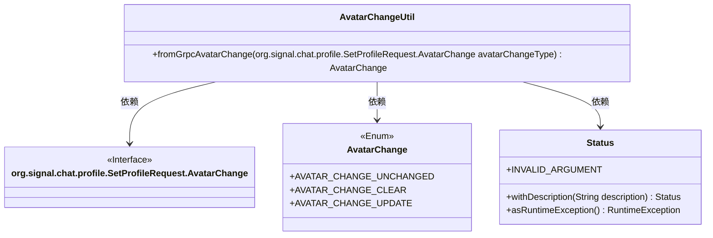
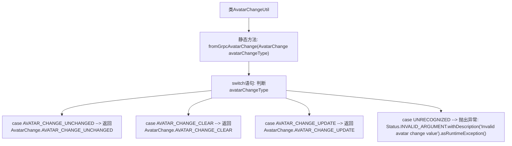

# 基础信息

|      |      |
|------|------|
| 名称 | AvatarChangeUtil |
| 编码语言 | .java |
| 代码路径 | Signal-Server/service/src/main/java/org/whispersystems/textsecuregcm/grpc/AvatarChangeUtil.java |
| 包名 | org.whispersystems.textsecuregcm.grpc |
| 依赖项 | ['io.grpc.Status', 'org.whispersystems.textsecuregcm.entities.AvatarChange'] |
| 概述说明 | AvatarChangeUtil类负责gRPC AvatarChange类型到内部类型的转换及异常处理。 |

# 说明

AvatarChangeUtil类的主要功能是将gRPC协议中的AvatarChange类型转换为系统内部使用的类型。在此过程中，该类负责处理可能出现的无效值异常，确保数据转换的准确性和稳定性。通过这一转换，系统能够有效利用gRPC提供的数据，同时避免因数据无效而导致的错误或异常情况。

# 类列表 Class Summary

| 名称   | 类型  | 说明 |
|-------|------|-------------|
| AvatarChangeUtil | class | AvatarChangeUtil类将gRPC的AvatarChange类型转换为内部类型，处理无效值异常。 |

## 类 AvatarChangeUtil

|      |      |
|------|------|
| 访问范围 | public |
| 类型 | class |
| 名称 | AvatarChangeUtil |
| 说明 | AvatarChangeUtil类将gRPC的AvatarChange类型转换为内部类型，处理无效值异常。 |

### UML类图

这段代码定义了一个 `AvatarChangeUtil` 类，其中包含一个静态方法 `fromGrpcAvatarChange`，用于将 gRPC 协议中的 `AvatarChange` 类型转换为本地枚举类型 `AvatarChange`。该方法通过 switch 语句处理不同的 `AvatarChange` 类型，并在遇到未知类型时抛出异常。`org.signal.chat.profile.SetProfileRequest.AvatarChange` 是一个接口，`AvatarChange` 是一个枚举类，`Status` 类用于处理异常情况。

### 内部方法调用关系图

这段代码定义了一个名为 `AvatarChangeUtil` 的类，其中包含一个静态方法 `fromGrpcAvatarChange`。该方法接收一个 `AvatarChange` 类型的参数，并通过 `switch` 语句根据参数的不同值返回相应的 `AvatarChange` 枚举值或抛出异常。该代码主要用于将 gRPC 请求中的 `AvatarChange` 类型转换为内部使用的 `AvatarChange` 枚举类型，并在遇到无法识别的值时抛出异常。

### 字段列表 Field List

| 名称  | 类型  | 说明 |
|-------|-------|------|

### 方法列表 Method List

| 名称  | 类型  | 说明 |
|-------|-------|------|
| fromGrpcAvatarChange | AvatarChange | 将gRPC头像变更类型转换为本地头像变更类型。 |

