# 基础信息

|      |      |
|------|------|
| 名称 | BackupsAnonymousGrpcService |
| 编码语言 | .java |
| 代码路径 | Signal-Server/service/src/main/java/org/whispersystems/textsecuregcm/grpc/BackupsAnonymousGrpcService.java |
| 包名 | org.whispersystems.textsecuregcm.grpc |
| 依赖项 | ['com.google.protobuf.ByteString', 'io.grpc.Status', 'java.util.Optional', 'java.util.concurrent.CompletableFuture', 'org.signal.chat.backup.CopyMediaRequest', 'org.signal.chat.backup.CopyMediaResponse', 'org.signal.chat.backup.DeleteAllRequest', 'org.signal.chat.backup.DeleteAllResponse', 'org.signal.chat.backup.DeleteMediaRequest', 'org.signal.chat.backup.DeleteMediaResponse', 'org.signal.chat.backup.GetBackupInfoRequest', 'org.signal.chat.backup.GetBackupInfoResponse', 'org.signal.chat.backup.GetCdnCredentialsRequest', 'org.signal.chat.backup.GetCdnCredentialsResponse', 'org.signal.chat.backup.GetUploadFormRequest', 'org.signal.chat.backup.GetUploadFormResponse', 'org.signal.chat.backup.ListMediaRequest', 'org.signal.chat.backup.ListMediaResponse', 'org.signal.chat.backup.ReactorBackupsAnonymousGrpc', 'org.signal.chat.backup.RefreshRequest', 'org.signal.chat.backup.RefreshResponse', 'org.signal.chat.backup.SetPublicKeyRequest', 'org.signal.chat.backup.SetPublicKeyResponse', 'org.signal.chat.backup.SignedPresentation', 'org.signal.libsignal.protocol.InvalidKeyException', 'org.signal.libsignal.protocol.ecc.ECPublicKey', 'org.signal.libsignal.zkgroup.InvalidInputException', 'org.signal.libsignal.zkgroup.backups.BackupAuthCredentialPresentation', 'org.whispersystems.textsecuregcm.auth.AuthenticatedBackupUser', 'org.whispersystems.textsecuregcm.backup.BackupManager', 'org.whispersystems.textsecuregcm.backup.CopyParameters', 'org.whispersystems.textsecuregcm.backup.MediaEncryptionParameters', 'reactor.core.publisher.Flux', 'reactor.core.publisher.Mono'] |
| 概述说明 | BackupsAnonymousGrpcService类实现备份管理，涵盖认证、CDN凭证、信息获取、刷新、公钥设置、上传、复制、列出和删除媒体等功能。 |

# 说明

BackupsAnonymousGrpcService类是一个用于备份管理的服务类，提供多种功能，包括用户认证、获取CDN凭证、管理备份信息、刷新操作、设置公钥、处理上传表单、复制媒体文件、列出媒体文件、删除所有备份以及删除特定媒体文件等操作。这些功能涵盖了备份管理的核心需求，确保数据的安全性和可恢复性。

# 类列表 Class Summary

| 名称   | 类型  | 说明 |
|-------|------|-------------|
| BackupsAnonymousGrpcService | class | BackupsAnonymousGrpcService类提供备份管理功能，包括认证、获取CDN凭证、备份信息、刷新、设置公钥、上传表单、复制媒体、列出媒体、删除所有和删除媒体等操作。 |

## 类 BackupsAnonymousGrpcService

|      |      |
|------|------|
| 访问范围 | public |
| 类型 | class |
| 名称 | BackupsAnonymousGrpcService |
| 说明 | BackupsAnonymousGrpcService类提供备份管理功能，包括认证、获取CDN凭证、备份信息、刷新、设置公钥、上传表单、复制媒体、列出媒体、删除所有和删除媒体等操作。 |

### UML类图

这段代码描述了一个`BackupsAnonymousGrpcService`类，它扩展了`ReactorBackupsAnonymousGrpc.BackupsAnonymousImplBase`，提供了多个与备份相关的gRPC服务方法。该类依赖于`BackupManager`接口来执行实际的备份管理操作，并使用`Deserializer`泛型接口来处理反序列化逻辑。`BackupManager`接口定义了多个异步方法，用于认证用户、获取备份信息、刷新TTL、设置公钥、创建上传描述符、复制媒体、列出媒体、删除备份等操作。`BackupsAnonymousGrpcService`类通过这些方法实现了具体的gRPC服务逻辑。

### 内部方法调用关系图

```mermaid
graph TD
    A["类BackupsAnonymousGrpcService"]
    B["属性: BackupManager backupManager"]
    C["构造方法: BackupsAnonymousGrpcService(BackupManager backupManager)"]
    D["方法: Mono<GetCdnCredentialsResponse> getCdnCredentials(GetCdnCredentialsRequest request)"]
    E["方法: Mono<GetBackupInfoResponse> getBackupInfo(GetBackupInfoRequest request)"]
    F["方法: Mono<RefreshResponse> refresh(RefreshRequest request)"]
    G["方法: Mono<SetPublicKeyResponse> setPublicKey(SetPublicKeyRequest request)"]
    H["方法: Mono<GetUploadFormResponse> getUploadForm(GetUploadFormRequest request)"]
    I["方法: Flux<CopyMediaResponse> copyMedia(CopyMediaRequest request)"]
    J["方法: Mono<ListMediaResponse> listMedia(ListMediaRequest request)"]
    K["方法: Mono<DeleteAllResponse> deleteAll(DeleteAllRequest request)"]
    L["方法: Flux<DeleteMediaResponse> deleteMedia(DeleteMediaRequest request)"]
    M["私有方法: Mono<AuthenticatedBackupUser> authenticateBackupUserMono(SignedPresentation signedPresentation)"]
    N["私有方法: CompletableFuture<AuthenticatedBackupUser> authenticateBackupUser(SignedPresentation signedPresentation)"]
    O["私有方法: static int fromUnsignedExact(int i)"]
    P["私有方法: static <T> T deserialize(Deserializer<T> deserializer, byte[] bytes)"]
    Q["接口: Deserializer<T>"]

    A --> B
    A --> C
    A --> D
    A --> E
    A --> F
    A --> G
    A --> H
    A --> I
    A --> J
    A --> K
    A --> L
    A --> M
    A --> N
    A --> O
    A --> P
    A -.-> Q
```

这段代码定义了一个名为 `BackupsAnonymousGrpcService` 的类，该类继承自 `ReactorBackupsAnonymousGrpc.BackupsAnonymousImplBase`，主要用于处理与备份相关的gRPC请求。类中包含多个方法，用于处理不同类型的备份请求，如获取CDN凭证、获取备份信息、刷新备份、设置公钥、获取上传表单、复制媒体、列出媒体、删除所有备份以及删除特定媒体等。每个方法都通过 `BackupManager` 来执行具体的业务逻辑，并且通过 `authenticateBackupUserMono` 和 `authenticateBackupUser` 方法来验证用户身份。代码中还包含一些辅助方法，如 `fromUnsignedExact` 和 `deserialize`，用于处理数据转换和反序列化操作。

### 字段列表 Field List

| 名称  | 类型  | 说明 |
|-------|-------|------|
| backupManager | BackupManager | 私有备份管理器实例。 |

### 方法列表 Method List

| 名称  | 类型  | 说明 |
|-------|-------|------|
| authenticateBackupUserMono | Mono<AuthenticatedBackupUser> | 异步验证备份用户身份并返回结果。 |
| deleteAll | Mono<DeleteAllResponse> | 覆盖方法删除所有备份，返回默认响应实例。 |
| getCdnCredentials | Mono<GetCdnCredentialsResponse> | 方法通过验证用户生成CDN凭据并返回响应。 |
| listMedia | Mono<ListMediaResponse> | 该方法通过认证用户并列出媒体文件，构建并返回媒体列表响应。 |
| setPublicKey | Mono<SetPublicKeyResponse> | 方法处理公钥设置请求，验证签名并返回默认响应。 |
| authenticateBackupUser | CompletableFuture<AuthenticatedBackupUser> | 验证备份用户身份，处理空值及反序列化异常。 |
| getUploadForm | Mono<GetUploadFormResponse> | 该方法根据上传类型生成上传表单，处理消息或媒体上传，未设置类型时返回错误。 |
| refresh | Mono<RefreshResponse> | 方法刷新用户认证并返回默认响应。 |
| copyMedia | Flux<CopyMediaResponse> | 该方法处理媒体复制请求，验证用户后执行备份操作，并根据结果生成响应。 |
| fromUnsignedExact | int | 私有静态方法检查整数非负，否则抛出无效参数异常。 |
| deleteMedia | Flux<DeleteMediaResponse> | 该方法通过认证用户并删除指定媒体文件，返回删除响应。 |
| deserialize | T | 私有静态方法反序列化字节数组，捕获异常并抛出无效参数运行时异常。 |
| getBackupInfo | Mono<GetBackupInfoResponse> | 该方法通过验证用户请求，获取备份信息并构建响应对象。 |

