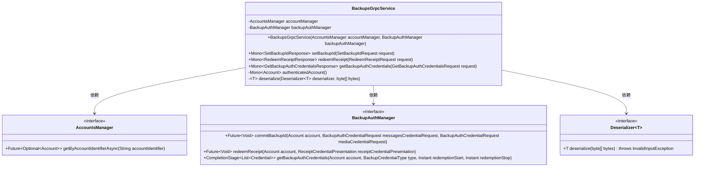
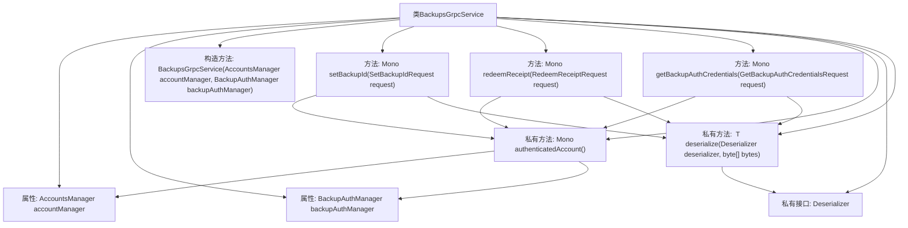

# 基础信息

|      |      |
|------|------|
| 名称 | BackupsGrpcService |
| 编码语言 | .java |
| 代码路径 | Signal-Server/service/src/main/java/org/whispersystems/textsecuregcm/grpc/BackupsGrpcService.java |
| 包名 | org.whispersystems.textsecuregcm.grpc |
| 依赖项 | ['com.google.protobuf.ByteString', 'io.grpc.Status', 'java.time.Instant', 'java.util.List', 'java.util.stream.Collectors', 'org.signal.chat.backup.GetBackupAuthCredentialsRequest', 'org.signal.chat.backup.GetBackupAuthCredentialsResponse', 'org.signal.chat.backup.ReactorBackupsGrpc', 'org.signal.chat.backup.RedeemReceiptRequest', 'org.signal.chat.backup.RedeemReceiptResponse', 'org.signal.chat.backup.SetBackupIdRequest', 'org.signal.chat.backup.SetBackupIdResponse', 'org.signal.chat.common.ZkCredential', 'org.signal.libsignal.zkgroup.InvalidInputException', 'org.signal.libsignal.zkgroup.backups.BackupAuthCredentialRequest', 'org.signal.libsignal.zkgroup.backups.BackupCredentialType', 'org.signal.libsignal.zkgroup.receipts.ReceiptCredentialPresentation', 'org.whispersystems.textsecuregcm.auth.grpc.AuthenticatedDevice', 'org.whispersystems.textsecuregcm.auth.grpc.AuthenticationUtil', 'org.whispersystems.textsecuregcm.backup.BackupAuthManager', 'org.whispersystems.textsecuregcm.storage.Account', 'org.whispersystems.textsecuregcm.storage.AccountsManager', 'reactor.core.publisher.Mono'] |
| 概述说明 | BackupsGrpcService负责备份认证与凭证管理，包括设置ID、兑换收据和获取凭证。 |

# 说明

BackupsGrpcService是一个专门处理备份认证与凭证管理的服务，主要功能包括设置备份ID、兑换收据以及获取备份凭证。该服务通过gRPC接口实现，确保备份操作的安全性和高效性。设置备份ID用于标识和管理备份任务，兑换收据功能则用于验证和确认备份请求的合法性，而获取备份凭证功能则为用户提供必要的凭证以访问和恢复备份数据。整体设计旨在简化备份流程，增强数据管理的可靠性和安全性。

# 类列表 Class Summary

| 名称   | 类型  | 说明 |
|-------|------|-------------|
| BackupsGrpcService | class | BackupsGrpcService处理备份认证与凭证管理，包含设置备份ID、兑换收据和获取备份凭证功能。 |

## 类 BackupsGrpcService

|      |      |
|------|------|
| 访问范围 | public |
| 类型 | class |
| 名称 | BackupsGrpcService |
| 说明 | BackupsGrpcService处理备份认证与凭证管理，包含设置备份ID、兑换收据和获取备份凭证功能。 |

### UML类图

**描述：**  
`BackupsGrpcService` 是一个基于 gRPC 的服务类，用于处理备份相关的请求。它依赖于 `AccountsManager` 和 `BackupAuthManager` 接口来管理账户和备份认证。该类提供了三个主要方法：`setBackupId`、`redeemReceipt` 和 `getBackupAuthCredentials`，分别用于设置备份ID、兑换收据和获取备份认证凭证。`authenticatedAccount` 方法用于验证并获取当前认证的账户信息，`deserialize` 方法用于反序列化字节数据。

### 内部方法调用关系图

这段代码定义了一个名为 `BackupsGrpcService` 的类，该类继承自 `ReactorBackupsGrpc.BackupsImplBase`。类中包含两个主要属性 `accountManager` 和 `backupAuthManager`，并通过构造函数进行初始化。类中定义了三个主要方法 `setBackupId`、`redeemReceipt` 和 `getBackupAuthCredentials`，这些方法分别处理不同的 gRPC 请求。每个方法都调用了 `authenticatedAccount` 方法来验证账户，并使用 `deserialize` 方法进行数据反序列化。`authenticatedAccount` 方法通过 `accountManager` 获取账户信息，而 `deserialize` 方法则通过 `Deserializer` 接口进行反序列化操作。

### 字段列表 Field List

| 名称  | 类型  | 说明 |
|-------|-------|------|
| backupAuthManager | BackupAuthManager | 私有备份认证管理器实例。 |
| accountManager | AccountsManager | 私有且不可变的账户管理器实例。 |

### 方法列表 Method List

| 名称  | 类型  | 说明 |
|-------|-------|------|
| deserialize | T | 私有方法反序列化字节数组，处理无效输入异常。 |
| authenticatedAccount | Mono<Account> | 获取已验证设备账户，若不存在则抛出未认证异常。 |
| setBackupId | Mono<SetBackupIdResponse> | 重写方法处理备份ID设置，反序列化请求并提交至认证管理器。 |
| redeemReceipt | Mono<RedeemReceiptResponse> | 该方法处理收据兑换请求，反序列化凭证并调用认证账户进行兑换，最后返回默认响应。 |
| getBackupAuthCredentials | Mono<GetBackupAuthCredentialsResponse> | 该方法获取备份认证凭据，包括消息和媒体类型，并返回响应。 |

