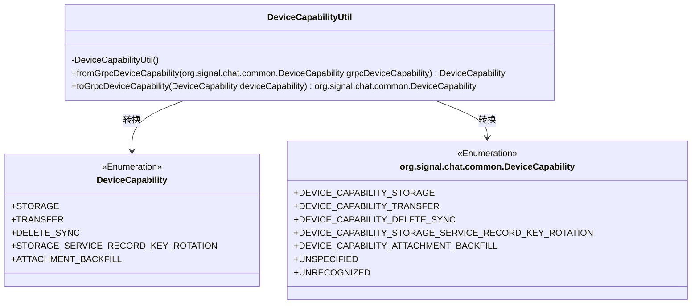

# 基础信息

|      |      |
|------|------|
| 名称 | DeviceCapabilityUtil |
| 编码语言 | .java |
| 代码路径 | Signal-Server/service/src/main/java/org/whispersystems/textsecuregcm/grpc/DeviceCapabilityUtil.java |
| 包名 | org.whispersystems.textsecuregcm.grpc |
| 依赖项 | ['io.grpc.Status', 'org.whispersystems.textsecuregcm.storage.DeviceCapability'] |
| 概述说明 | DeviceCapabilityUtil类实现gRPC设备能力与本地枚举的相互转换。 |

# 说明

DeviceCapabilityUtil类主要负责实现gRPC设备能力与本地枚举之间的相互转换功能。该类通过封装转换逻辑，确保在gRPC协议与本地系统之间进行设备能力信息的无缝转换，从而提升系统的兼容性和可维护性。这一实现有助于简化设备能力管理的复杂性，确保数据在不同平台或协议间的一致性和准确性。

# 类列表 Class Summary

| 名称   | 类型  | 说明 |
|-------|------|-------------|
| DeviceCapabilityUtil | class | DeviceCapabilityUtil类实现gRPC设备能力与本地枚举的相互转换。 |

## 类 DeviceCapabilityUtil

|      |      |
|------|------|
| 访问范围 | public |
| 类型 | class |
| 名称 | DeviceCapabilityUtil |
| 说明 | DeviceCapabilityUtil类实现gRPC设备能力与本地枚举的相互转换。 |

### UML类图

**描述：**
`DeviceCapabilityUtil` 是一个工具类，用于在 `DeviceCapability` 枚举和 `org.signal.chat.common.DeviceCapability` 枚举之间进行转换。该类提供了两个静态方法：`fromGrpcDeviceCapability` 将 gRPC 的设备能力枚举转换为本地枚举，`toGrpcDeviceCapability` 则将本地枚举转换为 gRPC 枚举。如果传入的 gRPC 枚举是未指定或无法识别的，`fromGrpcDeviceCapability` 方法会抛出异常。

### 内部方法调用关系图

```mermaid
graph TD
    A["类DeviceCapabilityUtil"]
    B["私有构造方法: DeviceCapabilityUtil()"]
    C["静态方法: fromGrpcDeviceCapability(org.signal.chat.common.DeviceCapability)"]
    D["静态方法: toGrpcDeviceCapability(DeviceCapability)"]
    E["switch语句: 转换grpcDeviceCapability到DeviceCapability"]
    F["抛出异常: Status.INVALID_ARGUMENT.withDescription('Unrecognized device capability').asRuntimeException()"]
    G["switch语句: 转换DeviceCapability到grpcDeviceCapability"]

    A --> B
    A --> C
    A --> D
    C --> E
    E -->|DEVICE_CAPABILITY_STORAGE| DeviceCapability.STORAGE
    E -->|DEVICE_CAPABILITY_TRANSFER| DeviceCapability.TRANSFER
    E -->|DEVICE_CAPABILITY_DELETE_SYNC| DeviceCapability.DELETE_SYNC
    E -->|DEVICE_CAPABILITY_STORAGE_SERVICE_RECORD_KEY_ROTATION| DeviceCapability.STORAGE_SERVICE_RECORD_KEY_ROTATION
    E -->|DEVICE_CAPABILITY_ATTACHMENT_BACKFILL| DeviceCapability.ATTACHMENT_BACKFILL
    E -->|DEVICE_CAPABILITY_UNSPECIFIED, UNRECOGNIZED| F
    D --> G
    G -->|STORAGE| org.signal.chat.common.DeviceCapability.DEVICE_CAPABILITY_STORAGE
    G -->|TRANSFER| org.signal.chat.common.DeviceCapability.DEVICE_CAPABILITY_TRANSFER
    G -->|DELETE_SYNC| org.signal.chat.common.DeviceCapability.DEVICE_CAPABILITY_DELETE_SYNC
    G -->|STORAGE_SERVICE_RECORD_KEY_ROTATION| org.signal.chat.common.DeviceCapability.DEVICE_CAPABILITY_STORAGE_SERVICE_RECORD_KEY_ROTATION
    G -->|ATTACHMENT_BACKFILL| org.signal.chat.common.DeviceCapability.DEVICE_CAPABILITY_ATTACHMENT_BACKFILL
```

**描述：**  
`DeviceCapabilityUtil`类提供了两个静态方法，用于在`DeviceCapability`和`org.signal.chat.common.DeviceCapability`之间进行转换。`fromGrpcDeviceCapability`方法将gRPC设备能力枚举转换为内部枚举，并在遇到未识别的值时抛出异常。`toGrpcDeviceCapability`方法则将内部枚举转换回gRPC枚举。这两个方法通过`switch`语句实现枚举值的映射。

### 字段列表 Field List

| 名称  | 类型  | 说明 |
|-------|-------|------|

### 方法列表 Method List

| 名称  | 类型  | 说明 |
|-------|-------|------|
| fromGrpcDeviceCapability | DeviceCapability | 将gRPC设备能力转换为本地设备能力，未识别时抛出异常。 |
| toGrpcDeviceCapability | org.signal.chat.common.DeviceCapability | 将设备能力枚举转换为gRPC设备能力枚举。 |

