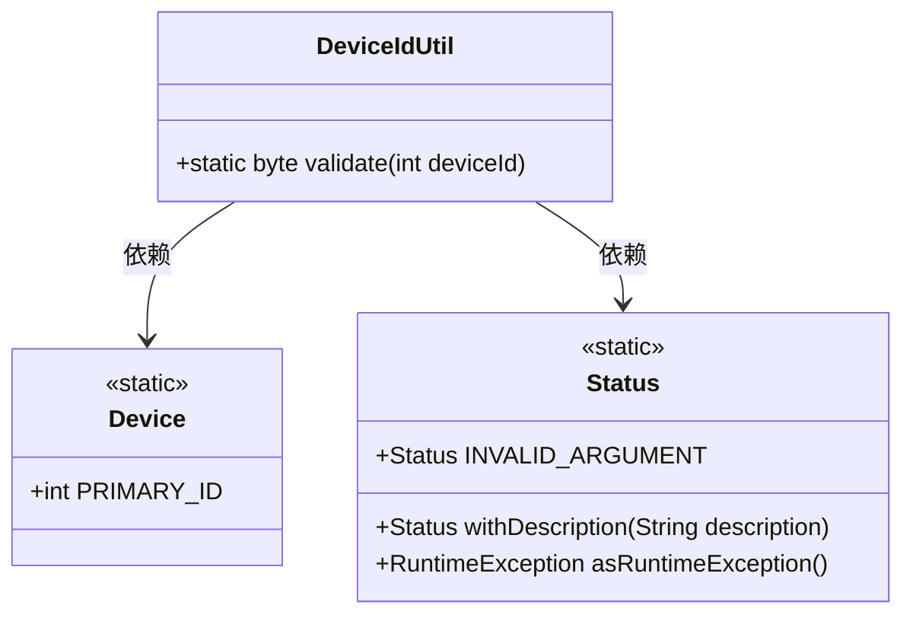
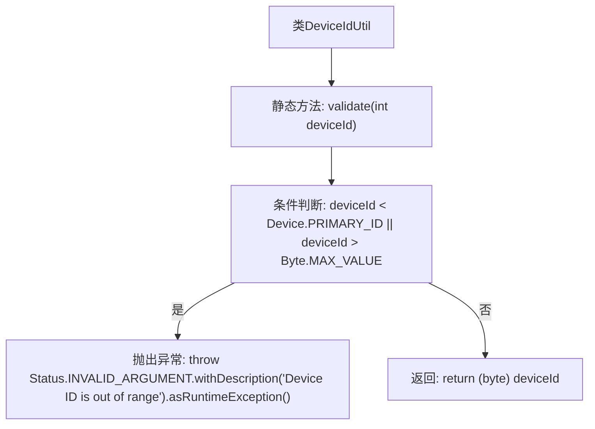

# 基础信息

|      |      |
|------|------|
| 名称 | DeviceIdUtil |
| 编码语言 | .java |
| 代码路径 | Signal-Server/service/src/main/java/org/whispersystems/textsecuregcm/grpc/DeviceIdUtil.java |
| 包名 | org.whispersystems.textsecuregcm.grpc |
| 依赖项 | ['io.grpc.Status', 'org.whispersystems.textsecuregcm.storage.Device'] |
| 概述说明 | DeviceIdUtil类验证设备ID有效性，无效则抛出异常。 |

# 说明

DeviceIdUtil类的主要功能是验证设备ID是否处于有效范围内。如果设备ID不在有效范围内，该类将抛出异常，以确保设备ID的合法性和安全性。这一验证机制有助于在系统处理设备ID时避免无效或不合规的输入，从而提高系统的稳定性和可靠性。

# 类列表 Class Summary

| 名称   | 类型  | 说明 |
|-------|------|-------------|
| DeviceIdUtil | class | DeviceIdUtil类验证设备ID是否在有效范围内，否则抛出异常。 |

## 类 DeviceIdUtil

|      |      |
|------|------|
| 访问范围 | public |
| 类型 | class |
| 名称 | DeviceIdUtil |
| 说明 | DeviceIdUtil类验证设备ID是否在有效范围内，否则抛出异常。 |

### UML类图

这段代码定义了一个`DeviceIdUtil`类，其中包含一个静态方法`validate`，用于验证设备ID是否在有效范围内。如果设备ID小于`Device.PRIMARY_ID`或大于`Byte.MAX_VALUE`，则抛出`Status.INVALID_ARGUMENT`异常。`Device`类提供了一个静态常量`PRIMARY_ID`，而`Status`类提供了异常处理的相关方法。`DeviceIdUtil`类依赖于`Device`和`Status`类来完成其功能。

### 内部方法调用关系图

这段代码定义了一个名为 `DeviceIdUtil` 的类，其中包含一个静态方法 `validate`，用于验证设备ID是否在有效范围内。如果设备ID小于 `Device.PRIMARY_ID` 或大于 `Byte.MAX_VALUE`，则抛出异常，提示设备ID超出范围；否则，将设备ID转换为 `byte` 类型并返回。流程图展示了方法的执行流程，包括条件判断和异常处理。

### 字段列表 Field List

| 名称  | 类型  | 说明 |
|-------|-------|------|

### 方法列表 Method List

| 名称  | 类型  | 说明 |
|-------|-------|------|
| validate | byte | 验证设备ID是否在有效范围内，若无效则抛出异常。 |

