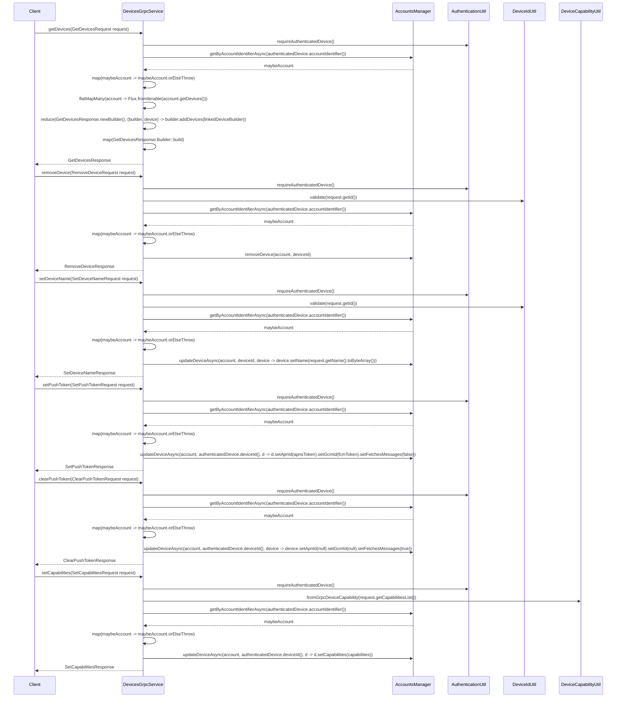

# 基础信息

|      |      |
|------|------|
| 名称 | DevicesGrpcService |
| 编码语言 | .java |
| 代码路径 | Signal-Server/service/src/main/java/org/whispersystems/textsecuregcm/grpc/DevicesGrpcService.java |
| 包名 | org.whispersystems.textsecuregcm.grpc |
| 依赖项 | ['com.google.protobuf.ByteString', 'io.grpc.Status', 'java.util.Objects', 'java.util.Set', 'java.util.stream.Collectors', 'javax.annotation.Nullable', 'org.apache.commons.lang3.StringUtils', 'org.signal.chat.device.ClearPushTokenRequest', 'org.signal.chat.device.ClearPushTokenResponse', 'org.signal.chat.device.GetDevicesRequest', 'org.signal.chat.device.GetDevicesResponse', 'org.signal.chat.device.ReactorDevicesGrpc', 'org.signal.chat.device.RemoveDeviceRequest', 'org.signal.chat.device.RemoveDeviceResponse', 'org.signal.chat.device.SetCapabilitiesRequest', 'org.signal.chat.device.SetCapabilitiesResponse', 'org.signal.chat.device.SetDeviceNameRequest', 'org.signal.chat.device.SetDeviceNameResponse', 'org.signal.chat.device.SetPushTokenRequest', 'org.signal.chat.device.SetPushTokenResponse', 'org.whispersystems.textsecuregcm.auth.grpc.AuthenticatedDevice', 'org.whispersystems.textsecuregcm.auth.grpc.AuthenticationUtil', 'org.whispersystems.textsecuregcm.storage.AccountsManager', 'org.whispersystems.textsecuregcm.storage.Device', 'org.whispersystems.textsecuregcm.storage.DeviceCapability', 'reactor.core.publisher.Flux', 'reactor.core.publisher.Mono'] |
| 概述说明 | DevicesGrpcService实现设备管理功能，涵盖获取、移除、命名、设置推送令牌及设备能力。 |

# 说明

DevicesGrpcService提供全面的设备管理功能，支持获取设备信息、移除设备、为设备命名、设置推送令牌、清除推送令牌以及配置设备能力。这些功能通过gRPC接口实现，确保高效、可靠的设备管理和操作。

# 类列表 Class Summary

| 名称   | 类型  | 说明 |
|-------|------|-------------|
| DevicesGrpcService | class | DevicesGrpcService实现设备管理功能，包括获取、移除、命名设备，设置推送令牌和清除令牌，以及设置设备能力。 |

## 类 DevicesGrpcService

|      |      |
|------|------|
| 访问范围 | public |
| 类型 | class |
| 名称 | DevicesGrpcService |
| 说明 | DevicesGrpcService实现设备管理功能，包括获取、移除、命名设备，设置推送令牌和清除令牌，以及设置设备能力。 |

### UML类图

```mermaid
classDiagram
    class DevicesGrpcService {
        -AccountsManager accountsManager
        -static final int MAX_NAME_LENGTH
        +DevicesGrpcService(AccountsManager accountsManager)
        +Mono~GetDevicesResponse~ getDevices(GetDevicesRequest request)
        +Mono~RemoveDeviceResponse~ removeDevice(RemoveDeviceRequest request)
        +Mono~SetDeviceNameResponse~ setDeviceName(SetDeviceNameRequest request)
        +Mono~SetPushTokenResponse~ setPushToken(SetPushTokenRequest request)
        +Mono~ClearPushTokenResponse~ clearPushToken(ClearPushTokenRequest request)
        +Mono~SetCapabilitiesResponse~ setCapabilities(SetCapabilitiesRequest request)
    }

    class AccountsManager {
        +Mono~Optional~Account~~ getByAccountIdentifierAsync(String accountIdentifier)
        +Mono~Void~ removeDevice(Account account, byte deviceId)
        +Mono~Void~ updateDeviceAsync(Account account, byte deviceId, Consumer~Device~ updater)
    }

    class AuthenticationUtil {
        +static AuthenticatedDevice requireAuthenticatedDevice()
    }

    class Device {
        +static final byte PRIMARY_ID
        +String getName()
        +byte getId()
        +long getCreated()
        +long getLastSeen()
        +void setName(byte[] name)
        +void setApnId(String apnId)
        +void setGcmId(String gcmId)
        +void setFetchesMessages(boolean fetchesMessages)
        +void setCapabilities(Set~DeviceCapability~ capabilities)
    }

    class DeviceIdUtil {
        +static byte validate(byte deviceId)
    }

    class DeviceCapabilityUtil {
        +static DeviceCapability fromGrpcDeviceCapability(DeviceCapability grpcCapability)
    }

    class Status {
        +static Status UNAUTHENTICATED
        +static Status INVALID_ARGUMENT
        +static Status PERMISSION_DENIED
        +static Status NOT_FOUND
        +Status withDescription(String description)
        +RuntimeException asRuntimeException()
    }

    DevicesGrpcService --> AccountsManager : 依赖
    DevicesGrpcService --> AuthenticationUtil : 依赖
    DevicesGrpcService --> Device : 依赖
    DevicesGrpcService --> DeviceIdUtil : 依赖
    DevicesGrpcService --> DeviceCapabilityUtil : 依赖
    DevicesGrpcService --> Status : 依赖
```

这段代码定义了一个`DevicesGrpcService`类，它继承自`ReactorDevicesGrpc.DevicesImplBase`，用于处理设备相关的gRPC请求。该类依赖于`AccountsManager`来管理账户和设备信息，并通过`AuthenticationUtil`进行身份验证。它还使用了`Device`、`DeviceIdUtil`、`DeviceCapabilityUtil`和`Status`等工具类来处理设备ID验证、设备能力设置以及错误状态管理。`DevicesGrpcService`提供了多个方法，如获取设备、移除设备、设置设备名称、设置推送令牌、清除推送令牌和设置设备能力等，每个方法都返回一个`Mono`类型的响应对象。

### 内部方法调用关系图

```mermaid
graph TD
    A["类DevicesGrpcService"]
    B["属性: AccountsManager accountsManager"]
    C["属性: int MAX_NAME_LENGTH"]
    D["构造方法: DevicesGrpcService(AccountsManager accountsManager)"]
    E["方法: Mono<GetDevicesResponse> getDevices(GetDevicesRequest request)"]
    F["方法: Mono<RemoveDeviceResponse> removeDevice(RemoveDeviceRequest request)"]
    G["方法: Mono<SetDeviceNameResponse> setDeviceName(SetDeviceNameRequest request)"]
    H["方法: Mono<SetPushTokenResponse> setPushToken(SetPushTokenRequest request)"]
    I["方法: Mono<ClearPushTokenResponse> clearPushToken(ClearPushTokenRequest request)"]
    J["方法: Mono<SetCapabilitiesResponse> setCapabilities(SetCapabilitiesRequest request)"]

    A --> B
    A --> C
    A --> D
    A --> E
    A --> F
    A --> G
    A --> H
    A --> I
    A --> J
```

这段代码定义了一个`DevicesGrpcService`类，该类继承自`ReactorDevicesGrpc.DevicesImplBase`，并实现了多个gRPC服务方法。每个方法都通过`AuthenticationUtil`验证设备身份，并通过`AccountsManager`进行账户和设备的管理操作。代码中处理了多种设备操作，如获取设备列表、移除设备、设置设备名称、设置推送令牌、清除推送令牌和设置设备能力。每个方法都返回相应的gRPC响应对象。

### 字段列表 Field List

| 名称  | 类型  | 说明 |
|-------|-------|------|
| accountsManager | AccountsManager | 私有账户管理器实例变量。 |
| MAX_NAME_LENGTH = 256 | int | 定义私有静态常量MAX_NAME_LENGTH，值为256。 |

### 方法列表 Method List

| 名称  | 类型  | 说明 |
|-------|-------|------|
| clearPushToken | Mono<ClearPushTokenResponse> | 清除推送令牌并更新设备信息，返回响应。 |
| getDevices | Mono<GetDevicesResponse> | 获取设备信息，验证设备身份，返回设备列表。 |
| setCapabilities | Mono<SetCapabilitiesResponse> | 该方法验证设备并更新其功能集，最后返回响应。 |
| removeDevice | Mono<RemoveDeviceResponse> | 移除设备方法：验证设备ID，检查权限，删除设备并返回响应。 |
| setDeviceName | Mono<SetDeviceNameResponse> | 验证设备权限并设置设备名称，处理无效参数和权限错误。 |
| setPushToken | Mono<SetPushTokenResponse> | 方法验证并设置APNs或FCM推送令牌，更新设备信息。 |

